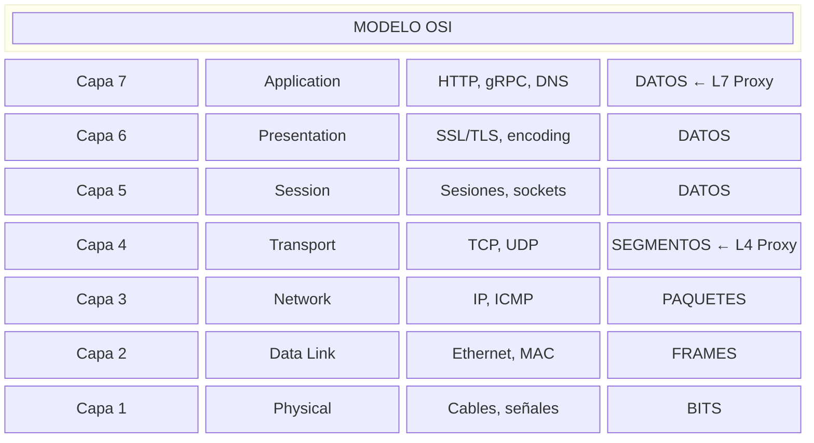
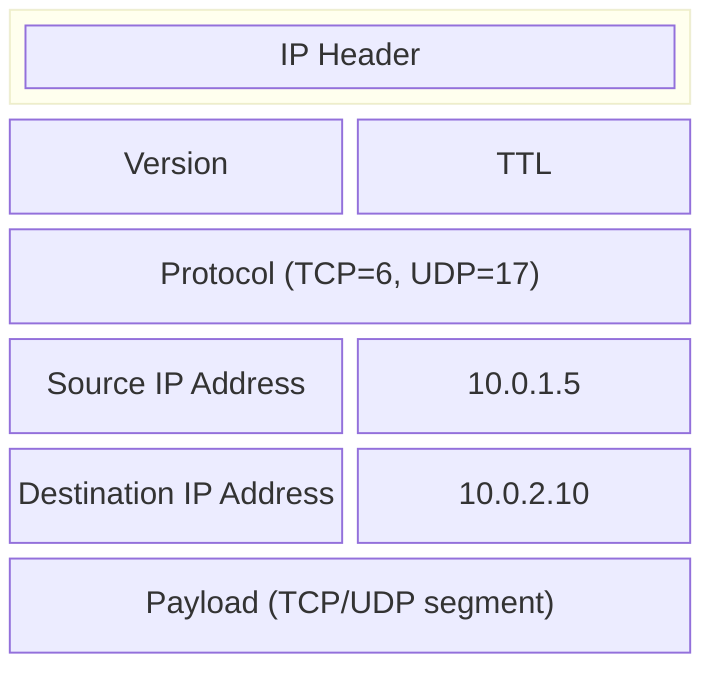
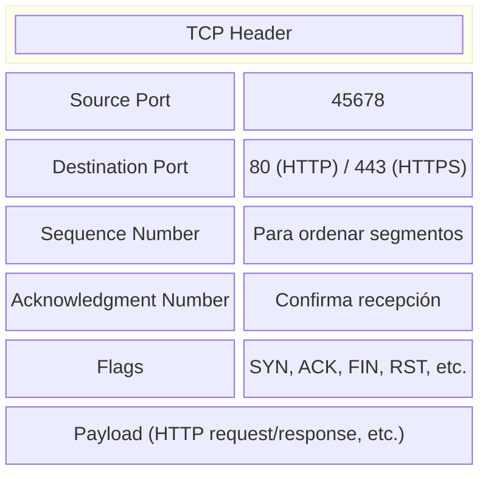
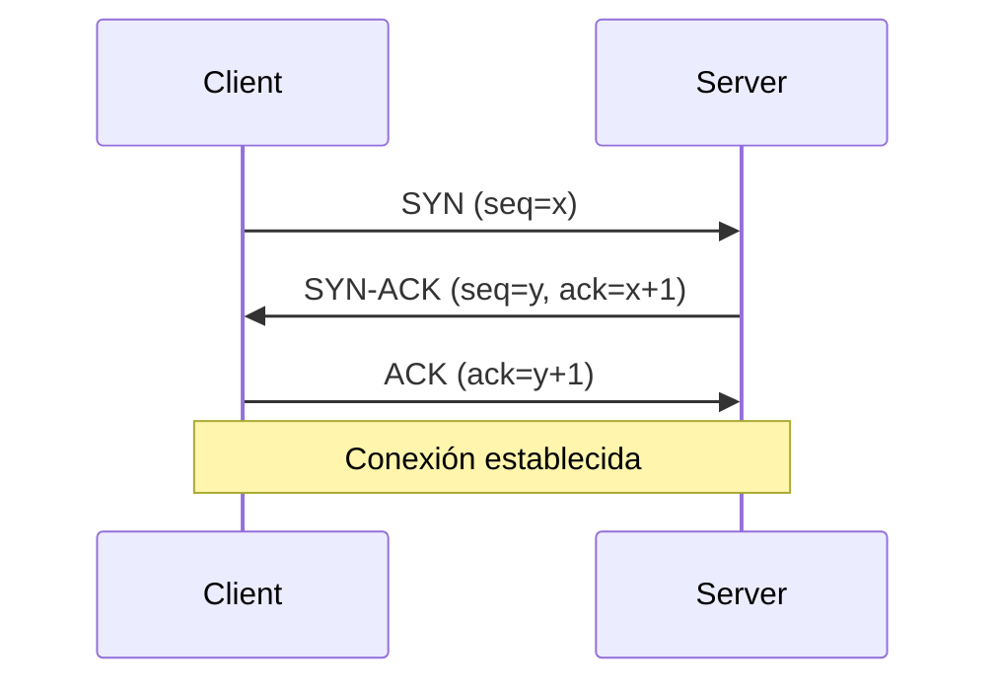
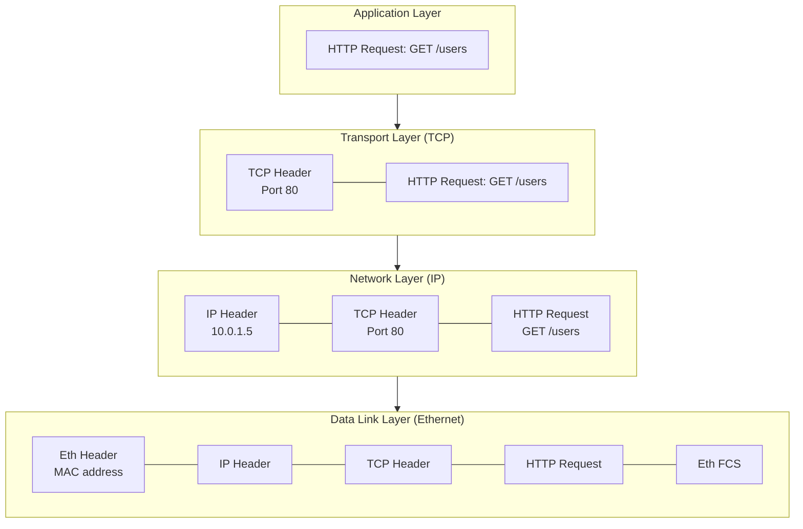
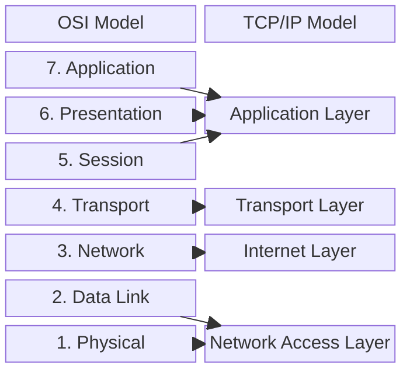
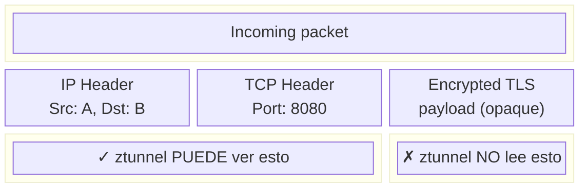
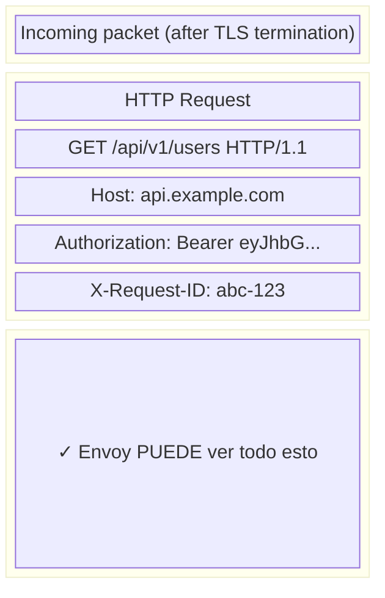
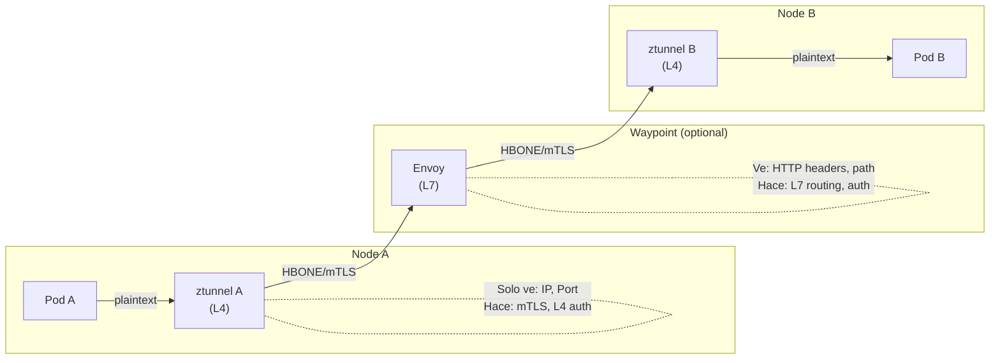

# Modelo OSI y Capas de Red

---

**Módulo**: 1 - Fundamentos de Redes
**Tema**: Modelo OSI
**Tiempo estimado**: 2 horas
**Prerrequisitos**: Ninguno

---

## Objetivos de Aprendizaje

Al completar este documento:

- Entenderás el modelo OSI y el propósito de cada capa
- Identificarás en qué capas operan los proxies L4 y L7
- Comprenderás cómo fluyen los datos a través de las capas
- Relacionarás el modelo teórico con implementaciones reales

---

## 1. Introducción al Modelo OSI

### 1.1 ¿Qué es el Modelo OSI?

El **OSI (Open Systems Interconnection)** es un modelo conceptual creado por la ISO que estandariza las funciones de un sistema de comunicaciones en **siete capas abstractas**. Cada capa tiene una responsabilidad específica y se comunica solo con las capas adyacentes.



### 1.2 ¿Por Qué Importa para Proxies?

Los proxies se clasifican por la capa OSI en la que operan:

| Tipo de Proxy | Capa OSI        | Qué "entiende"           | Ejemplo |
| ------------- | --------------- | ------------------------ | ------- |
| **L4 Proxy**  | Transport (4)   | IP, puertos, TCP/UDP     | ztunnel |
| **L7 Proxy**  | Application (7) | HTTP headers, URLs, gRPC | Envoy   |

**Concepto clave**: Un proxy L7 debe "atravesar" todas las capas hasta L7, lo que significa más procesamiento pero más información disponible para tomar decisiones.

---

## 2. Capas Relevantes para Proxies

### 2.1 Capa 3: Network Layer (IP)

**Responsabilidad**: Routing de paquetes entre redes.

**Conceptos clave**:

- **IP Address**: Identificador único de un host en la red (ej: `10.0.1.5`)
- **Routing**: Decisión de por dónde enviar un paquete
- **CIDR**: Notación de rangos de IP (ej: `10.0.0.0/8`)

**Estructura de un paquete IP**:



**Relevancia para proxies**:

- Las decisiones L4 pueden basarse en IP origen/destino
- Los clusters en Envoy agrupan endpoints por IP
- ztunnel usa IP para identificar workloads

### 2.2 Capa 4: Transport Layer (TCP/UDP)

**Responsabilidad**: Transporte confiable (TCP) o no confiable (UDP) de datos.

**TCP (Transmission Control Protocol)**:

- **Connection-oriented**: Requiere handshake antes de transmitir
- **Reliable**: Garantiza entrega ordenada
- **Flow control**: Evita saturar al receptor

**Estructura de un segmento TCP**:



**El TCP Handshake (Three-Way Handshake)**:



**Relevancia para proxies**:

- Un proxy L4 solo necesita ver puertos para hacer forwarding
- Connection pooling en Envoy mantiene conexiones TCP abiertas
- ztunnel opera a este nivel, sin entender el payload

### 2.3 Capa 7: Application Layer (HTTP, gRPC)

**Responsabilidad**: Protocolos de aplicación que los usuarios/servicios utilizan directamente.

**HTTP Request**:

```
GET /api/users HTTP/1.1              ← Method + Path + Version
Host: api.example.com                ← Header: Host
Authorization: Bearer eyJ...         ← Header: Auth token
Content-Type: application/json       ← Header: Content type
Accept: application/json             ← Header: Expected response
                                     ← Línea vacía (fin de headers)
{"user_id": 123}                     ← Body (opcional)
```

**HTTP Response**:

```
HTTP/1.1 200 OK                      ← Status line
Content-Type: application/json       ← Headers
Content-Length: 45
                                     ← Línea vacía
{"name": "John", "status": "active"} ← Body
```

**Relevancia para proxies**:

- Un proxy L7 puede leer/modificar cualquier parte del request/response
- Routing basado en path (`/api/v1` → cluster A, `/api/v2` → cluster B)
- Rate limiting basado en API key en headers
- JWT validation

---

## 3. Encapsulación de Datos

### 3.1 El Proceso de Encapsulación

Cuando una aplicación envía datos, cada capa añade su propia cabecera (header):



### 3.2 Decapsulación

El receptor hace el proceso inverso, quitando headers capa por capa hasta llegar a los datos de aplicación.

**Implicación para proxies**:

- Un proxy L4 solo necesita decapsular hasta L4 (ve TCP header, no HTTP)
- Un proxy L7 decapsula completamente hasta ver HTTP headers

---

## 4. Modelo TCP/IP vs OSI

En la práctica, se usa más el modelo TCP/IP que combina algunas capas:



**En el contexto de proxies**, usamos la terminología OSI:

- "L4" = Transport Layer
- "L7" = Application Layer

---

## 5. Aplicación a Envoy y ztunnel

### 5.1 ztunnel (L4)

ztunnel opera en **Layer 4**:



**Decisiones que puede tomar:**
- ✓ Forward basado en IP destino
- ✓ mTLS entre pods
- ✓ Autorización basada en identidad (SPIFFE)
- ✗ NO puede hacer routing por URL path
- ✗ NO puede leer HTTP headers

### 5.2 Envoy (L7)

Envoy opera en **Layer 7**:



**Decisiones que puede tomar:**
- ✓ Route /api/v1/* → cluster-v1
- ✓ Route /api/v2/* → cluster-v2
- ✓ Validate JWT token
- ✓ Add/modify headers
- ✓ Rate limit by user
- ✓ Load balance by header hash

### 5.3 Cómo Trabajan Juntos (Ambient Mode)



---

## 6. Ejercicio de Reflexión

### Pregunta 1

Un servicio necesita enrutar requests a diferentes backends según el header `X-Api-Version`. ¿Qué tipo de proxy necesita y por qué?

<details>
<summary>Respuesta</summary>

Necesita un **proxy L7** porque:

- Los headers HTTP solo son visibles en Layer 7
- Un proxy L4 no puede leer el contenido del payload HTTP
- Envoy sería la opción correcta, no ztunnel

</details>

### Pregunta 2

Un cluster de Kubernetes necesita mTLS entre todos los pods, pero no necesita modificar las requests HTTP. ¿Qué tipo de proxy es suficiente?

<details>
<summary>Respuesta</summary>

Un **proxy L4** es suficiente porque:

- mTLS opera en Layer 4/5 (TLS handshake)
- No se necesita leer el contenido HTTP
- ztunnel sería ideal para este caso
- Menor overhead que un proxy L7

</details>

---

## 7. Recursos Adicionales

### Documentación

- [OSI Model (Wikipedia)](https://en.wikipedia.org/wiki/OSI_model)
- [TCP/IP Model](https://en.wikipedia.org/wiki/Internet_protocol_suite)

### En el Código

**Envoy** - Network filter que procesa L4:

```
source/extensions/filters/network/tcp_proxy/tcp_proxy.cc
```

**Envoy** - HTTP filter que procesa L7:

```
source/extensions/filters/http/router/router.cc
```

**ztunnel** - Proxy L4 implementation:

```
src/proxy/
```

---

## 8. Autoevaluación

1. ¿En qué capa opera TCP? ¿Y HTTP?
2. ¿Por qué un proxy L7 tiene más latencia que un L4?
3. ¿Qué información tiene un paquete en L4 que no tiene en L3?
4. Dibuja el proceso de encapsulación para un request HTTP.
5. ¿Por qué ztunnel puede hacer mTLS pero no routing por URL?

---

**Siguiente**: [02_tcp_udp.md](02_tcp_udp.md) - Protocolos de Transporte
