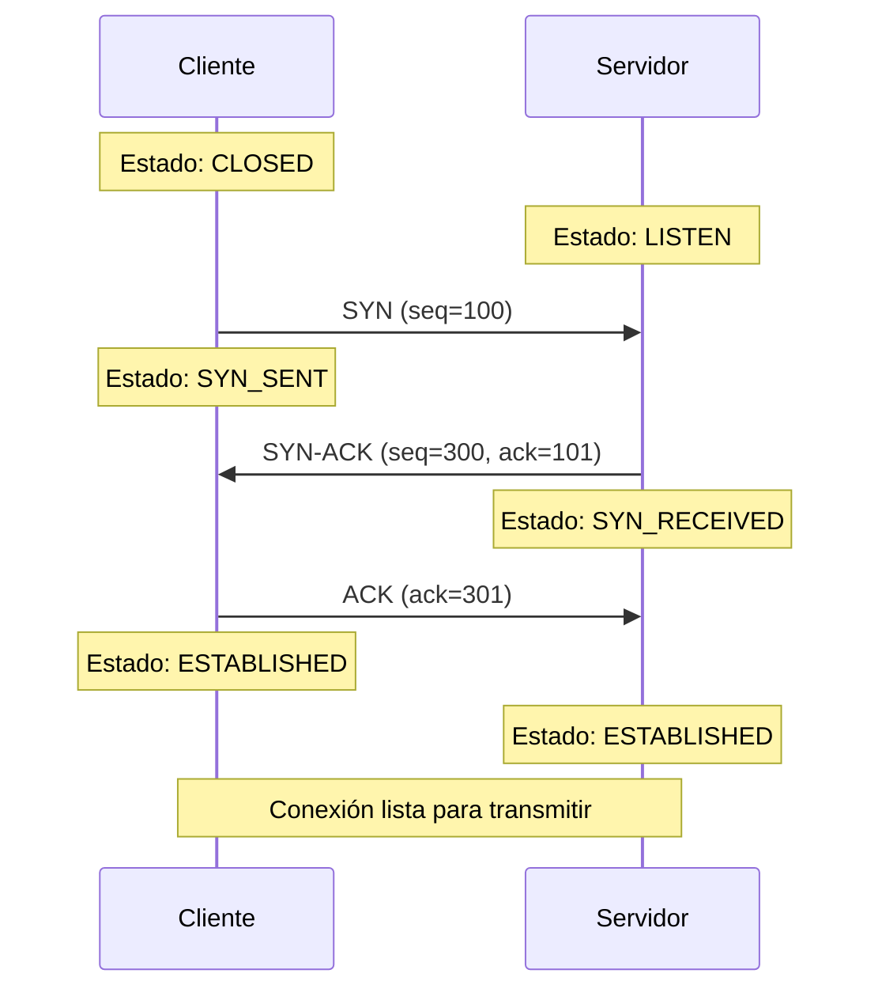
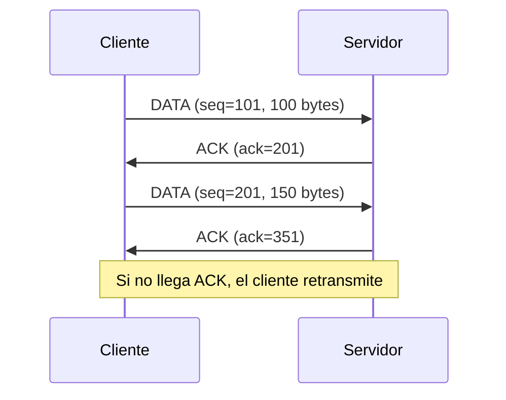
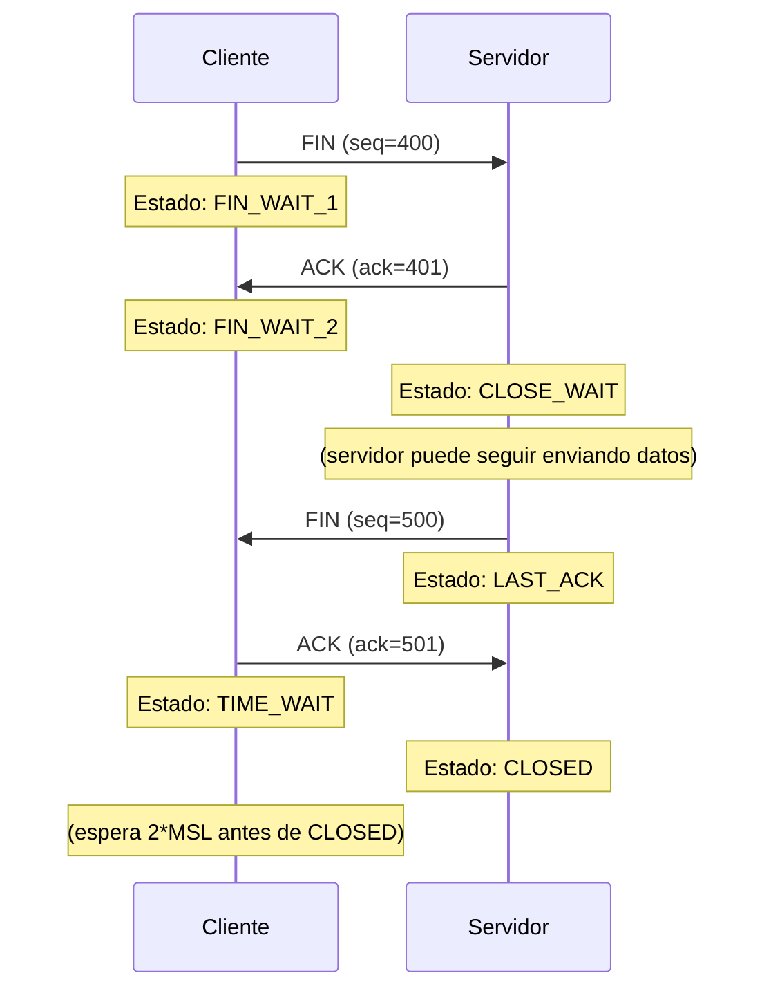
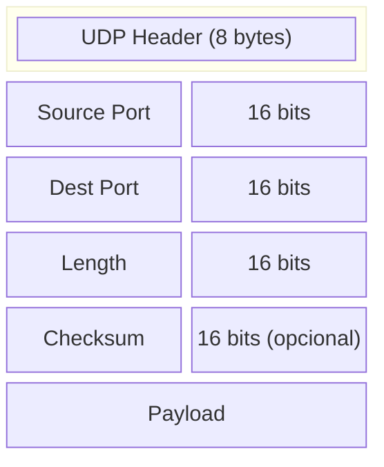
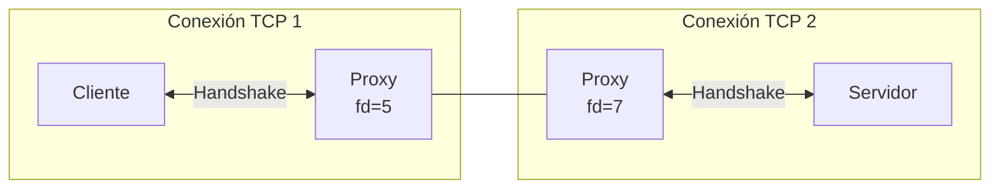
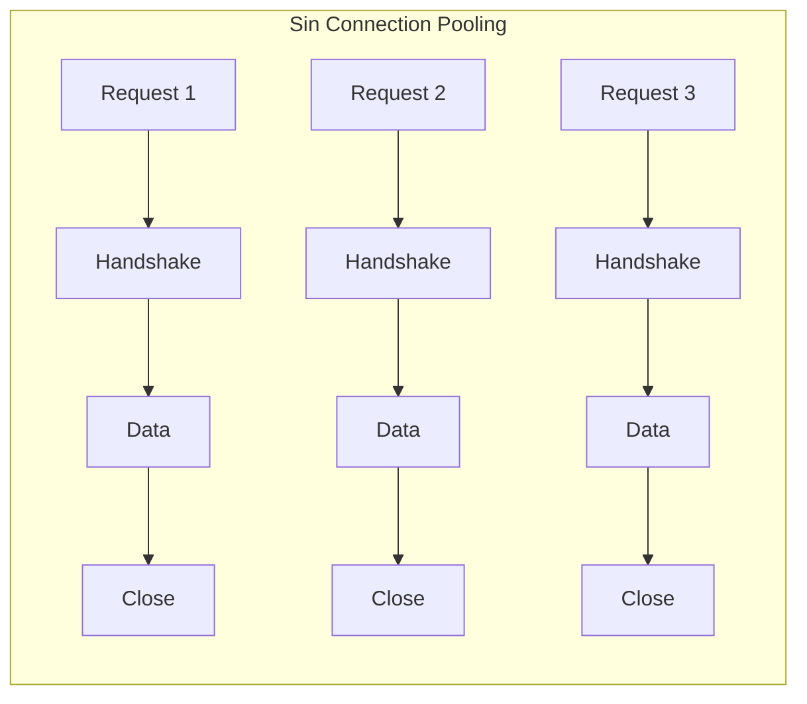
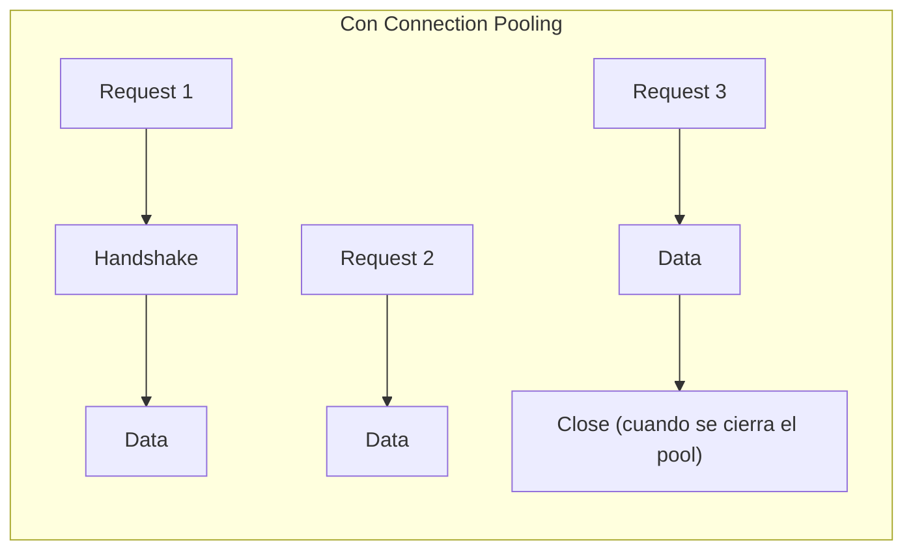
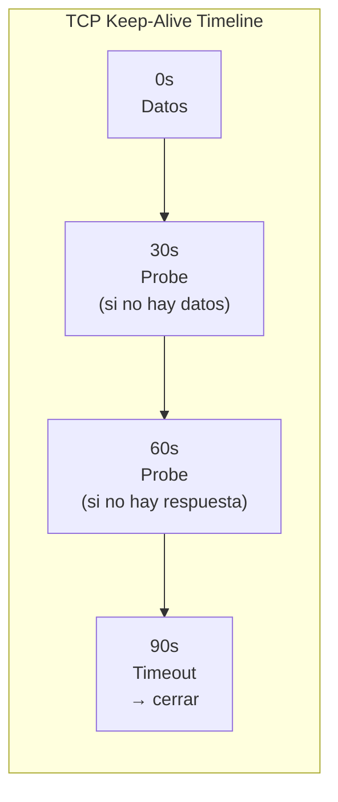
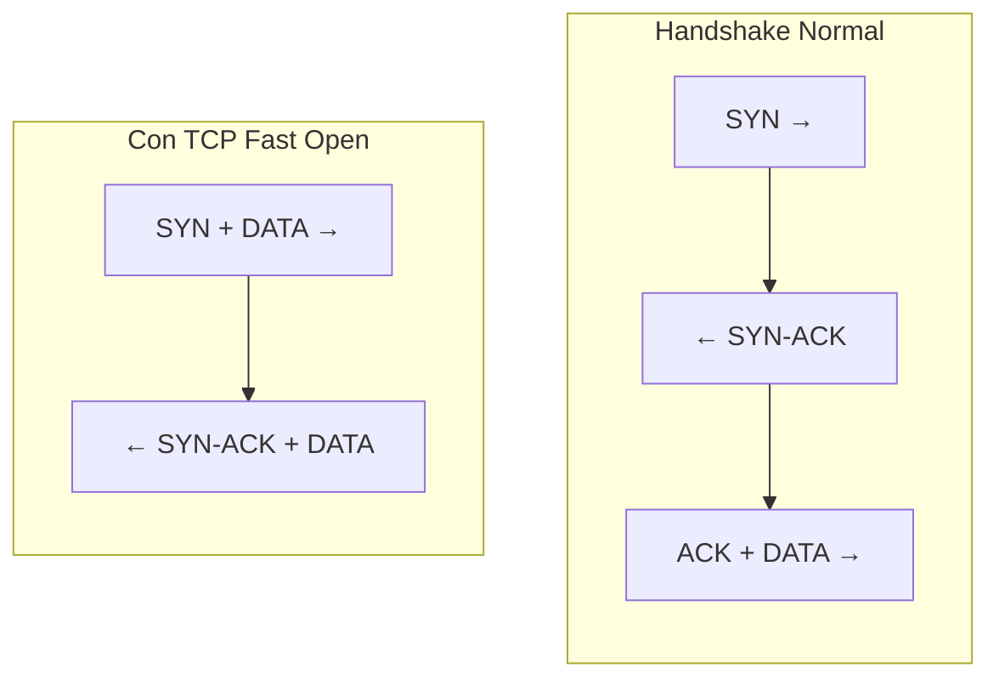

# Protocolos de Transporte: TCP y UDP

---

**Módulo**: 1 - Fundamentos de Redes
**Tema**: TCP y UDP
**Tiempo estimado**: 2 horas
**Prerrequisitos**: [01_modelo_osi.md](01_modelo_osi.md)

---

## Objetivos de Aprendizaje

Al completar este documento:

- Entenderás las diferencias fundamentales entre TCP y UDP
- Comprenderás el ciclo de vida de una conexión TCP
- Sabrás cómo los proxies manejan conexiones TCP
- Identificarás cuándo se usa cada protocolo

---

## 1. TCP: Transmission Control Protocol

### 1.1 Características Fundamentales

TCP es un protocolo **connection-oriented** y **reliable**:

| Característica          | Descripción                                            |
| ----------------------- | ------------------------------------------------------ |
| **Connection-oriented** | Requiere establecer conexión antes de transmitir datos |
| **Reliable**            | Garantiza entrega de todos los bytes en orden          |
| **Stream-based**        | Trata los datos como flujo continuo de bytes           |
| **Flow control**        | Evita saturar al receptor                              |
| **Congestion control**  | Adapta velocidad según condiciones de red              |

### 1.2 El Three-Way Handshake

Antes de cualquier transmisión de datos, TCP establece una conexión:



**Detalles importantes**:

- `seq` (sequence number): Número de secuencia inicial (ISN - Initial Sequence Number)
- `ack` (acknowledgment): Confirma recepción hasta ese byte
- Cada lado tiene su propio número de secuencia

### 1.3 Transmisión de Datos

Una vez establecida la conexión:



**Conceptos clave**:

- **Sequence number**: Identifica cada byte en el stream
- **Acknowledgment**: Confirma bytes recibidos
- **Window size**: Cuántos bytes puede recibir sin confirmar

### 1.4 Cierre de Conexión (Four-Way Handshake)



**El estado TIME_WAIT**:

- Dura 2 × MSL (Maximum Segment Lifetime, típicamente 60 segundos)
- Permite que lleguen segmentos retrasados
- Evita que nueva conexión con mismos puertos reciba datos viejos

**Implicación para proxies**:

- Muchas conexiones en TIME_WAIT pueden agotar puertos
- Connection pooling en Envoy reutiliza conexiones para evitar esto

### 1.5 Sockets y File Descriptors

En sistemas Unix, una conexión TCP se representa como un **file descriptor (fd)**:

```c
// Servidor: crear socket y escuchar
int server_fd = socket(AF_INET, SOCK_STREAM, 0);  // Crea fd
bind(server_fd, &addr, sizeof(addr));              // Asocia a puerto
listen(server_fd, backlog);                        // Marca como listening

// Aceptar conexión entrante
int client_fd = accept(server_fd, &client_addr, &len);  // Nuevo fd por conexión

// Leer/escribir datos
read(client_fd, buffer, size);
write(client_fd, data, size);

// Cerrar
close(client_fd);
```

**Conceptos clave**:

- Cada conexión TCP = un file descriptor
- `accept()` crea un nuevo fd para cada cliente
- El proxy tiene fds para downstream y upstream

**En Envoy**:

```
source/common/network/connection_impl.h:50-150
```

La clase `ConnectionImpl` encapsula el socket fd y maneja eventos de I/O.

---

## 2. UDP: User Datagram Protocol

### 2.1 Características Fundamentales

UDP es **connectionless** y **unreliable** (en el sentido de que no garantiza entrega):

| Característica | TCP                                | UDP                        |
| -------------- | ---------------------------------- | -------------------------- |
| Connection     | Sí (handshake)                     | No                         |
| Reliability    | Garantizada                        | No garantizada             |
| Ordering       | En orden                           | Sin garantía               |
| Overhead       | Mayor (headers, ACKs)              | Menor                      |
| Latency        | Mayor (handshake, retransmisiones) | Menor                      |
| Use case       | HTTP, gRPC                         | DNS, video streaming, QUIC |

### 2.2 Estructura de un Datagrama UDP



**Comparado con TCP**:

- Header de 8 bytes vs 20+ bytes de TCP
- Sin sequence numbers, ACKs, flags
- Más simple pero sin garantías

### 2.3 Cuándo Usar UDP

| Caso de Uso         | Por qué UDP                                  |
| ------------------- | -------------------------------------------- |
| **DNS**             | Queries pequeñas, baja latencia crítica      |
| **Video streaming** | Pérdida de frame < retransmisión             |
| **Gaming**          | Latencia mínima, estado más reciente importa |
| **QUIC/HTTP/3**     | UDP como base, reliability en app layer      |

**QUIC** (usado en HTTP/3):

- Construido sobre UDP
- Implementa reliability y ordering en espacio de usuario
- Evita head-of-line blocking de TCP
- Envoy soporta QUIC/HTTP/3: `source/common/quic/`

---

## 3. TCP en el Contexto de Proxies

### 3.1 El Proxy como Intermediario

Un proxy L4 termina conexiones TCP de ambos lados:



**El proxy mantiene**:

- Un fd para la conexión downstream (cliente)
- Un fd para la conexión upstream (servidor)
- Copia datos entre ambos

### 3.2 Connection Pooling

Sin pooling, cada request = nueva conexión TCP:



*Overhead de 3 handshakes*

Con pooling (como hace Envoy):



**En Envoy**:

```
source/common/http/conn_pool_base.h
```

### 3.3 TCP Proxy en Envoy

El filtro `tcp_proxy` es un proxy L4 puro:

```yaml
# Configuración de tcp_proxy
filters:
  - name: envoy.filters.network.tcp_proxy
    typed_config:
      "@type": type.googleapis.com/envoy.extensions.filters.network.tcp_proxy.v3.TcpProxy
      stat_prefix: tcp
      cluster: backend_cluster
```

**Código**:

```
source/extensions/filters/network/tcp_proxy/tcp_proxy.cc
```

Este filtro:

1. Acepta conexión TCP downstream
2. Establece conexión TCP a upstream cluster
3. Copia bytes bidireccionalmente
4. No interpreta el payload (podría ser cualquier protocolo)

### 3.4 ztunnel como TCP Proxy

ztunnel es esencialmente un TCP proxy con mTLS:

```rust
// Pseudocódigo conceptual de ztunnel
async fn proxy_connection(downstream: TcpStream, upstream_addr: SocketAddr) {
    // Establecer conexión upstream con mTLS
    let upstream = establish_mtls_connection(upstream_addr).await;

    // Copiar datos bidireccionalmente
    let (dr, dw) = downstream.split();
    let (ur, uw) = upstream.split();

    tokio::select! {
        _ = copy(dr, uw) => {},  // downstream → upstream
        _ = copy(ur, dw) => {},  // upstream → downstream
    }
}
```

**Código real**:

```
ztunnel/src/proxy/
```

---

## 4. Conceptos Avanzados de TCP

### 4.1 SO_REUSEPORT y SO_REUSEADDR

**SO_REUSEADDR**:

- Permite reutilizar un puerto en TIME_WAIT
- Útil para restart rápido de servidores

**SO_REUSEPORT**:

- Permite que múltiples sockets escuchen en el mismo puerto
- El kernel distribuye conexiones entre ellos
- Envoy lo usa para distribuir entre worker threads

**En Envoy**:

```cpp
// source/common/network/socket_option_impl.cc
setSocketOption(SO_REUSEPORT, 1);
```

### 4.2 TCP Keep-Alive

Detecta conexiones "muertas" enviando probes periódicos:



**Configuración en Envoy** (cluster config):

```yaml
upstream_connection_options:
  tcp_keepalive:
    keepalive_probes: 3
    keepalive_time: 30
    keepalive_interval: 10
```

### 4.3 TCP Fast Open (TFO)

Permite enviar datos en el primer paquete SYN:



Ahorra un RTT (round-trip time) para el primer request.

---

## 5. Ejercicios Prácticos

### Ejercicio 1: Observar Handshake con tcpdump

```bash
# Terminal 1: Capturar tráfico
sudo tcpdump -i lo port 8080 -nn

# Terminal 2: Hacer request
curl http://localhost:8080/
```

Identifica:

- Los 3 paquetes del handshake (SYN, SYN-ACK, ACK)
- Los números de secuencia
- El cierre de conexión

### Ejercicio 2: Verificar TIME_WAIT

```bash
# Después de muchas conexiones cortas
ss -tan | grep TIME-WAIT | wc -l
```

### Ejercicio 3: Ver Connection Pooling en Envoy

```bash
# Con Envoy corriendo
curl localhost:9901/stats | grep upstream_cx
```

Observa:

- `upstream_cx_total`: Total de conexiones creadas
- `upstream_cx_active`: Conexiones actualmente activas
- `upstream_cx_destroy`: Conexiones cerradas

---

## 6. Autoevaluación

1. ¿Por qué TCP necesita un handshake y UDP no?
2. ¿Qué problema resuelve el estado TIME_WAIT?
3. ¿Por qué connection pooling mejora el rendimiento?
4. ¿En qué se diferencia un proxy L4 de un proxy L7 en términos de manejo de conexiones TCP?
5. ¿Qué ventaja tiene SO_REUSEPORT para un proxy con múltiples workers?

---

## 7. Referencias en el Código

### Envoy

| Archivo                                                    | Descripción                 |
| ---------------------------------------------------------- | --------------------------- |
| `source/common/network/connection_impl.h`                  | Abstracción de conexión TCP |
| `source/common/network/socket_impl.cc`                     | Opciones de socket          |
| `source/extensions/filters/network/tcp_proxy/tcp_proxy.cc` | TCP proxy filter            |
| `source/common/http/conn_pool_base.h`                      | Connection pooling          |

### ztunnel

| Archivo      | Descripción       |
| ------------ | ----------------- |
| `src/proxy/` | Core TCP proxying |

---

**Siguiente**: [03_http_protocols.md](03_http_protocols.md) - HTTP/1.1, HTTP/2, gRPC
