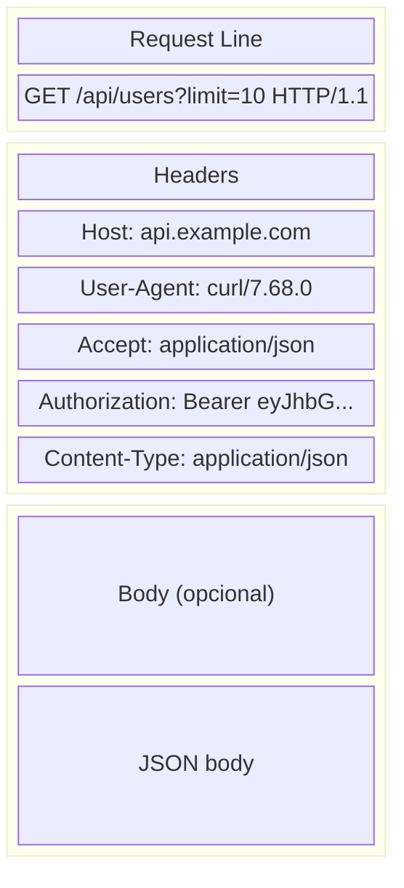
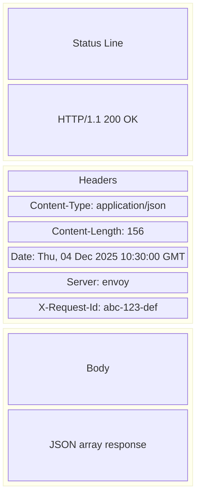
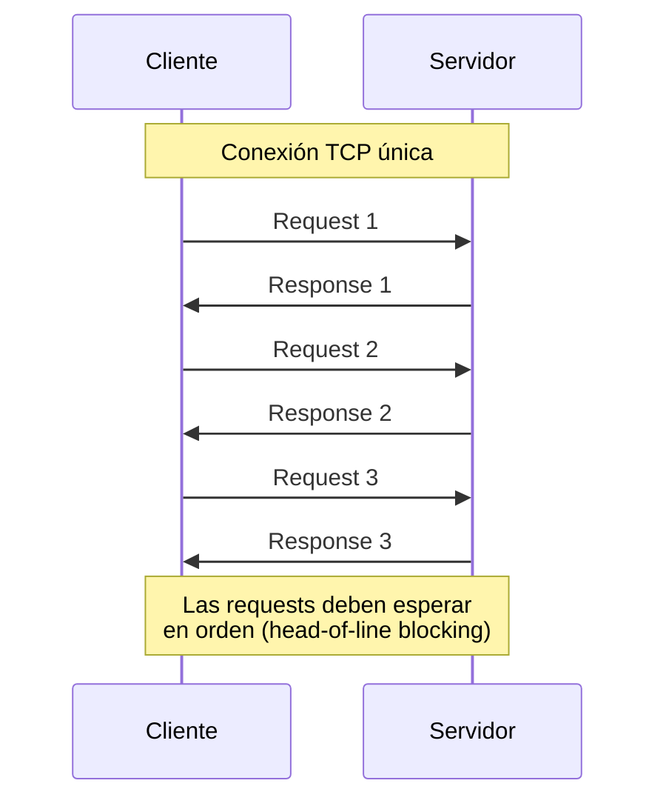
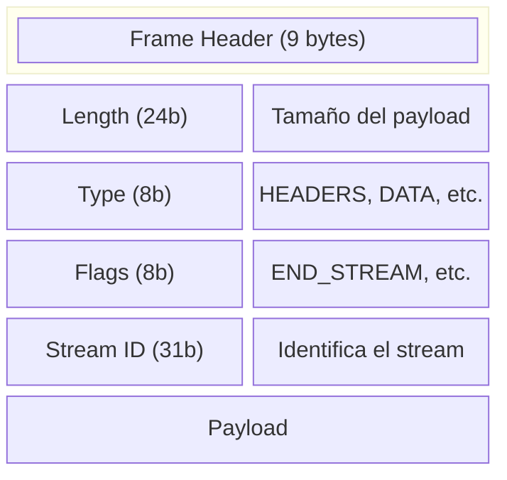
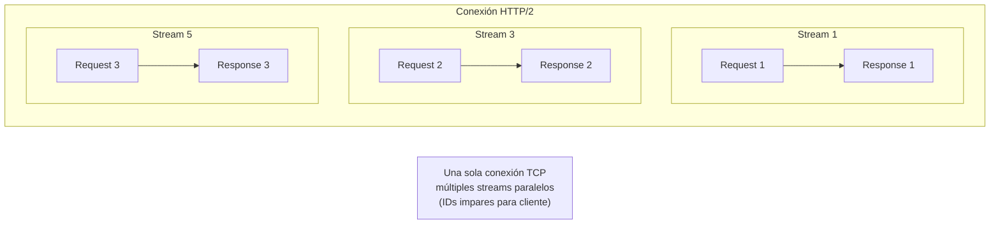
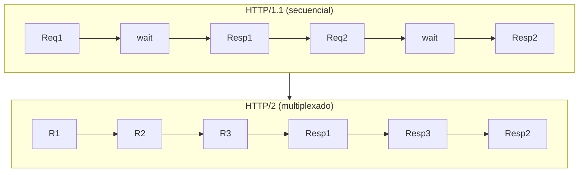
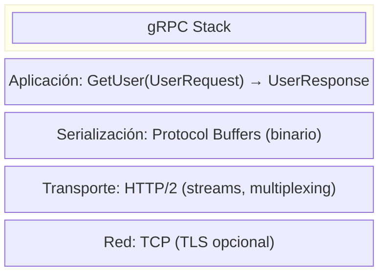
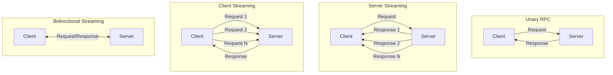
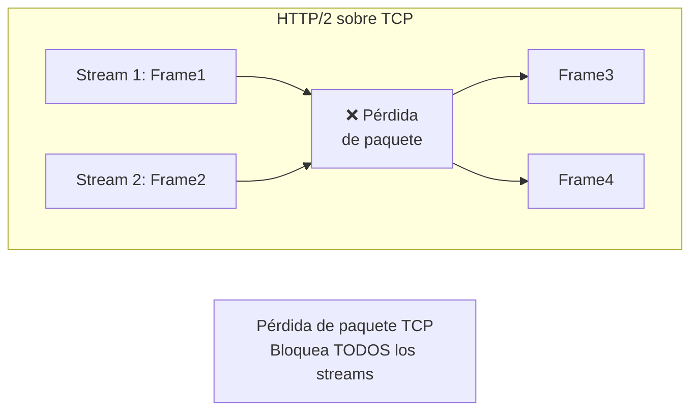
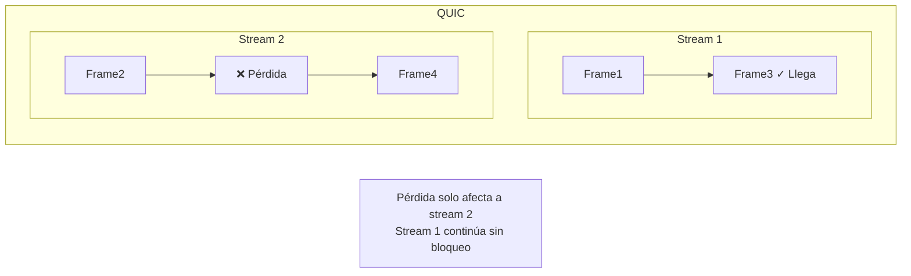

# Protocolos HTTP: HTTP/1.1, HTTP/2 y gRPC

---

**Módulo**: 1 - Fundamentos de Redes
**Tema**: Protocolos HTTP
**Tiempo estimado**: 3 horas
**Prerrequisitos**: [01_modelo_osi.md](01_modelo_osi.md), [02_tcp_udp.md](02_tcp_udp.md)

---

## Objetivos de Aprendizaje

Al completar este documento:

- Entenderás las diferencias entre HTTP/1.1 y HTTP/2
- Comprenderás cómo gRPC usa HTTP/2
- Sabrás qué es multiplexing y por qué importa
- Identificarás cómo Envoy maneja diferentes versiones de HTTP

---

## 1. HTTP/1.1

### 1.1 Estructura de un Request



**Componentes**:

- **Method**: GET, POST, PUT, DELETE, PATCH, etc.
- **Path**: `/api/users?limit=10` (incluyendo query parameters)
- **Version**: `HTTP/1.1`
- **Headers**: Clave-valor separados por `:`
- **Body**: Datos opcionales (común en POST/PUT)

### 1.2 Estructura de un Response



**Status Codes Comunes**:
| Código | Significado | Uso en Proxies |
|--------|-------------|----------------|
| 200 | OK | Request exitoso |
| 301/302 | Redirect | Proxy puede seguir o devolver |
| 400 | Bad Request | Error de cliente |
| 401 | Unauthorized | JWT inválido, sin auth |
| 403 | Forbidden | Auth OK pero sin permiso |
| 404 | Not Found | Ruta no existe |
| 429 | Too Many Requests | Rate limiting |
| 500 | Internal Error | Error en upstream |
| 502 | Bad Gateway | Upstream no responde |
| 503 | Service Unavailable | Upstream no disponible |
| 504 | Gateway Timeout | Timeout hacia upstream |

### 1.3 Limitaciones de HTTP/1.1

**Head-of-Line Blocking**:



**Soluciones en HTTP/1.1**:

- **Múltiples conexiones TCP**: Los navegadores abren 6+ conexiones por dominio
- **Pipelining**: Enviar requests sin esperar responses (poco usado, problemas de compatibilidad)
- **Keep-Alive**: Reutilizar conexión para múltiples requests secuenciales

**Connection Keep-Alive**:

```
# Request
GET /page1 HTTP/1.1
Host: example.com
Connection: keep-alive

# Response
HTTP/1.1 200 OK
Connection: keep-alive

# Segunda request en misma conexión
GET /page2 HTTP/1.1
...
```

---

## 2. HTTP/2

### 2.1 Mejoras sobre HTTP/1.1

| Característica     | HTTP/1.1             | HTTP/2         |
| ------------------ | -------------------- | -------------- |
| Formato            | Texto                | Binario        |
| Multiplexing       | No                   | Sí             |
| Header compression | No                   | HPACK          |
| Server push        | No                   | Sí             |
| Conexiones         | Múltiples necesarias | Una suficiente |

### 2.2 Conceptos Fundamentales de HTTP/2

**Frame**: Unidad mínima de comunicación



**Stream**: Secuencia bidireccional de frames dentro de una conexión



### 2.3 Multiplexing en Detalle



*Requests y responses intercalados en la misma conexión*

**Beneficio**: Si Response 1 es lento, Response 2 y 3 pueden llegar antes.

### 2.4 HPACK: Header Compression

HTTP headers son muy repetitivos. HPACK los comprime:

**Static Table**: Headers comunes predefinidos

```
Index  Header Name                 Header Value
1      :authority
2      :method                     GET
3      :method                     POST
4      :path                       /
5      :path                       /index.html
...
```

**Dynamic Table**: Headers específicos de la sesión

```
Request 1:
  :method: GET                    → Índice 2
  :path: /api/users               → Literal (se añade a tabla)
  authorization: Bearer eyJ...    → Literal

Request 2:
  :method: GET                    → Índice 2
  :path: /api/users               → Índice de tabla dinámica
  authorization: Bearer eyJ...    → Índice de tabla dinámica
                                    (si es el mismo token)
```

### 2.5 Pseudo-Headers

HTTP/2 usa pseudo-headers (prefijo `:`) en lugar de la request line:

```
HTTP/1.1:                       HTTP/2:
GET /api/users HTTP/1.1         :method: GET
Host: api.example.com           :path: /api/users
                                :scheme: https
                                :authority: api.example.com
```

---

## 3. gRPC

### 3.1 ¿Qué es gRPC?

gRPC es un framework RPC (Remote Procedure Call) que usa:

- **HTTP/2** como transporte
- **Protocol Buffers** (protobuf) para serialización



### 3.2 Definición de Servicio (.proto)

```protobuf
syntax = "proto3";

package user.v1;

service UserService {
  // Unary RPC
  rpc GetUser(GetUserRequest) returns (GetUserResponse);

  // Server streaming
  rpc ListUsers(ListUsersRequest) returns (stream User);

  // Client streaming
  rpc CreateUsers(stream CreateUserRequest) returns (CreateUsersResponse);

  // Bidirectional streaming
  rpc Chat(stream ChatMessage) returns (stream ChatMessage);
}

message GetUserRequest {
  string user_id = 1;
}

message GetUserResponse {
  User user = 1;
}

message User {
  string id = 1;
  string name = 2;
  string email = 3;
}
```

### 3.3 Cómo gRPC Usa HTTP/2

```
POST /user.v1.UserService/GetUser HTTP/2
content-type: application/grpc
grpc-encoding: identity
grpc-accept-encoding: identity,gzip

[5-byte header][protobuf message bytes]

Response:
HTTP/2 200
content-type: application/grpc
grpc-status: 0
grpc-message:

[5-byte header][protobuf response bytes]
```

**El path gRPC**: `/package.Service/Method`

**Content-Type**: `application/grpc` o `application/grpc+proto`

**Trailers**: gRPC usa trailers HTTP/2 para `grpc-status` (el status real de la llamada)

### 3.4 Tipos de RPC en gRPC



---

## 4. HTTP/2 y gRPC en Envoy

### 4.1 HTTP Connection Manager

Envoy usa `HttpConnectionManager` para manejar HTTP:

```
source/common/http/conn_manager_impl.h:60
```

Este componente:

1. Detecta versión HTTP (HTTP/1.1, HTTP/2)
2. Parsea requests usando el codec apropiado
3. Crea streams para cada request
4. Ejecuta la filter chain

### 4.2 Codecs HTTP

```
source/common/http/http1/codec_impl.cc   → HTTP/1.1 codec
source/common/http/http2/codec_impl.cc   → HTTP/2 codec
```

**Auto-detection**:

- Por ALPN en TLS handshake (`h2` para HTTP/2)
- Por prefijo de conexión para HTTP/2 (`PRI * HTTP/2.0`)

### 4.3 Configuración de HTTP/2 en Envoy

```yaml
listeners:
  - name: http_listener
    address:
      socket_address:
        address: 0.0.0.0
        port_value: 10000
    filter_chains:
      - filters:
          - name: envoy.filters.network.http_connection_manager
            typed_config:
              "@type": type.googleapis.com/envoy.extensions.filters.network.http_connection_manager.v3.HttpConnectionManager
              codec_type: AUTO # Detecta HTTP/1.1 o HTTP/2
              # O explícitamente:
              # codec_type: HTTP2
```

### 4.4 gRPC Transcoding

Envoy puede convertir HTTP/JSON a gRPC:

```yaml
http_filters:
  - name: envoy.filters.http.grpc_json_transcoder
    typed_config:
      "@type": type.googleapis.com/envoy.extensions.filters.http.grpc_json_transcoder.v3.GrpcJsonTranscoder
      proto_descriptor: /path/to/descriptor.pb
      services: ["user.v1.UserService"]
```

Esto permite:

```
# HTTP/JSON Request
POST /v1/users/123 HTTP/1.1
Content-Type: application/json

{"name": "John"}

# Se convierte a gRPC
POST /user.v1.UserService/GetUser
content-type: application/grpc
[protobuf bytes]
```

---

## 5. HTTP/3 y QUIC (Brevemente)

### 5.1 Motivación

HTTP/2 todavía tiene head-of-line blocking a nivel TCP:



### 5.2 QUIC

QUIC es un protocolo de transporte sobre UDP que:

- Tiene streams independientes (sin HOL blocking entre streams)
- Integra TLS 1.3
- Tiene 0-RTT connection establishment



**En Envoy**:

```
source/common/quic/
```

---

## 6. Ejercicios Prácticos

### Ejercicio 1: Comparar HTTP/1.1 vs HTTP/2

```bash
# HTTP/1.1
curl -v --http1.1 https://example.com/

# HTTP/2
curl -v --http2 https://example.com/
```

Observa las diferencias en los headers y el protocolo.

### Ejercicio 2: Ver Multiplexing con nghttp

```bash
# Instalar nghttp2
sudo dnf install nghttp2

# Hacer múltiples requests en una conexión
nghttp -nv https://example.com/ https://example.com/page1 https://example.com/page2
```

### Ejercicio 3: Inspeccionar gRPC con grpcurl

```bash
# Listar servicios
grpcurl -plaintext localhost:50051 list

# Describir servicio
grpcurl -plaintext localhost:50051 describe user.v1.UserService

# Llamar método
grpcurl -plaintext -d '{"user_id": "123"}' localhost:50051 user.v1.UserService/GetUser
```

---

## 7. Autoevaluación

1. ¿Qué es head-of-line blocking y cómo HTTP/2 lo resuelve?
2. ¿Qué es un stream en HTTP/2?
3. ¿Por qué gRPC usa HTTP/2 y no HTTP/1.1?
4. ¿Qué diferencia hay entre `grpc-status` y el status HTTP?
5. ¿Cómo detecta Envoy si una conexión es HTTP/1.1 o HTTP/2?

---

## 8. Referencias en el Código

### Envoy

| Archivo                                                | Descripción             |
| ------------------------------------------------------ | ----------------------- |
| `source/common/http/conn_manager_impl.h:60`            | HTTP Connection Manager |
| `source/common/http/http1/codec_impl.cc`               | HTTP/1.1 codec          |
| `source/common/http/http2/codec_impl.cc`               | HTTP/2 codec            |
| `source/extensions/filters/http/grpc_json_transcoder/` | gRPC transcoding        |
| `source/common/quic/`                                  | QUIC/HTTP/3             |

---

**Siguiente**: [04_tls_mtls.md](04_tls_mtls.md) - TLS y mTLS
