# TLS y mTLS: Seguridad en la Capa de Transporte

---

**Módulo**: 1 - Fundamentos de Redes
**Tema**: TLS y mTLS
**Tiempo estimado**: 2 horas
**Prerrequisitos**: [02_tcp_udp.md](02_tcp_udp.md), [03_http_protocols.md](03_http_protocols.md)

---

## Objetivos de Aprendizaje

Al completar este documento:

- Entenderás cómo funciona TLS y el proceso de handshake
- Comprenderás la diferencia entre TLS y mTLS
- Sabrás qué son los certificados X.509 y SPIFFE
- Identificarás cómo Envoy y ztunnel implementan TLS/mTLS

---

## 1. TLS: Transport Layer Security

### 1.1 ¿Qué es TLS?

TLS (Transport Layer Security) proporciona:

| Propiedad            | Descripción                                                  |
| -------------------- | ------------------------------------------------------------ |
| **Confidencialidad** | Los datos están cifrados, solo el receptor puede leerlos     |
| **Integridad**       | Los datos no pueden ser modificados sin detección            |
| **Autenticación**    | El servidor (y opcionalmente el cliente) prueba su identidad |

**TLS en el Modelo OSI**:

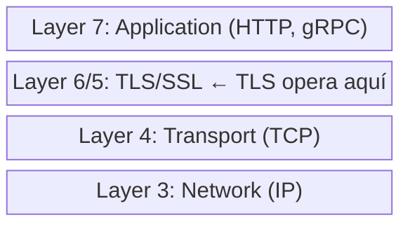

### 1.2 El Handshake TLS 1.2

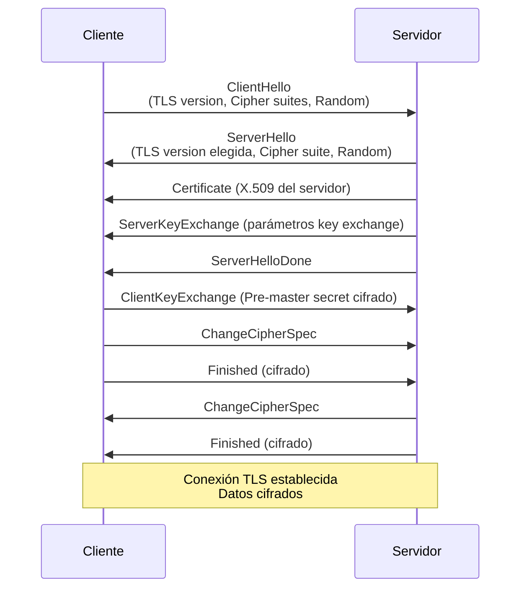

### 1.3 El Handshake TLS 1.3 (Simplificado)

TLS 1.3 reduce el handshake a 1-RTT:

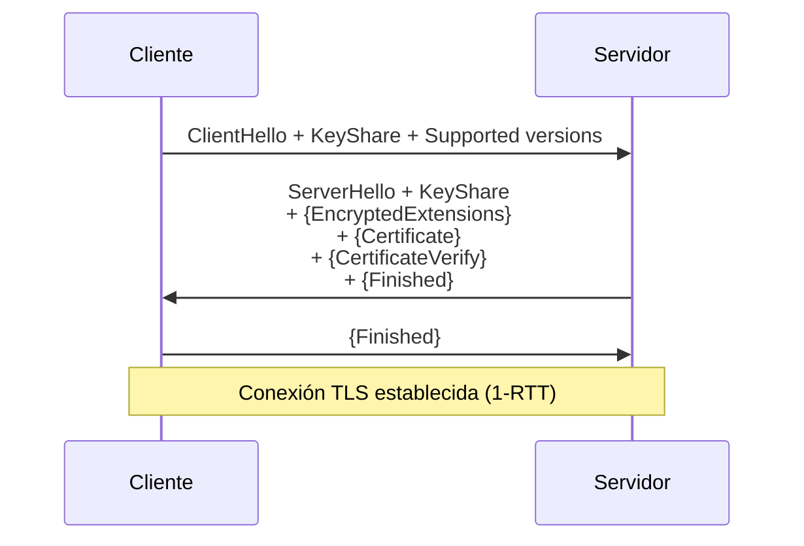

**Ventajas de TLS 1.3**:

- 1-RTT para nuevo handshake (vs 2-RTT en TLS 1.2)
- 0-RTT posible para reconexiones
- Solo cipher suites seguros
- Mejor forward secrecy

### 1.4 Cipher Suites

Un cipher suite define los algoritmos usados:

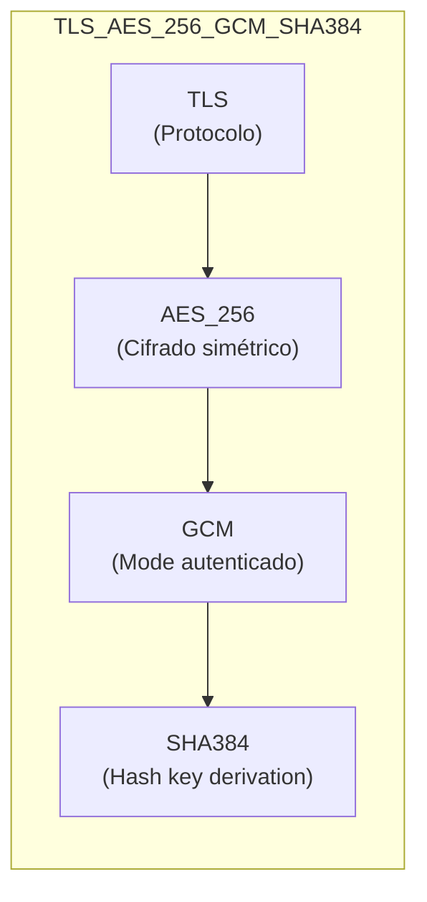

**ztunnel** usa solo TLS 1.3 con:

- `TLS13_AES_256_GCM_SHA384`
- `TLS13_AES_128_GCM_SHA256`

---

## 2. Certificados X.509

### 2.1 Estructura de un Certificado

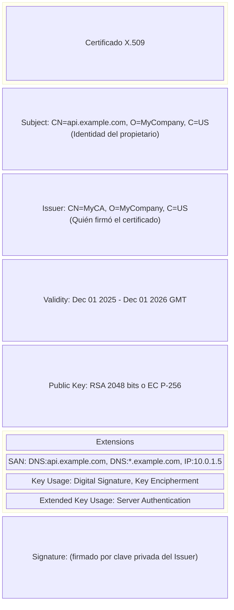

### 2.2 Cadena de Confianza

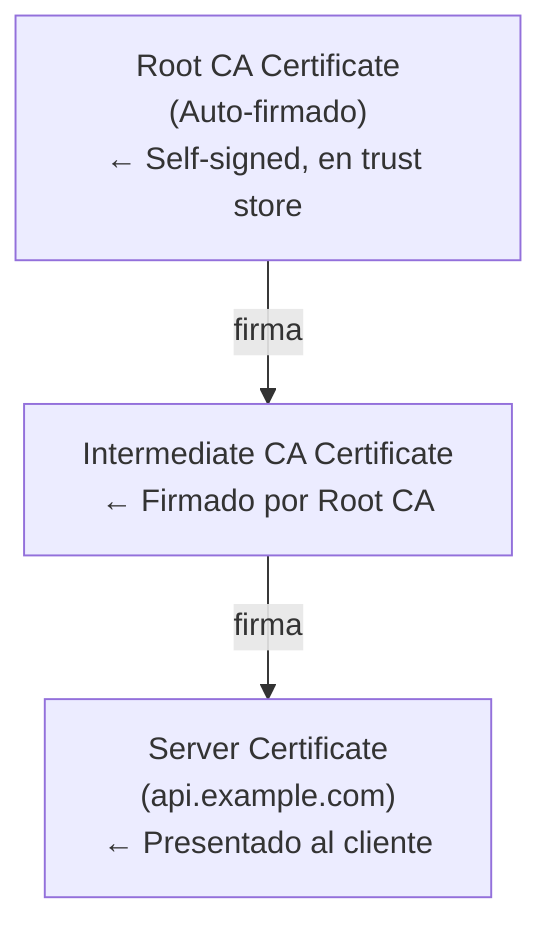

**Verificación**:

1. Cliente recibe certificado del servidor
2. Verifica firma con clave pública del Intermediate CA
3. Verifica firma del Intermediate con clave del Root CA
4. Root CA está en el trust store del cliente → ¡Confianza establecida!

---

## 3. mTLS: Mutual TLS

### 3.1 ¿Qué es mTLS?

En TLS estándar, solo el **servidor** presenta certificado. En mTLS, **ambas partes** lo hacen:

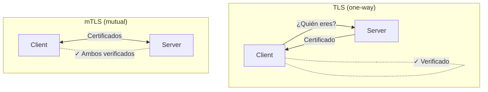

### 3.2 Handshake mTLS

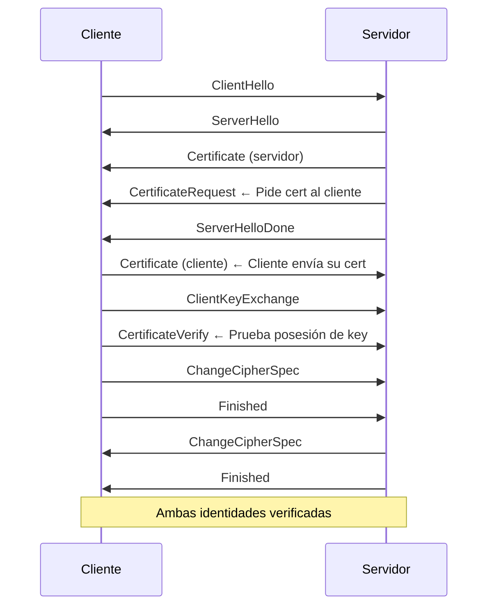

### 3.3 ¿Por qué mTLS en Service Mesh?

En un service mesh:

- Múltiples servicios se comunican entre sí
- Necesitamos autenticar **ambas partes** de cada conexión
- mTLS proporciona:
  - Identidad verificable del cliente y servidor
  - Cifrado de datos en tránsito
  - Base para políticas de autorización

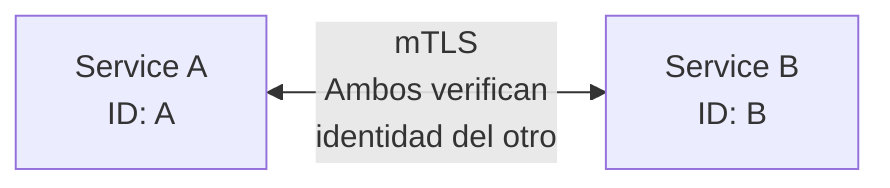

---

## 4. SPIFFE: Identidades para Workloads

### 4.1 ¿Qué es SPIFFE?

**SPIFFE** (Secure Production Identity Framework For Everyone) define un estándar para identidades de workloads.

**SPIFFE ID**: URI que identifica un workload

```
spiffe://trust-domain/path

Ejemplos:
spiffe://cluster.local/ns/default/sa/frontend
spiffe://cluster.local/ns/payments/sa/api
```

**SVID** (SPIFFE Verifiable Identity Document): Certificado X.509 con SPIFFE ID en el SAN:

```
Subject Alternative Names:
  URI: spiffe://cluster.local/ns/default/sa/frontend
```

### 4.2 SPIFFE en Istio/ztunnel

Istio usa SPIFFE para identidades de workloads:

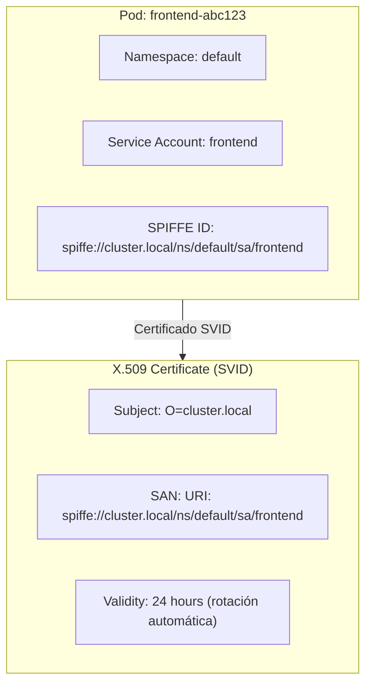

### 4.3 ztunnel e Identidades

ztunnel gestiona certificados **en nombre de los workloads**:

```
ztunnel/src/identity/
```

**Flujo**:

1. Pod se inicia en el nodo
2. ztunnel solicita SVID para el pod a istiod
3. ztunnel almacena el certificado
4. Cuando pod hace conexión outbound, ztunnel usa su certificado
5. Cuando llega conexión inbound, ztunnel valida el certificado del peer

**De `ARCHITECTURE.md`**:

> Ztunnel's own identity is never used for mTLS connections between workloads.
> The certificates will be of the actual user workloads, not Ztunnel's own identity.

---

## 5. TLS en Envoy

### 5.1 TLS Termination

Envoy puede terminar TLS:

```yaml
listeners:
  - name: https_listener
    address:
      socket_address:
        address: 0.0.0.0
        port_value: 443
    filter_chains:
      - transport_socket:
          name: envoy.transport_sockets.tls
          typed_config:
            "@type": type.googleapis.com/envoy.extensions.transport_sockets.tls.v3.DownstreamTlsContext
            common_tls_context:
              tls_certificates:
                - certificate_chain:
                    filename: /etc/certs/server.crt
                  private_key:
                    filename: /etc/certs/server.key
```

**Código**:

```
source/extensions/transport_sockets/tls/ssl_socket.cc
source/extensions/transport_sockets/tls/context_impl.cc
```

### 5.2 mTLS en Envoy

Para requerir certificado del cliente:

```yaml
transport_socket:
  name: envoy.transport_sockets.tls
  typed_config:
    "@type": type.googleapis.com/envoy.extensions.transport_sockets.tls.v3.DownstreamTlsContext
    require_client_certificate: true # ← Requiere mTLS
    common_tls_context:
      validation_context:
        trusted_ca:
          filename: /etc/certs/ca.crt # ← CA para validar cliente
      tls_certificates:
        - certificate_chain:
            filename: /etc/certs/server.crt
          private_key:
            filename: /etc/certs/server.key
```

### 5.3 SNI y Filter Chain Matching

Envoy puede seleccionar certificados basado en SNI:

```yaml
filter_chains:
  - filter_chain_match:
      server_names: ["api.example.com"]
    transport_socket:
      # Certificado para api.example.com
  - filter_chain_match:
      server_names: ["web.example.com"]
    transport_socket:
      # Certificado para web.example.com
```

**SNI** (Server Name Indication): El cliente indica el hostname en el ClientHello, permitiendo:

- Un IP/puerto → múltiples certificados
- Virtual hosting con TLS

---

## 6. TLS en ztunnel

### 6.1 Rustls

ztunnel usa **rustls** (TLS en Rust puro):

```
README.md:
Ztunnel's TLS is built on rustls.
```

**Providers de crypto soportados**:

- aws-lc (default)
- ring
- boring (FIPS)
- openssl

### 6.2 HBONE y TLS

HBONE es HTTP/2 CONNECT sobre mTLS:

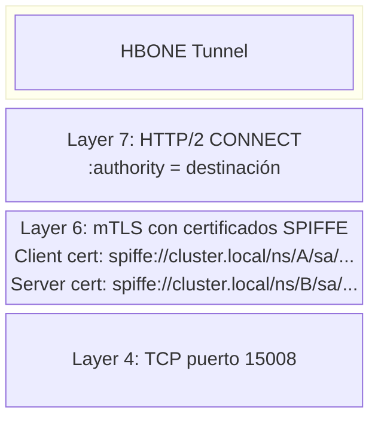

---

## 7. Ejercicios Prácticos

### Ejercicio 1: Ver Certificado de un Servidor

```bash
# Ver certificado
openssl s_client -connect example.com:443 -showcerts

# Ver detalles del certificado
echo | openssl s_client -connect example.com:443 2>/dev/null | \
  openssl x509 -text -noout
```

### Ejercicio 2: Verificar Cadena de Confianza

```bash
# Descargar certificado
echo | openssl s_client -connect example.com:443 2>/dev/null | \
  openssl x509 -out server.crt

# Verificar contra CA conocida
openssl verify -CAfile /etc/ssl/certs/ca-certificates.crt server.crt
```

### Ejercicio 3: Generar Certificados de Prueba

```bash
# Generar CA
openssl genrsa -out ca.key 4096
openssl req -new -x509 -days 365 -key ca.key -out ca.crt \
  -subj "/CN=Test CA"

# Generar certificado de servidor
openssl genrsa -out server.key 2048
openssl req -new -key server.key -out server.csr \
  -subj "/CN=localhost"
openssl x509 -req -days 365 -in server.csr -CA ca.crt -CAkey ca.key \
  -CAcreateserial -out server.crt
```

---

## 8. Autoevaluación

1. ¿Cuál es la diferencia principal entre TLS y mTLS?
2. ¿Qué es un SPIFFE ID y cómo se relaciona con los certificados?
3. ¿Por qué ztunnel usa los certificados de los workloads y no su propia identidad?
4. ¿Qué ventajas tiene TLS 1.3 sobre TLS 1.2?
5. ¿Cómo puede Envoy servir múltiples certificados en un solo listener?

---

## 9. Referencias en el Código

### Envoy

| Archivo                                                   | Descripción         |
| --------------------------------------------------------- | ------------------- |
| `source/extensions/transport_sockets/tls/ssl_socket.cc`   | Socket TLS          |
| `source/extensions/transport_sockets/tls/context_impl.cc` | Contexto TLS        |
| `source/extensions/transport_sockets/tls/cert_validator/` | Validación de certs |

### ztunnel

| Archivo           | Descripción                   |
| ----------------- | ----------------------------- |
| `src/identity/`   | Gestión de identidades SPIFFE |
| `README.md`       | Proveedores TLS soportados    |
| `ARCHITECTURE.md` | Flujo de certificados         |

---

**Siguiente Módulo**: [../02_proxies_conceptos/01_que_es_proxy.md](../02_proxies_conceptos/01_que_es_proxy.md) - ¿Qué es un Proxy?
