# ¿Qué es un Proxy de Red?

---

**Módulo**: 2 - Proxies - Conceptos Fundamentales
**Tema**: Introducción a Proxies
**Tiempo estimado**: 2 horas
**Prerrequisitos**: Módulo 1 completo

---

## Objetivos de Aprendizaje

Al completar este documento:

- Entenderás qué es un proxy y por qué existen
- Diferenciarás entre forward y reverse proxy
- Comprenderás los casos de uso principales
- Identificarás dónde encajan Envoy y ztunnel

---

## 1. Definición de Proxy

### 1.1 Concepto Básico

Un **proxy** es un intermediario que actúa en nombre de otro. En redes, un proxy de red es un servidor que recibe requests de clientes y los reenvía a servidores destino:

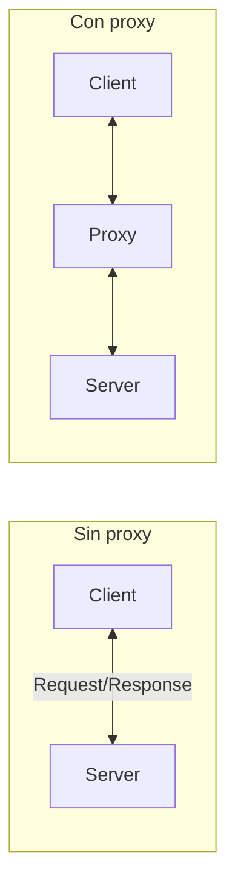

**El proxy puede:**
- Inspeccionar tráfico
- Modificar requests/responses
- Cachear contenido
- Aplicar políticas
- Agregar observabilidad

### 1.2 ¿Por Qué Usar un Proxy?

| Objetivo               | Descripción                          | Ejemplo                      |
| ---------------------- | ------------------------------------ | ---------------------------- |
| **Seguridad**          | Cifrado, autenticación, autorización | mTLS, JWT validation         |
| **Observabilidad**     | Métricas, logs, traces               | Request latency, error rates |
| **Resiliencia**        | Retries, circuit breakers, timeouts  | Failover automático          |
| **Control de tráfico** | Rate limiting, load balancing        | Proteger backends            |
| **Transformación**     | Modificar headers, body, protocol    | gRPC-JSON transcoding        |
| **Caché**              | Almacenar responses frecuentes       | Reducir carga upstream       |

---

## 2. Tipos de Proxies

### 2.1 Forward Proxy (Proxy Directo)

El cliente conoce el proxy y lo configura explícitamente:

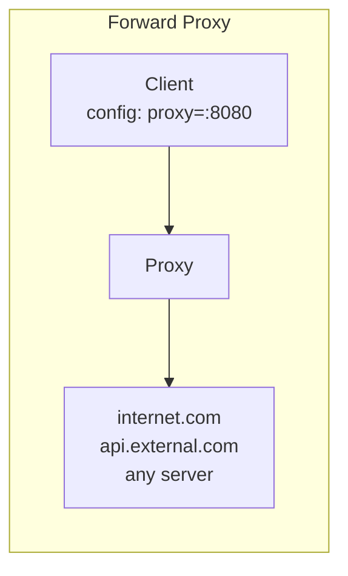

**Casos de uso:**
- Filtrado de contenido
- Control de acceso a internet
- Anonimizar origen
- Caché corporativo

**Ejemplos**: Squid, Proxy corporativo

### 2.2 Reverse Proxy (Proxy Inverso)

Los clientes no saben que hay un proxy; creen hablar directamente con el servidor:

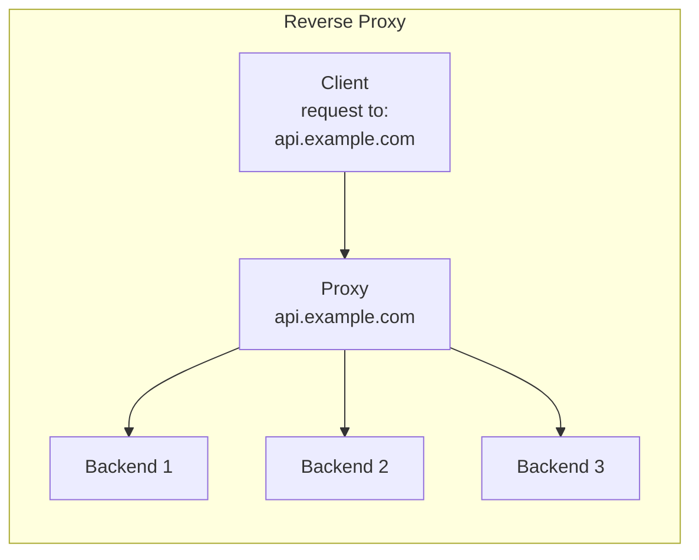

**Casos de uso:**
- Load balancing
- SSL termination
- API Gateway
- Proteger backends
- Service Mesh sidecar

**Ejemplos**: Nginx, HAProxy, Envoy, ztunnel

**Envoy y ztunnel son principalmente reverse proxies**, aunque Envoy puede actuar como forward proxy también.

### 2.3 Transparent Proxy (Proxy Transparente)

El tráfico se redirige al proxy sin que el cliente lo sepa o configure:

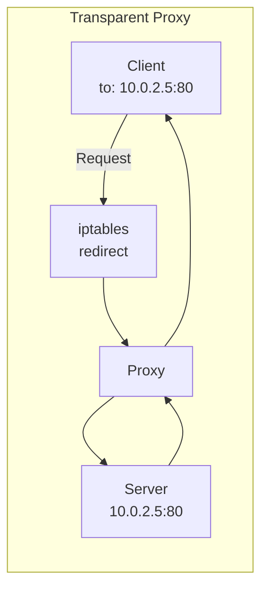

**Mecanismo:**
- iptables/netfilter
- TPROXY
- Network namespace manipulation

**Usado por:**
- ztunnel (Istio ambient)
- Istio sidecar (iptables redirect)

**ztunnel usa transparent proxying**:

```
ARCHITECTURE.md:
| 15001 | Pod outbound traffic capture  | Y |
| 15006 | Pod inbound plaintext capture | Y |
```

Las reglas iptables redirigen el tráfico de los pods al ztunnel sin que los pods lo sepan.

---

## 3. Proxy en el Contexto de Service Mesh

### 3.1 Sidecar Proxy (Modelo Tradicional)

Cada pod tiene su propio proxy sidecar:

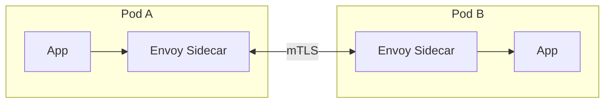

*localhost:8080 → localhost:15001*

**Ventajas**:

- Aislamiento por workload
- L7 completo por pod

**Desventajas**:

- Un Envoy por pod = alto overhead
- Mucha memoria/CPU en clusters grandes

### 3.2 Node Proxy (Ambient Mode)

Un proxy por nodo para todos los pods:

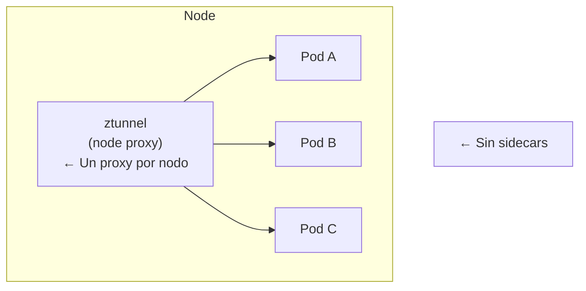

**Ventajas**:

- Mucho menor overhead (1 ztunnel por nodo vs N sidecars)
- L4 eficiente para todos

**Desventajas**:

- Solo L4 (necesita waypoint para L7)

---

## 4. Funciones Principales de un Proxy

### 4.1 Load Balancing

Distribuir tráfico entre múltiples backends:

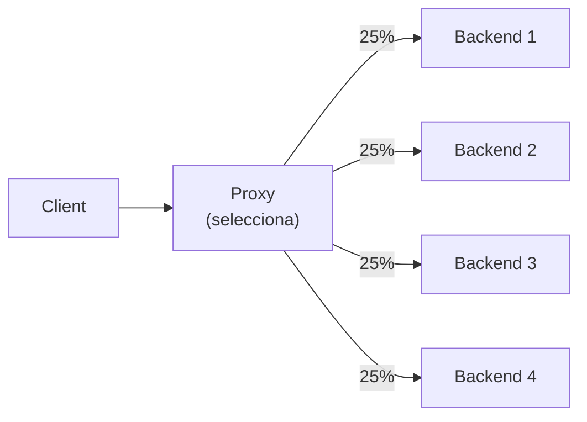

**Algoritmos**:

- **Round Robin**: Rotación circular
- **Least Connections**: Al backend con menos conexiones activas
- **Random**: Selección aleatoria
- **Ring Hash**: Consistent hashing (útil para caché)
- **Weighted**: Por pesos asignados

**En Envoy**:

```
source/common/upstream/load_balancer_impl.cc
```

### 4.2 Health Checking

Verificar que los backends estén sanos:

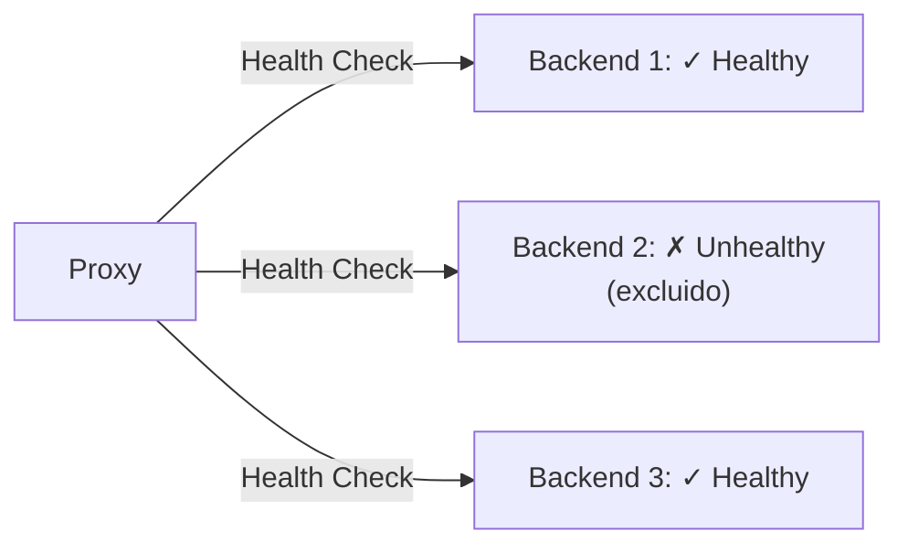

*Tráfico solo va a 1 y 3*

**Tipos**:

- **Active**: El proxy envía requests de prueba
- **Passive**: Detecta fallos en tráfico real (outlier detection)

**En Envoy**:

```
source/common/upstream/health_checker_impl.cc
```

### 4.3 Circuit Breaking

Proteger backends sobrecargados:

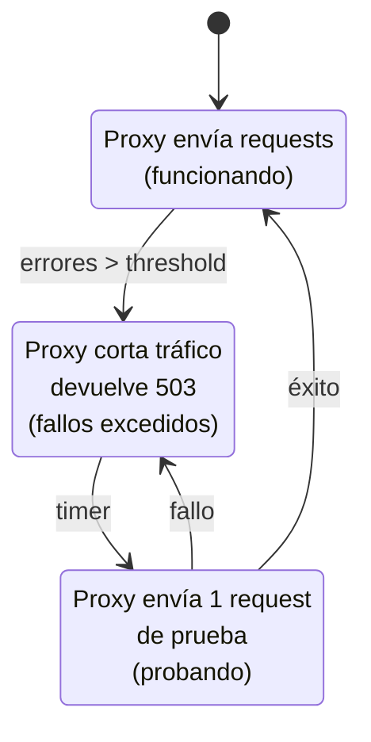

### 4.4 Retry y Timeout

Manejo de fallos transitorios:

```yaml
# Configuración Envoy
route_config:
  virtual_hosts:
    - routes:
        - route:
            timeout: 30s # Timeout total
            retry_policy:
              retry_on: "5xx,reset"
              num_retries: 3
              per_try_timeout: 10s
```

### 4.5 Observabilidad

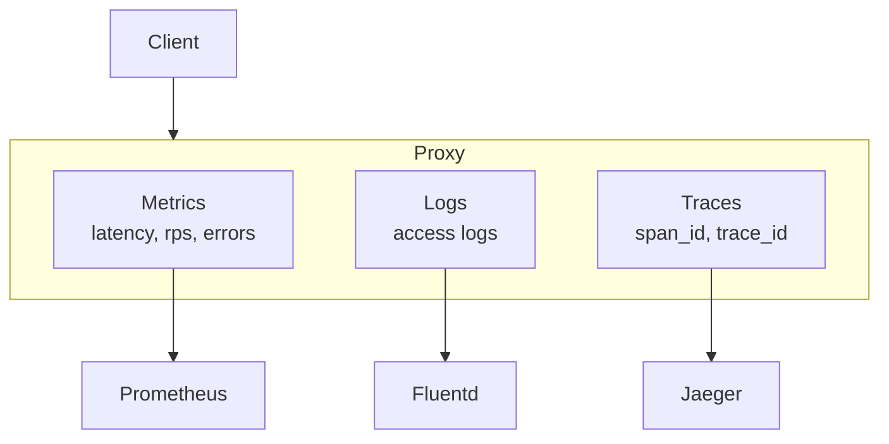

---

## 5. Envoy vs ztunnel: Posicionamiento

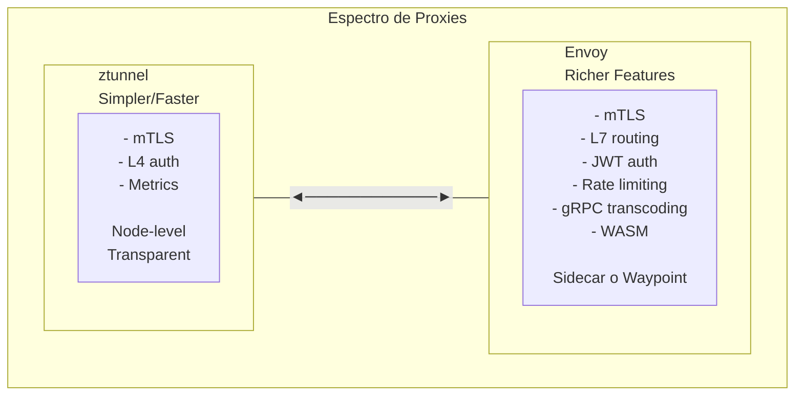

---

## 6. Ejercicio de Reflexión

### Pregunta 1

Una empresa necesita:

- Load balancing entre 10 backends
- Health checks
- Métricas de latencia
- Sin modificar el código de las aplicaciones

¿Qué tipo de proxy usarían y por qué?

<details>
<summary>Respuesta</summary>

Un **reverse proxy** porque:

- Transparente para las aplicaciones (no necesitan código)
- Centraliza load balancing y health checks
- Puede exportar métricas sin cambios en apps
- Ejemplos: Nginx, HAProxy, Envoy

</details>

### Pregunta 2

Un cluster Kubernetes tiene 500 pods y necesita mTLS entre todos. ¿Qué modelo es más eficiente?

<details>
<summary>Respuesta</summary>

**Node proxy (ztunnel)** porque:

- 500 sidecars = alto overhead de memoria
- Si hay 50 nodos, solo 50 ztunnels
- Para solo mTLS, L4 es suficiente
- L7 (waypoint) solo donde se necesite

</details>

---

## 7. Autoevaluación

1. ¿Cuál es la diferencia entre forward y reverse proxy?
2. ¿Qué es un transparent proxy y cómo funciona?
3. ¿Por qué un service mesh usa proxies?
4. ¿Qué ventaja tiene el modelo node proxy sobre sidecars?
5. Nombra 3 funciones que realiza un proxy.

---

**Siguiente**: [02_proxy_l4.md](02_proxy_l4.md) - Proxy Layer 4 en Profundidad
