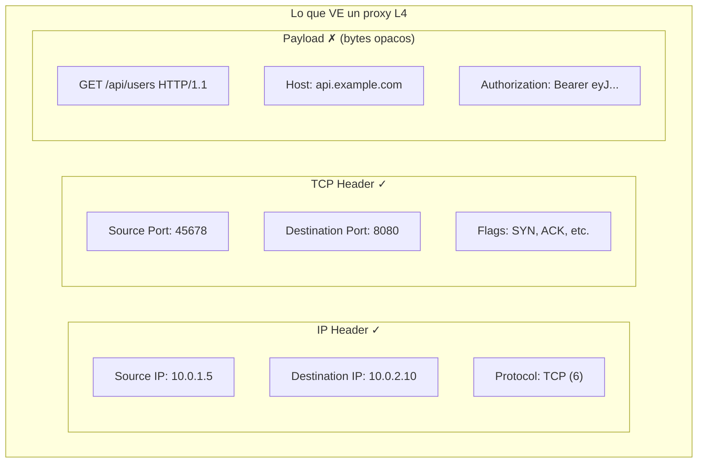
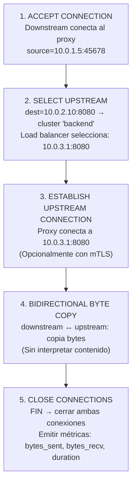
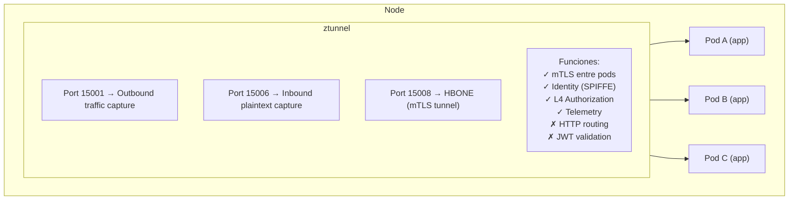
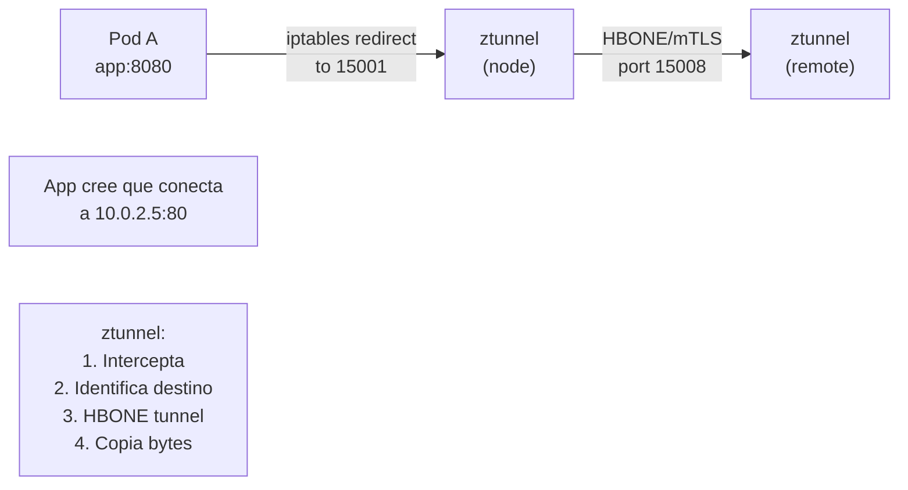
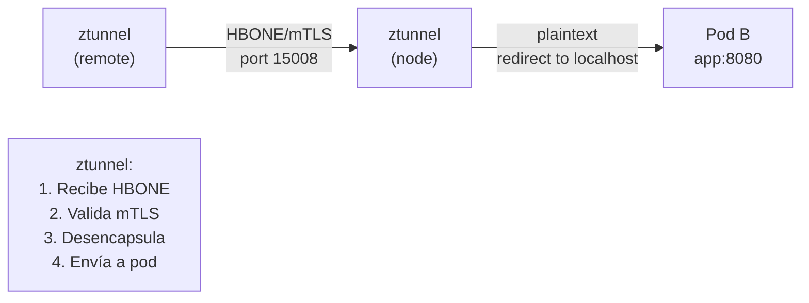

# Proxy Layer 4 en Profundidad

---

**Módulo**: 2 - Proxies - Conceptos Fundamentales
**Tema**: Proxy L4
**Tiempo estimado**: 2 horas
**Prerrequisitos**: [01_que_es_proxy.md](01_que_es_proxy.md)

---

## Objetivos de Aprendizaje

Al completar este documento:

- Entenderás cómo opera un proxy L4
- Sabrás qué decisiones puede tomar y cuáles no
- Comprenderás el modelo de ztunnel como proxy L4
- Identificarás casos de uso ideales para L4

---

## 1. Características de un Proxy L4

### 1.1 Qué "Ve" un Proxy L4

Un proxy L4 opera en la **capa de transporte** del modelo OSI. Solo tiene acceso a:



*(El proxy L4 no entiende HTTP, solo ve bytes)*

### 1.2 Qué Puede y No Puede Hacer

| Capacidad                         | Proxy L4 | Por qué                     |
| --------------------------------- | -------- | --------------------------- |
| **Routing por IP/puerto**         | ✓        | Visible en headers L3/L4    |
| **mTLS**                          | ✓        | TLS opera en L4/L5          |
| **Connection-level metrics**      | ✓        | Bytes, conexiones, latencia |
| **Load balancing**                | ✓        | Puede seleccionar backend   |
| **Routing por URL path**          | ✗        | Path está en payload HTTP   |
| **Routing por header**            | ✗        | Headers están en payload    |
| **JWT validation**                | ✗        | JWT está en payload         |
| **gRPC method routing**           | ✗        | Método está en HTTP headers |
| **Request/response modification** | ✗        | No entiende el protocolo    |

### 1.3 El Flujo de un Proxy L4



---

## 2. ztunnel como Proxy L4

### 2.1 Arquitectura de ztunnel

ztunnel es un **proxy L4 puro** diseñado específicamente para Istio ambient mode:



### 2.2 Flujo de Tráfico en ztunnel

**Outbound (Pod → External)**:



**Inbound (External → Pod)**:



### 2.3 Código de ztunnel

El core del proxy está en:

```
src/proxy/
```

**Estructura típica de un proxy L4 en Rust**:

```rust
// Pseudocódigo conceptual
async fn handle_connection(downstream: TcpStream) -> Result<()> {
    // 1. Determinar destino original
    let original_dest = get_original_dest(&downstream)?;

    // 2. Establecer conexión upstream con mTLS
    let upstream = if is_in_mesh(&original_dest) {
        establish_hbone_connection(original_dest).await?
    } else {
        TcpStream::connect(original_dest).await?
    };

    // 3. Copiar bytes bidireccionalmente
    let (dr, dw) = downstream.split();
    let (ur, uw) = upstream.split();

    tokio::select! {
        r = tokio::io::copy(dr, uw) => r?,
        r = tokio::io::copy(ur, dw) => r?,
    }

    // 4. Emitir métricas
    emit_metrics(bytes_sent, bytes_received, duration);

    Ok(())
}
```

---

## 3. TCP Proxy en Envoy

Envoy también puede actuar como proxy L4 usando el filtro `tcp_proxy`:

### 3.1 Configuración

```yaml
static_resources:
  listeners:
    - name: tcp_listener
      address:
        socket_address:
          address: 0.0.0.0
          port_value: 10000
      filter_chains:
        - filters:
            - name: envoy.filters.network.tcp_proxy
              typed_config:
                "@type": type.googleapis.com/envoy.extensions.filters.network.tcp_proxy.v3.TcpProxy
                stat_prefix: tcp_stats
                cluster: backend_cluster

  clusters:
    - name: backend_cluster
      connect_timeout: 5s
      type: STATIC
      load_assignment:
        cluster_name: backend_cluster
        endpoints:
          - lb_endpoints:
              - endpoint:
                  address:
                    socket_address:
                      address: 10.0.1.5
                      port_value: 8080
```

### 3.2 Código

```
source/extensions/filters/network/tcp_proxy/tcp_proxy.cc
```

Este filtro:

1. Recibe conexión downstream
2. Selecciona upstream basado en cluster config
3. Conecta a upstream
4. Copia bytes en ambas direcciones
5. Cierra cuando cualquier lado cierra

---

## 4. Casos de Uso Ideales para L4

### 4.1 mTLS Transparente

Cuando solo necesitas cifrado sin L7:

```mermaid
flowchart LR
    A["App A<br/>HTTP, gRPC, Redis"] <-->|mTLS (L4)<br/>Las apps no saben<br/>que hay mTLS| B["App B<br/>HTTP, gRPC, Redis"]
```

### 4.2 Protocolos No-HTTP

Para protocolos que Envoy no parsea nativamente:

| Protocolo     | Proxy L4    | Proxy L7                  |
| ------------- | ----------- | ------------------------- |
| MySQL         | ✓ TCP proxy | Requiere codec específico |
| Redis         | ✓ TCP proxy | Envoy tiene redis_proxy   |
| Kafka         | ✓ TCP proxy | Requiere codec            |
| Custom binary | ✓ TCP proxy | No soportado              |

### 4.3 Alto Rendimiento

Cuando la latencia es crítica:

| Aspecto | L4 Proxy | L7 Proxy |
|---------|----------|----------|
| Parse | IP header + TCP header | IP + TCP + HTTP headers + body |
| Process | Minimal | Filters, routing rules |
| Time | ~microseconds | ~milliseconds |

*Para 1 millón de req/s, la diferencia importa.*

### 4.4 Service Mesh a Escala

| Modelo | Instancias | RAM por instancia | RAM Total |
|--------|------------|-------------------|-----------|
| Sidecar (L7) | 1000 Envoy sidecars | ~100MB | ~100GB |
| Node Proxy (L4) | 50 ztunnels (50 nodos) | ~50MB | ~2.5GB |

*Ahorro: ~97.5% en RAM*

---

## 5. Limitaciones de L4

### 5.1 No Puede Hacer Routing Inteligente

| Request | Lo que L4 ve | Lo que NO puede hacer |
|---------|--------------|----------------------|
| GET /api/v1/users | TCP bytes to 10.0.1.5:8080 | Enviar v1 a cluster-v1 |
| GET /api/v2/users | TCP bytes to 10.0.1.5:8080 | Enviar v2 a cluster-v2 |

*Ambos van al mismo destino porque L4 no entiende el path*

### 5.2 No Puede Validar Auth por Request

| Request | Resultado esperado | L4 puede verificar? |
|---------|-------------------|---------------------|
| Request con JWT válido | ✓ Permitir | ✗ No |
| Request con JWT inválido | ✗ Rechazar | ✗ No |

*Un proxy L4 ve ambos como bytes opacos. No puede rechazar el JWT inválido.*

### 5.3 No Tiene Request-Level Metrics

| Métrica | L7 puede? | L4 puede? |
|---------|-----------|-----------|
| Requests por segundo | ✓ | ✗ |
| Latencia por endpoint | ✓ | ✗ |
| Errores 5xx por path | ✓ | ✗ |
| Bytes por segundo | ✓ | ✓ |
| Conexiones activas | ✓ | ✓ |
| Latencia de conexión | ✓ | ✓ |

---

## 6. Autoevaluación

1. ¿Qué información puede ver un proxy L4 de un paquete?
2. ¿Por qué ztunnel puede hacer mTLS pero no routing por URL?
3. ¿Cuál es el overhead aproximado de un proxy L4 vs L7?
4. ¿Para qué tipo de protocolos es ideal un proxy L4?
5. ¿Qué métrica puede reportar L7 que L4 no puede?

---

## 7. Referencias en el Código

### ztunnel

| Archivo           | Descripción               |
| ----------------- | ------------------------- |
| `src/proxy/`      | Core proxy implementation |
| `ARCHITECTURE.md` | Puertos y flujo           |

### Envoy

| Archivo                                                    | Descripción         |
| ---------------------------------------------------------- | ------------------- |
| `source/extensions/filters/network/tcp_proxy/tcp_proxy.cc` | TCP proxy filter    |
| `source/common/network/connection_impl.h`                  | Connection handling |

---

**Siguiente**: [03_proxy_l7.md](03_proxy_l7.md) - Proxy Layer 7 en Profundidad
