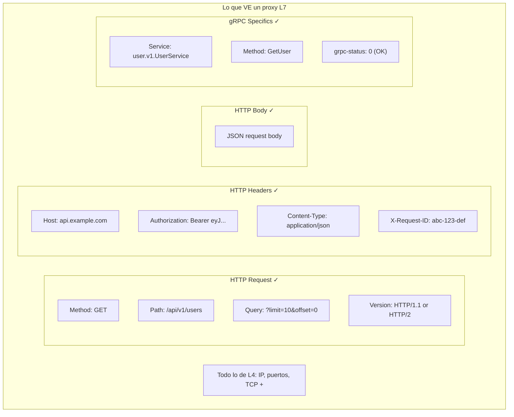
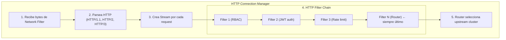
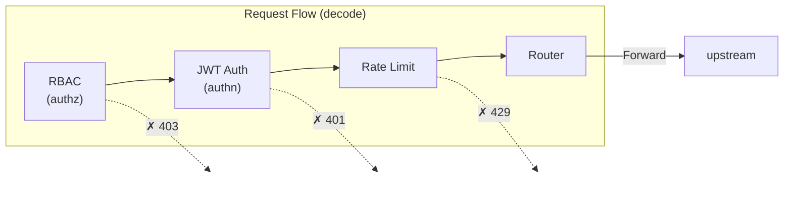
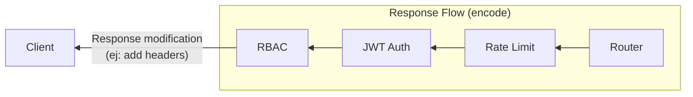
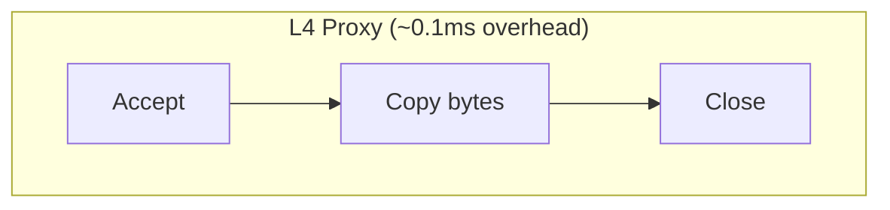
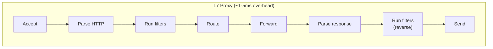

# Proxy Layer 7 en Profundidad

---

**Módulo**: 2 - Proxies - Conceptos Fundamentales
**Tema**: Proxy L7
**Tiempo estimado**: 2 horas
**Prerrequisitos**: [02_proxy_l4.md](02_proxy_l4.md)

---

## Objetivos de Aprendizaje

Al completar este documento:

- Entenderás cómo opera un proxy L7
- Comprenderás el modelo de filter chain
- Sabrás qué funcionalidades habilita L7
- Identificarás casos de uso ideales para Envoy

---

## 1. Características de un Proxy L7

### 1.1 Qué "Ve" un Proxy L7

Un proxy L7 **entiende el protocolo de aplicación**:



### 1.2 Capacidades de un Proxy L7

| Capacidad                           | Descripción                      | Ejemplo                  |
| ----------------------------------- | -------------------------------- | ------------------------ |
| **Content-based routing**           | Ruta según URL, headers          | `/api/v1` → cluster-v1   |
| **Header manipulation**             | Add/remove/modify headers        | Add `X-Request-ID`       |
| **Authentication**                  | Validar tokens                   | JWT, OAuth2              |
| **Authorization**                   | Permitir/denegar por path/método | RBAC                     |
| **Rate limiting**                   | Limitar por user/path            | 100 req/min por API key  |
| **Request/response transformation** | Modificar contenido              | gRPC-JSON transcoding    |
| **Caching**                         | Cachear responses                | Cache GET requests       |
| **Compression**                     | Comprimir responses              | gzip                     |
| **Request-level metrics**           | Métricas por endpoint            | Latencia de `/api/users` |

---

## 2. Envoy como Proxy L7

### 2.1 El HTTP Connection Manager

El corazón del procesamiento L7 en Envoy es el `HttpConnectionManager`:

```
source/common/http/conn_manager_impl.h:60
```



### 2.2 HTTP Filter Chain

Cada request pasa por una cadena de filtros:





### 2.3 Anatomía de un HTTP Filter

```cpp
// Interfaz simplificada
class StreamDecoderFilter {
  // Llamado cuando llegan headers
  FilterHeadersStatus decodeHeaders(RequestHeaderMap& headers, bool end_stream);

  // Llamado cuando llegan datos (body)
  FilterDataStatus decodeData(Buffer::Instance& data, bool end_stream);

  // Llamado cuando llegan trailers
  FilterTrailersStatus decodeTrailers(RequestTrailerMap& trailers);
};

class StreamEncoderFilter {
  // Llamado para response headers
  FilterHeadersStatus encodeHeaders(ResponseHeaderMap& headers, bool end_stream);

  // Llamado para response data
  FilterDataStatus encodeData(Buffer::Instance& data, bool end_stream);
};
```

**Return values**:

- `Continue`: Pasar al siguiente filtro
- `StopIteration`: Pausar procesamiento (ej: esperando respuesta async)
- `StopIterationAndBuffer`: Pausar y bufferar datos

**Código**:

```
source/common/http/filter_manager.cc
envoy/http/filter.h
```

---

## 3. Routing en L7

### 3.1 Route Matching

Envoy puede rutear basado en múltiples criterios:

```yaml
route_config:
  virtual_hosts:
    - name: api
      domains: ["api.example.com"] # Match por Host header
      routes:
        # Match por prefix
        - match:
            prefix: "/api/v1/"
          route:
            cluster: api-v1

        # Match por regex
        - match:
            safe_regex:
              google_re2: {}
              regex: "/users/[0-9]+"
          route:
            cluster: users-service

        # Match por headers
        - match:
            prefix: "/"
            headers:
              - name: "x-api-version"
                exact_match: "beta"
          route:
            cluster: api-beta

        # Match por query params
        - match:
            prefix: "/"
            query_parameters:
              - name: "debug"
                present_match: true
          route:
            cluster: debug-cluster
```

### 3.2 Router Filter

El Router filter es **siempre el último** en la cadena:

```
source/extensions/filters/http/router/router.cc
```

Responsabilidades:

1. Match de ruta según configuración
2. Seleccionar cluster destino
3. Obtener connection del pool
4. Forward request
5. Handle retries, timeouts
6. Return response

---

## 4. Funcionalidades L7 en Detalle

### 4.1 JWT Authentication

```yaml
http_filters:
  - name: envoy.filters.http.jwt_authn
    typed_config:
      "@type": type.googleapis.com/envoy.extensions.filters.http.jwt_authn.v3.JwtAuthentication
      providers:
        my_provider:
          issuer: "https://auth.example.com"
          audiences: ["api.example.com"]
          remote_jwks:
            http_uri:
              uri: "https://auth.example.com/.well-known/jwks.json"
              cluster: auth_cluster
      rules:
        - match:
            prefix: "/api/"
          requires:
            provider_name: my_provider
```

**Código**:

```
source/extensions/filters/http/jwt_authn/
```

### 4.2 Rate Limiting

```yaml
http_filters:
  - name: envoy.filters.http.local_ratelimit
    typed_config:
      "@type": type.googleapis.com/envoy.extensions.filters.http.local_ratelimit.v3.LocalRateLimit
      stat_prefix: http_local_rate_limiter
      token_bucket:
        max_tokens: 100
        tokens_per_fill: 10
        fill_interval: 1s
      filter_enabled:
        runtime_key: local_rate_limit_enabled
        default_value:
          numerator: 100
          denominator: HUNDRED
```

**Código**:

```
source/extensions/filters/http/local_ratelimit/
```

### 4.3 RBAC (Role-Based Access Control)

```yaml
http_filters:
  - name: envoy.filters.http.rbac
    typed_config:
      "@type": type.googleapis.com/envoy.extensions.filters.http.rbac.v3.RBAC
      rules:
        action: ALLOW
        policies:
          admin-access:
            principals:
              - header:
                  name: "x-user-role"
                  exact_match: "admin"
            permissions:
              - any: true
          user-access:
            principals:
              - any: true
            permissions:
              - url_path:
                  path:
                    prefix: "/api/public/"
```

**Código**:

```
source/extensions/filters/http/rbac/
```

---

## 5. Observabilidad L7

### 5.1 Métricas por Request

```
# Métricas que solo L7 puede generar:
http.downstream_rq_total                    # Total requests
http.downstream_rq_2xx                      # 2xx responses
http.downstream_rq_5xx                      # 5xx responses
http.downstream_rq_time                     # Request latency histogram

# Per-route stats
vhost.api.vcluster.users.upstream_rq_total  # Requests a /users
vhost.api.vcluster.orders.upstream_rq_total # Requests a /orders
```

### 5.2 Access Logs con Contexto HTTP

```yaml
access_log:
  - name: envoy.access_loggers.file
    typed_config:
      "@type": type.googleapis.com/envoy.extensions.access_loggers.file.v3.FileAccessLog
      path: "/var/log/envoy/access.log"
      log_format:
        text_format: |
          [%START_TIME%] "%REQ(:METHOD)% %REQ(:PATH)% %PROTOCOL%"
          %RESPONSE_CODE% %RESPONSE_FLAGS%
          %BYTES_RECEIVED% %BYTES_SENT%
          %DURATION% %RESP(X-ENVOY-UPSTREAM-SERVICE-TIME)%
          "%REQ(X-FORWARDED-FOR)%" "%REQ(USER-AGENT)%"
          "%REQ(X-REQUEST-ID)%"
```

### 5.3 Distributed Tracing

```yaml
tracing:
  provider:
    name: envoy.tracers.zipkin
    typed_config:
      "@type": type.googleapis.com/envoy.config.trace.v3.ZipkinConfig
      collector_cluster: zipkin
      collector_endpoint: "/api/v2/spans"
```

L7 puede:

- Propagar trace headers (`x-b3-traceid`, `x-request-id`)
- Crear spans con información de HTTP (path, status)
- Inyectar headers de trace si no existen

---

## 6. Trade-offs de L7

### 6.1 Mayor Latencia





### 6.2 Mayor Uso de Recursos

| Proxy | Operación | Recurso |
|-------|-----------|---------|
| **L7** | Parsear HTTP headers | CPU |
| **L7** | Mantener estado del stream | Memoria |
| **L7** | Ejecutar filtros | CPU |
| **L7** | Bufferar si es necesario | Memoria |
| **L4** | Copiar bytes | Mínimo CPU/memoria |

### 6.3 Cuando NO Usar L7

- Protocolos que Envoy no entiende (usar TCP proxy)
- Tráfico muy alto donde latencia es crítica
- Solo necesitas mTLS sin otras funciones

---

## 7. Ejercicio Práctico

### Diseñar Configuración para Caso de Uso

**Requisitos**:

1. Rutear `/api/v1/*` a cluster `api-v1`
2. Rutear `/api/v2/*` a cluster `api-v2`
3. Requerir JWT para todo `/api/*`
4. Rate limit de 100 req/min por IP
5. Logs de acceso con request ID

<details>
<summary>Solución</summary>

```yaml
http_filters:
  - name: envoy.filters.http.jwt_authn
    typed_config:
      "@type": type.googleapis.com/envoy.extensions.filters.http.jwt_authn.v3.JwtAuthentication
      providers:
        main:
          issuer: "https://auth.example.com"
          remote_jwks:
            http_uri:
              uri: "https://auth.example.com/.well-known/jwks.json"
              cluster: auth
      rules:
        - match:
            prefix: "/api/"
          requires:
            provider_name: main

  - name: envoy.filters.http.local_ratelimit
    typed_config:
      "@type": type.googleapis.com/envoy.extensions.filters.http.local_ratelimit.v3.LocalRateLimit
      stat_prefix: rate_limit
      token_bucket:
        max_tokens: 100
        tokens_per_fill: 100
        fill_interval: 60s

  - name: envoy.filters.http.router
    typed_config:
      "@type": type.googleapis.com/envoy.extensions.filters.http.router.v3.Router

route_config:
  virtual_hosts:
    - name: api
      domains: ["*"]
      routes:
        - match:
            prefix: "/api/v1/"
          route:
            cluster: api-v1
        - match:
            prefix: "/api/v2/"
          route:
            cluster: api-v2
```

</details>

---

## 8. Autoevaluación

1. ¿Qué información adicional ve un proxy L7 que L4 no ve?
2. ¿Por qué el Router filter debe ser el último?
3. ¿Qué devuelve `FilterHeadersStatus::StopIteration`?
4. ¿Por qué L7 tiene más latencia que L4?
5. Nombra 3 cosas que L7 puede hacer que L4 no puede.

---

## 9. Referencias en el Código

| Archivo                                           | Descripción             |
| ------------------------------------------------- | ----------------------- |
| `source/common/http/conn_manager_impl.h`          | HTTP Connection Manager |
| `source/common/http/filter_manager.cc`            | Filter chain execution  |
| `source/extensions/filters/http/router/router.cc` | Router filter           |
| `source/extensions/filters/http/jwt_authn/`       | JWT authentication      |
| `source/extensions/filters/http/rbac/`            | RBAC authorization      |
| `envoy/http/filter.h`                             | Filter interfaces       |

---

**Siguiente**: [04_comparativa.md](04_comparativa.md) - L4 vs L7: Cuándo Usar Cada Uno
