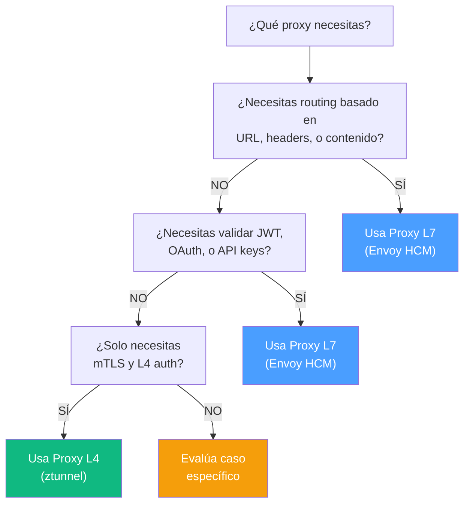
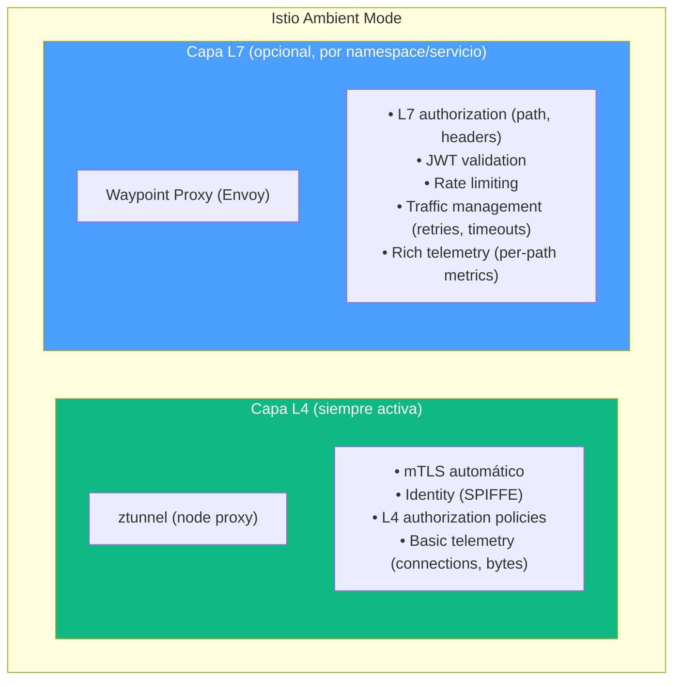
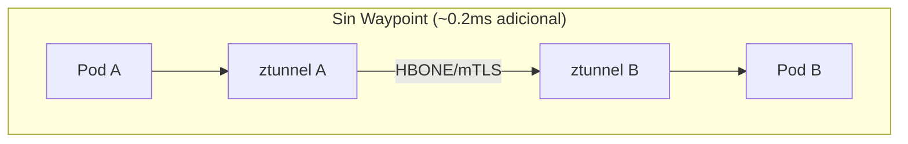
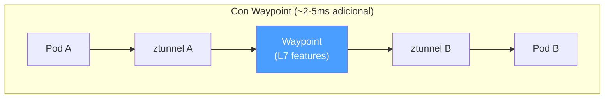
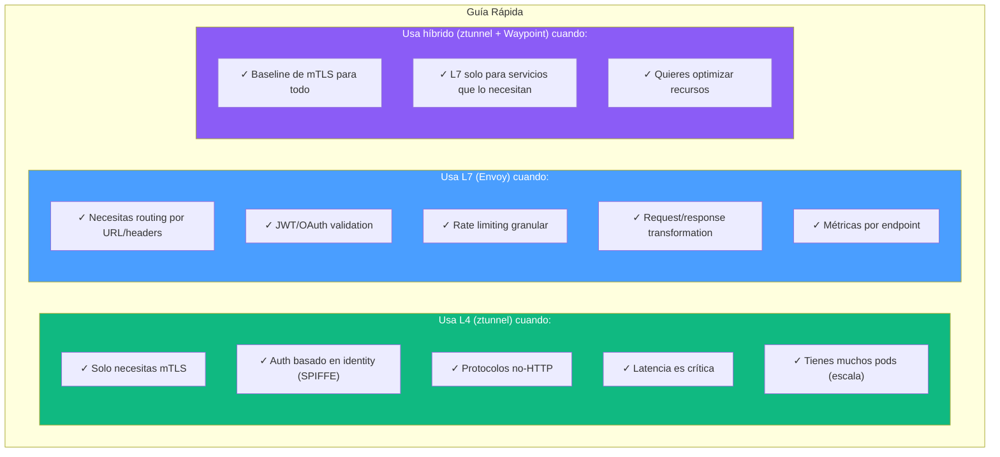

# L4 vs L7: Cuándo Usar Cada Uno

---

**Módulo**: 2 - Proxies - Conceptos Fundamentales
**Tema**: Comparativa L4 vs L7
**Tiempo estimado**: 1 hora
**Prerrequisitos**: [02_proxy_l4.md](02_proxy_l4.md), [03_proxy_l7.md](03_proxy_l7.md)

---

## Objetivos de Aprendizaje

Al completar este documento:

- Podrás decidir cuándo usar L4 vs L7
- Entenderás el modelo híbrido de Istio ambient
- Tendrás un framework de decisión claro

---

## 1. Tabla Comparativa Completa

| Aspecto                    | Proxy L4               | Proxy L7                   |
| -------------------------- | ---------------------- | -------------------------- |
| **Capa OSI**               | Transport (4)          | Application (7)            |
| **Qué ve**                 | IP, puertos, TCP flags | + HTTP headers, body, gRPC |
| **Routing basado en**      | IP:puerto destino      | URL, headers, query params |
| **Ejemplos**               | ztunnel, TCP proxy     | Envoy HCM, Nginx           |
| **Latencia adicional**     | ~0.1ms                 | ~1-5ms                     |
| **Memoria por conexión**   | ~1KB                   | ~10-100KB                  |
| **CPU por request**        | Mínimo                 | Parsing + filters          |
| **mTLS**                   | ✓                      | ✓                          |
| **L4 Auth (IP, identity)** | ✓                      | ✓                          |
| **L7 Auth (JWT, OAuth)**   | ✗                      | ✓                          |
| **Rate limit por path**    | ✗                      | ✓                          |
| **Header manipulation**    | ✗                      | ✓                          |
| **Request-level metrics**  | ✗                      | ✓                          |
| **Protocolos custom**      | ✓ (bytes opacos)       | Solo si hay codec          |

---

## 2. Framework de Decisión



---

## 3. Casos de Uso Concretos

### 3.1 Caso: API Gateway

**Requisitos**:

- Routing por path (`/users`, `/orders`)
- JWT validation
- Rate limiting por API key
- Request logging con path

**Decisión**: **L7 (Envoy)**

```yaml
# Solo L7 puede hacer esto
route_config:
  routes:
    - match: { prefix: "/users" }
      route: { cluster: users-service }
    - match: { prefix: "/orders" }
      route: { cluster: orders-service }
```

### 3.2 Caso: mTLS Transparente en Kubernetes

**Requisitos**:

- Cifrado entre todos los pods
- Zero-trust networking
- Sin modificar aplicaciones
- 1000+ pods

**Decisión**: **L4 (ztunnel)**

```
Razones:
- mTLS no requiere L7
- 1000 sidecars vs 50 ztunnels (50 nodos)
- Menor latencia
- Menor uso de recursos
```

### 3.3 Caso: Service Mesh con Políticas de Seguridad

**Requisitos**:

- mTLS entre servicios
- Rate limiting por endpoint
- JWT validation
- Canary deployments basados en header

**Decisión**: **Híbrido (ztunnel + Waypoint)**

```
ztunnel: mTLS para todo
Waypoint (Envoy): L7 policies solo donde se necesitan
```

### 3.4 Caso: Proxy para Base de Datos

**Requisitos**:

- Proxy para MySQL
- Load balancing entre réplicas
- Connection pooling

**Decisión**: **L4**

```
Razones:
- Envoy no tiene codec MySQL nativo
- L4 funciona con cualquier protocolo
- No se necesita inspeccionar queries
```

---

## 4. El Modelo Híbrido: Istio Ambient

Istio ambient combina lo mejor de ambos mundos:



### 4.1 Flujo de Tráfico en Ambient





### 4.2 Cuándo Usar Waypoint

| Servicio Necesita        | Sin Waypoint | Con Waypoint |
| ------------------------ | ------------ | ------------ |
| Solo mTLS                | ✓            | Overkill     |
| L4 auth (identity-based) | ✓            | Overkill     |
| L7 auth (path-based)     | ✗            | ✓            |
| JWT validation           | ✗            | ✓            |
| Rate limiting por path   | ✗            | ✓            |
| Canary por header        | ✗            | ✓            |

---

## 5. Comparación de Recursos

### 5.1 Memoria

**Cluster: 100 pods, 10 nodos**

| Modelo | Componentes | RAM Total |
|--------|-------------|-----------|
| **Sidecar (L7)** | 100 Envoy sidecars × ~50MB | ~5GB |
| **Ambient (L4)** | 10 ztunnels × ~30MB + Waypoints según necesidad | ~300MB + |

**Ahorro: >90% para baseline**

### 5.2 Latencia

**Latencia P99 adicional:**

| Componente | Latencia |
|------------|----------|
| Solo TCP proxy | ~0.1ms |
| ztunnel (HBONE) | ~0.2-0.5ms |
| Envoy sidecar (L7) | ~1-3ms |
| Waypoint (L7) | ~2-5ms |

> **Nota**: Para servicios sensibles a latencia, L4 puede ser la diferencia entre cumplir o no un SLA de 10ms.

---

## 6. Resumen de Decisión



---

## 7. Autoevaluación

1. Un servicio solo necesita mTLS. ¿L4 o L7?
2. Necesitas rate limiting de 100 req/min para `/api/expensive`. ¿L4 o L7?
3. ¿Por qué Istio ambient usa ztunnel en lugar de Envoy sidecars?
4. ¿Cuándo agregarías un Waypoint en ambient mode?
5. ¿Qué modelo usarías para un cluster de 5000 pods?

---

**Siguiente Módulo**: [../03_envoy_arquitectura/01_vision_general.md](../03_envoy_arquitectura/01_vision_general.md) - Arquitectura de Envoy
