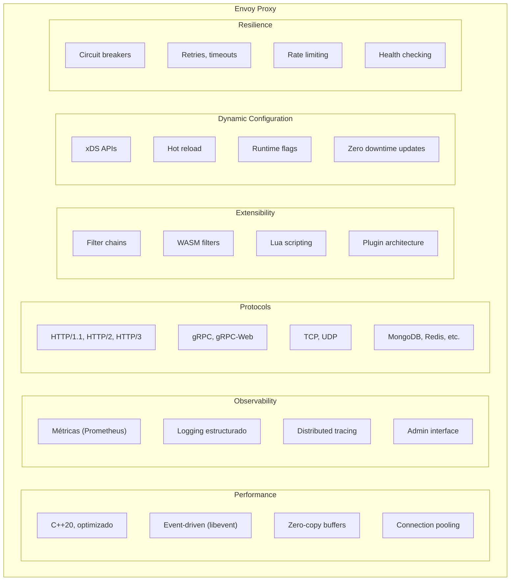
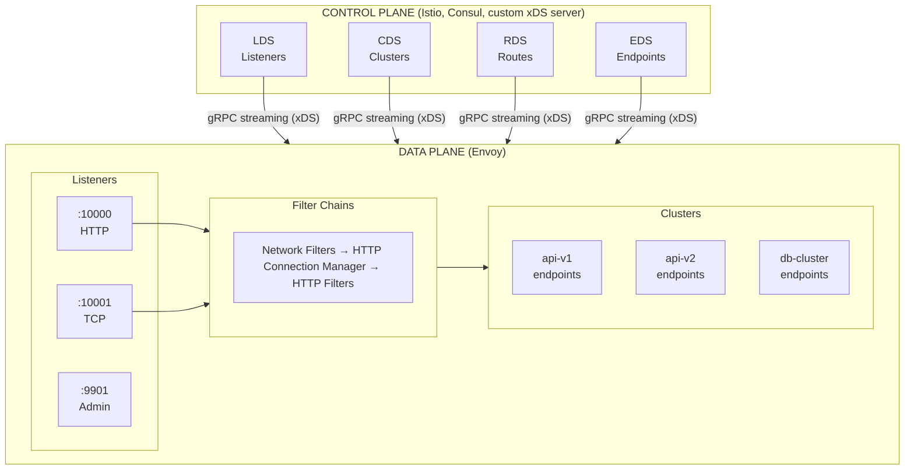
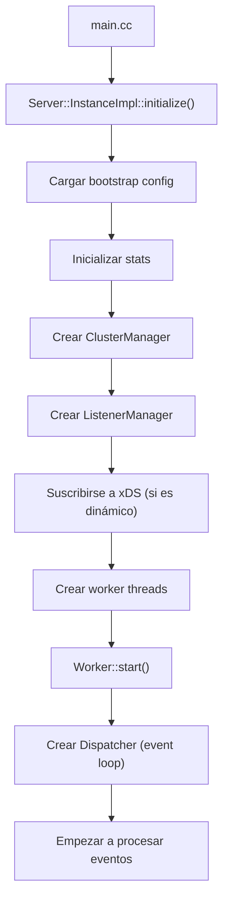
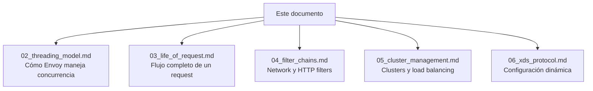

# Visión General de Envoy

---

**Módulo**: 3 - Arquitectura de Envoy
**Tema**: Visión General
**Tiempo estimado**: 2 horas
**Prerrequisitos**: Módulos 1 y 2 completos

---

## Objetivos de Aprendizaje

Al completar este documento:

- Entenderás qué es Envoy y su posición en el ecosistema
- Conocerás los componentes principales
- Comprenderás el modelo data plane vs control plane
- Tendrás un mapa mental de la arquitectura

---

## 1. ¿Qué es Envoy?

### 1.1 Definición

Envoy es un **proxy L4/L7 de alto rendimiento** escrito en C++20, diseñado para:

- **Service Mesh**: Sidecar proxy para Istio y otros
- **API Gateway**: Edge proxy para APIs
- **Front Proxy**: Load balancer de entrada
- **Embedded**: Librería para integrar en aplicaciones

### 1.2 Características Principales



---

## 2. Arquitectura de Alto Nivel

### 2.1 Data Plane vs Control Plane



### 2.2 Componentes Principales

| Componente        | Descripción                          | Código                                          |
| ----------------- | ------------------------------------ | ----------------------------------------------- |
| **Listener**      | Acepta conexiones en un puerto       | `source/common/listener_manager/`               |
| **Filter Chain**  | Procesa conexiones/requests          | `source/common/http/filter_manager.cc`          |
| **Cluster**       | Grupo de endpoints upstream          | `source/common/upstream/cluster_manager_impl.h` |
| **Endpoint**      | Instancia individual de backend      | Parte de cluster config                         |
| **Router**        | Selecciona cluster basado en request | `source/extensions/filters/http/router/`        |
| **Load Balancer** | Selecciona endpoint en cluster       | `source/common/upstream/load_balancer_impl.cc`  |

---

## 3. Estructura del Código

### 3.1 Directorios Principales

```
envoy/
├── source/
│   ├── exe/                    # Entry point del binario
│   │   └── main.cc
│   ├── server/                 # Lógica del servidor
│   │   ├── server.cc           # Inicialización
│   │   └── worker_impl.h       # Worker threads
│   ├── common/                 # Core library
│   │   ├── http/               # HTTP handling
│   │   │   ├── conn_manager_impl.h  # HTTP Connection Manager
│   │   │   └── filter_manager.cc    # Filter chain
│   │   ├── network/            # Network layer
│   │   ├── upstream/           # Cluster management
│   │   ├── event/              # Event loop
│   │   ├── config/             # xDS handling
│   │   └── stats/              # Métricas
│   └── extensions/             # Extensiones pluggables
│       ├── filters/
│       │   ├── network/        # L4 filters (tcp_proxy, etc.)
│       │   └── http/           # L7 filters (router, jwt, etc.)
│       ├── clusters/           # Cluster types
│       └── transport_sockets/  # TLS, etc.
├── api/                        # Protobuf definitions
│   └── envoy/
│       ├── config/             # Config protos
│       └── service/            # xDS protos
├── test/                       # Tests
│   ├── common/
│   ├── extensions/
│   └── integration/
└── docs/                       # Documentación
```

### 3.2 Namespaces

```cpp
namespace Envoy {
  namespace Server { }           // Server lifecycle
  namespace Network { }          // Connections, sockets
  namespace Http { }             // HTTP handling
  namespace Upstream { }         // Clusters, load balancing
  namespace Config { }           // xDS, configuration
  namespace Stats { }            // Metrics
  namespace Event { }            // Event loop

  namespace Extensions {
    namespace HttpFilters { }    // HTTP filters
    namespace NetworkFilters { } // Network filters
  }
}
```

---

## 4. Configuración de Envoy

### 4.1 Bootstrap Config

La configuración inicial de Envoy se define en un archivo YAML/JSON:

```yaml
# envoy.yaml
admin:
  address:
    socket_address:
      address: 127.0.0.1
      port_value: 9901

static_resources:
  listeners:
    - name: http_listener
      address:
        socket_address:
          address: 0.0.0.0
          port_value: 10000
      filter_chains:
        - filters:
            - name: envoy.filters.network.http_connection_manager
              typed_config:
                "@type": type.googleapis.com/envoy.extensions.filters.network.http_connection_manager.v3.HttpConnectionManager
                stat_prefix: ingress_http
                route_config:
                  name: local_route
                  virtual_hosts:
                    - name: backend
                      domains: ["*"]
                      routes:
                        - match:
                            prefix: "/"
                          route:
                            cluster: backend_cluster
                http_filters:
                  - name: envoy.filters.http.router
                    typed_config:
                      "@type": type.googleapis.com/envoy.extensions.filters.http.router.v3.Router

  clusters:
    - name: backend_cluster
      type: STATIC
      lb_policy: ROUND_ROBIN
      load_assignment:
        cluster_name: backend_cluster
        endpoints:
          - lb_endpoints:
              - endpoint:
                  address:
                    socket_address:
                      address: 10.0.0.1
                      port_value: 8080
              - endpoint:
                  address:
                    socket_address:
                      address: 10.0.0.2
                      port_value: 8080
```

### 4.2 Configuración Dinámica (xDS)

```yaml
# Bootstrap para xDS
dynamic_resources:
  lds_config:
    resource_api_version: V3
    api_config_source:
      api_type: GRPC
      transport_api_version: V3
      grpc_services:
        - envoy_grpc:
            cluster_name: xds_cluster

  cds_config:
    resource_api_version: V3
    api_config_source:
      api_type: GRPC
      transport_api_version: V3
      grpc_services:
        - envoy_grpc:
            cluster_name: xds_cluster

static_resources:
  clusters:
    - name: xds_cluster
      type: STATIC
      http2_protocol_options: {}
      load_assignment:
        cluster_name: xds_cluster
        endpoints:
          - lb_endpoints:
              - endpoint:
                  address:
                    socket_address:
                      address: istiod.istio-system
                      port_value: 15010
```

---

## 5. Flujo de Inicialización



**Código**:

```
source/server/server.cc:77-109
source/server/worker_impl.h:30-100
```

---

## 6. Admin Interface

Envoy expone una interfaz administrativa:

```bash
# Stats
curl http://localhost:9901/stats

# Prometheus format
curl http://localhost:9901/stats/prometheus

# Config dump
curl http://localhost:9901/config_dump

# Clusters info
curl http://localhost:9901/clusters

# Server info
curl http://localhost:9901/server_info

# Health check
curl http://localhost:9901/ready
```

---

## 7. Mapa de Navegación

Para profundizar en cada área:



---

## 8. Ejercicio Práctico

### Compilar y Ejecutar Envoy

```bash
# En el directorio de Envoy
cd /home/jojosneg/source/redhat/envoy/upstream/main

# Compilar (toma tiempo la primera vez)
bazel build -c opt //source/exe:envoy-static

# Ejecutar con config de ejemplo
./bazel-bin/source/exe/envoy-static -c configs/envoy-demo.yaml

# En otra terminal, probar
curl http://localhost:10000/
```

---

## 9. Autoevaluación

1. ¿Cuál es la diferencia entre data plane y control plane?
2. Nombra 3 tipos de xDS APIs
3. ¿Dónde está el código del HTTP Connection Manager?
4. ¿Qué hace el admin interface en puerto 9901?
5. ¿Por qué Envoy usa C++ en lugar de otro lenguaje?

---

**Siguiente**: [02_threading_model.md](02_threading_model.md) - Modelo de Threading
