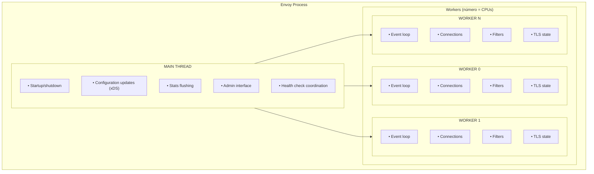
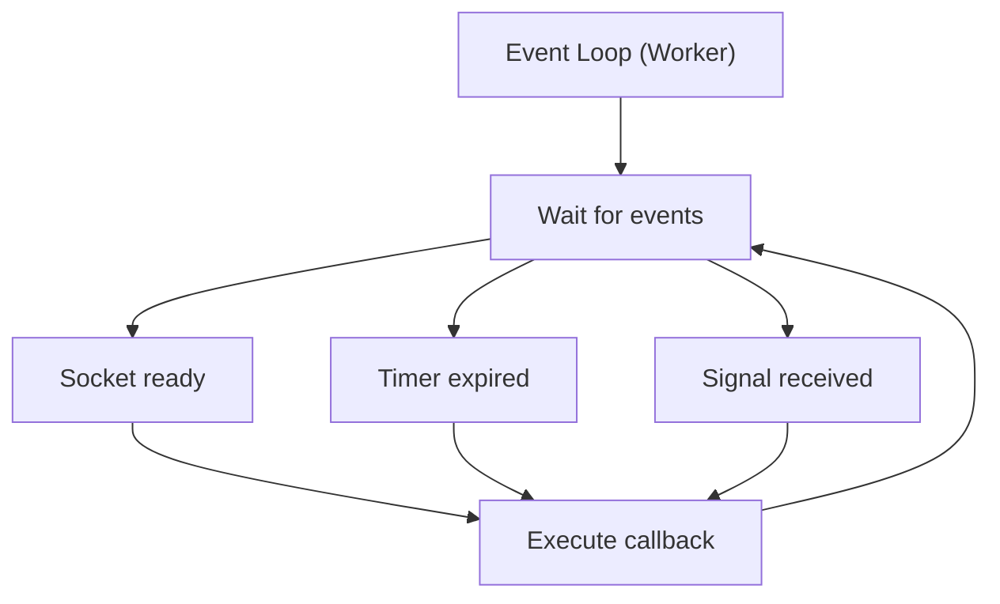
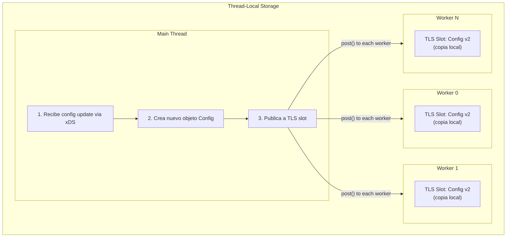
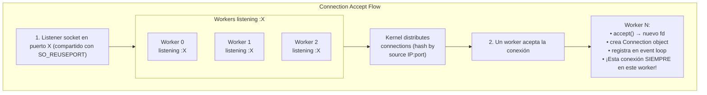
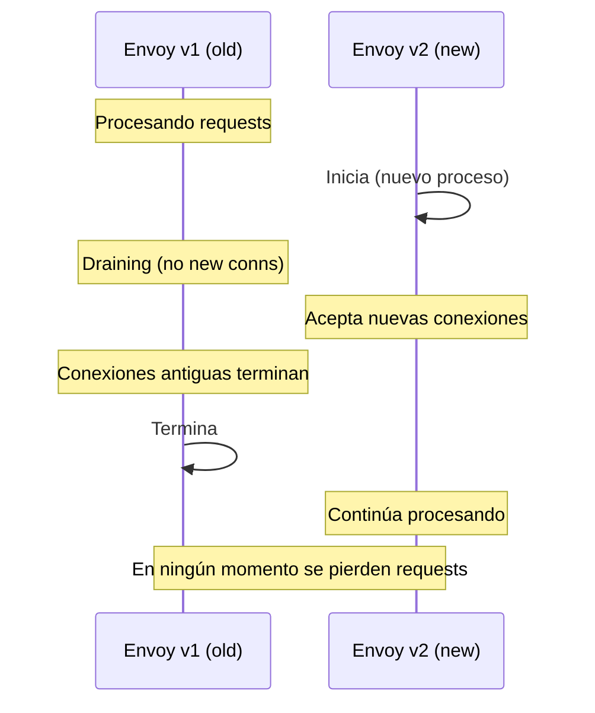
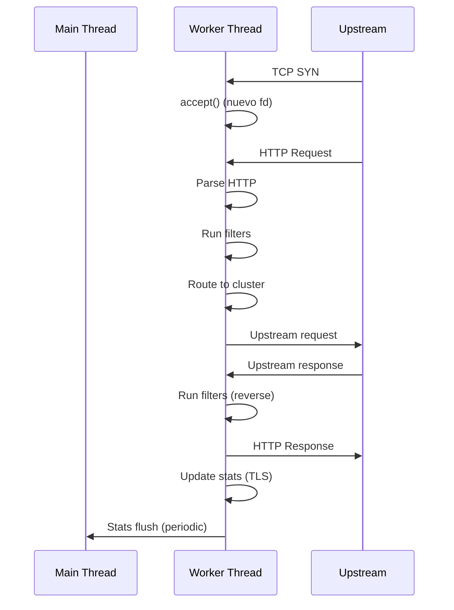

# Modelo de Threading en Envoy

---

**Módulo**: 3 - Arquitectura de Envoy
**Tema**: Threading Model
**Tiempo estimado**: 3 horas
**Prerrequisitos**: [01_vision_general.md](01_vision_general.md)

---

## Objetivos de Aprendizaje

Al completar este documento:

- Entenderás el modelo de threading de Envoy
- Comprenderás el event loop y cómo maneja I/O
- Sabrás qué es thread-local storage y por qué importa
- Podrás identificar hot paths en el código

---

## 1. Arquitectura de Threads

### 1.1 Visión General

Envoy usa un modelo **single-process, multi-threaded**:



### 1.2 Responsabilidades por Thread

| Thread      | Responsabilidad      | Código                        |
| ----------- | -------------------- | ----------------------------- |
| **Main**    | Config, admin, stats | `source/server/server.cc`     |
| **Workers** | Request processing   | `source/server/worker_impl.h` |

**Principio clave**: Los workers **casi nunca** comparten estado mutable. Cada uno tiene su propia copia de la configuración.

---

## 2. Event Loop (Dispatcher)

### 2.1 ¿Qué es el Event Loop?

Cada worker tiene un **Dispatcher** que maneja eventos de forma asíncrona:

```cpp
// source/common/event/dispatcher_impl.h:36

class DispatcherImpl : public Dispatcher {
  // Event loop basado en libevent
  event_base* base_;

  // Procesa eventos hasta que se llame exit()
  void run(RunType type) override;

  // Registra callbacks para file descriptors
  FileEventPtr createFileEvent(os_fd_t fd, FileReadyCb cb, ...);

  // Timers
  TimerPtr createTimer(TimerCb cb);

  // Deferred deletion (cleanup seguro)
  void deferredDelete(DeferredDeletablePtr&& to_delete);
};
```

### 2.2 Flujo del Event Loop



### 2.3 Tipos de Eventos

```cpp
// File events (sockets)
dispatcher.createFileEvent(
    socket_fd,
    [this](uint32_t events) {
        if (events & Event::FileReadyType::Read) {
            onRead();
        }
        if (events & Event::FileReadyType::Write) {
            onWrite();
        }
    },
    Event::FileTriggerType::Edge,
    Event::FileReadyType::Read | Event::FileReadyType::Write
);

// Timers
auto timer = dispatcher.createTimer([this]() {
    onTimeout();
});
timer->enableTimer(std::chrono::milliseconds(5000));

// Deferred work
dispatcher.post([this]() {
    // Ejecutado en el próximo loop iteration
    doSomethingLater();
});
```

---

## 3. Thread-Local Storage (TLS)

### 3.1 El Problema

La configuración cambia dinámicamente (via xDS). ¿Cómo actualizar todos los workers sin locks?

**Solución incorrecta**: Mutex global

```cpp
// MAL: Contención alta en hot path
std::mutex config_mutex;
Config* global_config;

void handleRequest() {
    std::lock_guard<std::mutex> lock(config_mutex);  // Serializa workers!
    auto cluster = global_config->getCluster("api");
    // ...
}
```

**Solución de Envoy**: Thread-Local Storage

```cpp
// BIEN: Cada worker tiene su propia copia
ThreadLocal::TypedSlot<Config> config_slot;

void handleRequest() {
    // Sin locks, acceso directo
    auto& config = config_slot->get();
    auto cluster = config.getCluster("api");
    // ...
}
```

### 3.2 Implementación de TLS



### 3.3 Código de TLS

```cpp
// source/common/thread_local/thread_local_impl.h

// Allocar un slot
ThreadLocal::TypedSlotPtr<MyData> slot = tls.allocateTypedSlot();

// Publicar datos a todos los workers
slot->set([](Event::Dispatcher&) {
    return std::make_shared<MyData>(/* ... */);
});

// Acceder a datos (en cualquier worker)
MyData& data = slot->get();
```

**Usos principales de TLS**:

- Cluster configuration
- Route tables
- Runtime feature flags
- Stats

---

## 4. Connection Handling

### 4.1 Aceptación de Conexiones



### 4.2 Lifetime de una Conexión

```cpp
// Una conexión vive en un solo worker thread

// source/common/network/connection_impl.h:50-150
class ConnectionImpl : public Connection {
    // File descriptor de la conexión
    os_fd_t fd_;

    // Dispatcher del worker que maneja esta conexión
    Event::Dispatcher& dispatcher_;

    // Buffer para datos pendientes de escribir
    Buffer::OwnedImpl write_buffer_;

    // Filter chain para procesar datos
    FilterManagerImpl filter_manager_;
};
```

**Regla fundamental**: Una conexión TCP **siempre** es manejada por el mismo worker thread durante toda su vida. Esto evita locks y race conditions.

---

## 5. Deferred Deletion

### 5.1 El Problema

Un callback puede tener referencias a objetos que se destruyen durante su ejecución:

```cpp
// PELIGROSO
void Connection::onData() {
    filter_->onData();  // El filter puede cerrar la conexión
    // ¡Ahora "this" puede estar destruido!
    doMoreWork();  // Use-after-free!
}
```

### 5.2 La Solución: Deferred Delete

```cpp
// source/common/event/dispatcher_impl.cc:400-450

void ConnectionImpl::close() {
    // No destruir inmediatamente
    // En su lugar, programar destrucción para después del callback actual
    dispatcher_.deferredDelete(
        std::unique_ptr<Connection>(this)
    );
}

// El dispatcher destruye al final del loop iteration
void DispatcherImpl::runPostCallbacks() {
    // Procesar deferred deletions
    while (!to_delete_.empty()) {
        to_delete_.pop_front();  // destructor called here
    }
}
```

---

## 6. Hot Restart

### 6.1 ¿Qué es Hot Restart?

Envoy puede reiniciarse sin perder conexiones:



### 6.2 Mecanismo

```cpp
// El nuevo proceso hereda:
// - Listen sockets (via SCM_RIGHTS)
// - Stats memory (shared memory)
// - Hot restart epoch

// source/server/hot_restart_impl.cc
```

---

## 7. Código Clave

### 7.1 Archivos Principales

| Archivo                                                 | Descripción   |
| ------------------------------------------------------- | ------------- |
| `source/common/event/dispatcher_impl.h:36`              | Event loop    |
| `source/server/worker_impl.h:30-100`                    | Worker thread |
| `source/common/thread_local/thread_local_impl.h:50-200` | TLS           |
| `source/common/network/connection_impl.h:50-150`        | Connection    |
| `source/server/hot_restart_impl.cc`                     | Hot restart   |

### 7.2 Worker Initialization

```cpp
// source/server/worker_impl.cc

void WorkerImpl::start(GuardDog& guard_dog) {
    thread_ = api_.threadFactory().createThread([this, &guard_dog]() {
        // Crear dispatcher para este worker
        dispatcher_ = api_.allocateDispatcher();

        // Registrar con watchdog
        guard_dog.createWatchDog(dispatcher_->name());

        // Entrar al event loop (bloquea hasta shutdown)
        dispatcher_->run(Event::Dispatcher::RunType::Block);
    });
}
```

---

## 8. Diagrama de Secuencia: Request Processing



---

## 9. Autoevaluación

1. ¿Por qué Envoy usa múltiples workers en lugar de un thread pool?
2. ¿Qué problema resuelve Thread-Local Storage?
3. ¿Por qué una conexión siempre es manejada por el mismo worker?
4. ¿Qué es deferred deletion y por qué es necesario?
5. ¿Cómo funciona hot restart a alto nivel?

---

## 10. Ejercicio Práctico

### Ver Workers en Acción

```bash
# Ejecutar Envoy con N workers
./envoy --concurrency 4 -c envoy.yaml

# Ver threads
ps -T -p $(pgrep envoy)

# Ver stats de workers
curl localhost:9901/stats | grep worker
```

---

**Siguiente**: [03_life_of_request.md](03_life_of_request.md) - Vida de un Request
