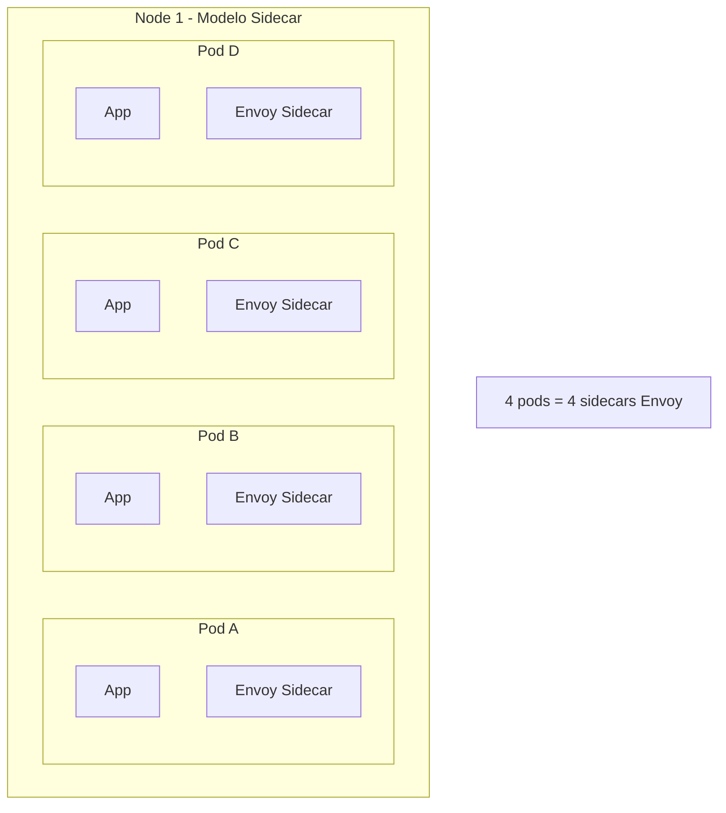
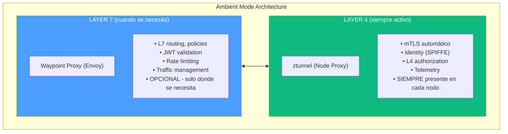
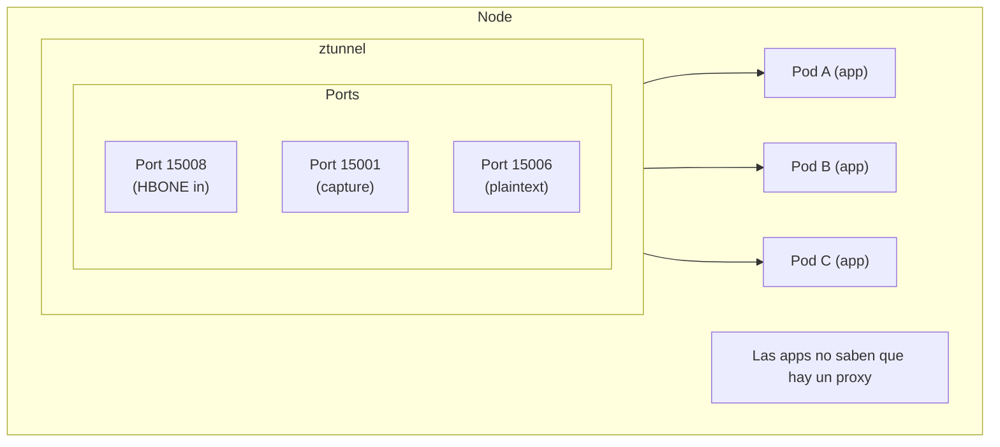
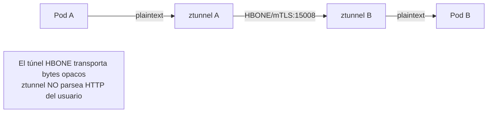
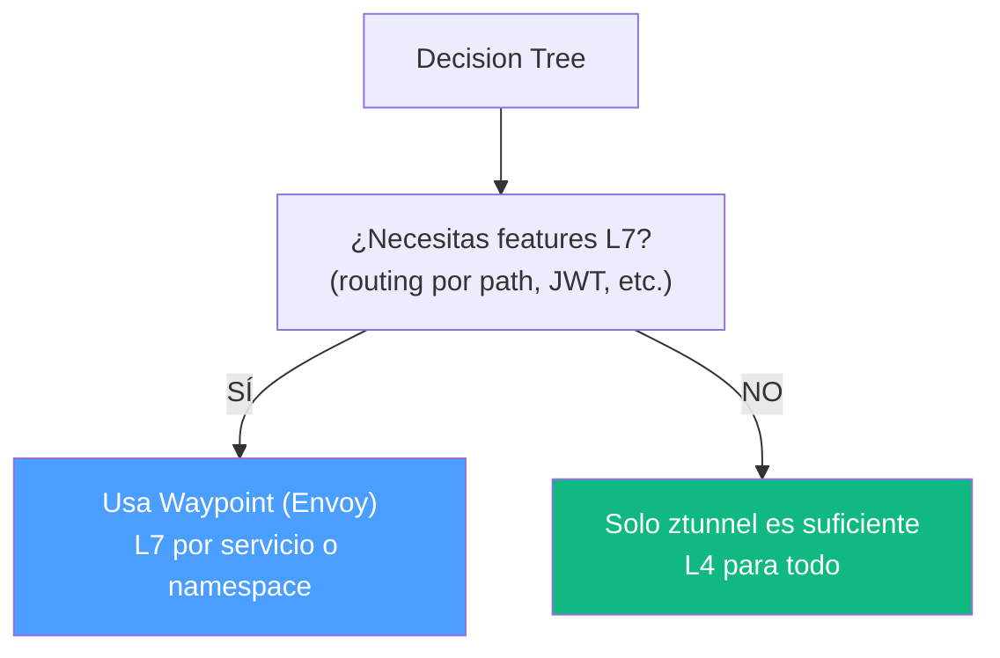

# Istio Ambient Mode y Contexto de ztunnel

---

**Módulo**: 4 - Arquitectura de ztunnel
**Tema**: Contexto de Ambient Mode
**Tiempo estimado**: 2 horas
**Prerrequisitos**: Módulos 1-3 completos

---

## Objetivos de Aprendizaje

Al completar este documento:

- Entenderás qué es Istio ambient mode
- Conocerás el rol de ztunnel en la arquitectura
- Comprenderás por qué se creó ztunnel
- Identificarás las diferencias con el modelo sidecar

---

## 1. El Problema con Sidecars

### 1.1 Modelo Sidecar Tradicional



### 1.2 Problemas del Modelo Sidecar

| Problema                   | Descripción                 | Impacto                             |
| -------------------------- | --------------------------- | ----------------------------------- |
| **Overhead de recursos**   | ~50-100MB RAM por sidecar   | Cluster de 1000 pods = 50-100GB RAM |
| **Latencia**               | Parsing L7 en cada hop      | +1-5ms por request                  |
| **Complejidad de upgrade** | Cada pod necesita restart   | Disruption durante updates          |
| **Startup time**           | Envoy inicia con el pod     | Pods lentos para arrancar           |
| **Seguridad**              | Sidecar tiene acceso al pod | Superficie de ataque mayor          |

### 1.3 La Pregunta Clave

> "¿Realmente TODOS los servicios necesitan L7?"

La respuesta: **No**. Muchos solo necesitan:

- mTLS (cifrado)
- Identity (autenticación)
- L4 authorization
- Métricas básicas

---

## 2. Ambient Mode: La Solución

### 2.1 Arquitectura de Dos Capas



### 2.2 Comparación

| Aspecto             | Sidecar       | Ambient                   |
| ------------------- | ------------- | ------------------------- |
| **Proxies por pod** | 1 Envoy       | 0 (ztunnel en nodo)       |
| **RAM overhead**    | ~50-100MB/pod | ~30MB/nodo                |
| **L4 features**     | Siempre       | Siempre (ztunnel)         |
| **L7 features**     | Siempre       | Solo si waypoint          |
| **Upgrade**         | Restart pods  | Restart ztunnel DaemonSet |
| **Startup**         | Con cada pod  | Ya corriendo              |

---

## 3. ztunnel: El Node Proxy

### 3.1 ¿Qué es ztunnel?

**ztunnel** (Zero Trust Tunnel) es un proxy L4 escrito en Rust:

```
De README.md:
"Ztunnel is intended to be a purpose built implementation of the
node proxy in ambient mesh. Part of the goals of this included
keeping a narrow feature set."
```

### 3.2 Características Clave

| ✓ Incluido (In Scope) | ✗ Excluido (Out of Scope) |
|----------------------|---------------------------|
| mTLS between workloads | HTTP traffic termination |
| SPIFFE identity | Generic extensibility |
| L4 authorization | WASM, Lua, ext_authz |
| L4 telemetry | |
| HBONE tunneling | |

> "Ztunnel does not aim to be a generic extensible proxy; Envoy is better suited for that task."

### 3.3 Por qué Rust

| Razón              | Beneficio                            |
| ------------------ | ------------------------------------ |
| **Memory safety**  | Sin buffer overflows, use-after-free |
| **Performance**    | Comparable a C/C++                   |
| **Async native**   | Tokio runtime eficiente              |
| **Modern tooling** | Cargo, testing, etc.                 |
| **Security**       | Menos CVEs que C/C++                 |

---

## 4. Arquitectura de ztunnel

### 4.1 Despliegue

ztunnel corre como **DaemonSet** en Kubernetes:

```yaml
# Cada nodo tiene exactamente un ztunnel
apiVersion: apps/v1
kind: DaemonSet
metadata:
  name: ztunnel
  namespace: istio-system
spec:
  selector:
    matchLabels:
      app: ztunnel
  template:
    spec:
      containers:
        - name: ztunnel
          image: istio/ztunnel:latest
          securityContext:
            capabilities:
              add:
                - NET_ADMIN # Para iptables
                - SYS_ADMIN # Para network namespaces
```

### 4.2 Flujo de Tráfico



### 4.3 HBONE Protocol

HBONE (HTTP-Based Overlay Network Encapsulation):

**Formato:**
```
HTTP/2 CONNECT request
:method = CONNECT
:authority = 10.0.1.5:8080 (destino real)
:protocol = connect-tcp

Sobre mTLS con certificados SPIFFE
Puerto 15008
```



---

## 5. Comparación con Envoy

### 5.1 Tabla Detallada

| Característica       | Envoy      | ztunnel            |
| -------------------- | ---------- | ------------------ |
| **Lenguaje**         | C++20      | Rust               |
| **Líneas de código** | ~500K      | ~30K               |
| **Capa**             | L4 + L7    | Solo L4            |
| **HTTP parsing**     | Sí         | No                 |
| **gRPC support**     | Sí         | No (payload opaco) |
| **Filter chain**     | Extensible | Mínimo             |
| **WASM**             | Sí         | No                 |
| **Memoria típica**   | 50-100MB   | 20-50MB            |
| **Startup time**     | ~1-2s      | ~100ms             |

### 5.2 Cuándo Usar Cada Uno



---

## 6. Habilitando Ambient Mode

### 6.1 Por Namespace

```bash
# Habilitar ambient para un namespace
kubectl label namespace default istio.io/dataplane-mode=ambient
```

### 6.2 Verificar Estado

```bash
# Ver pods en ambient mode
kubectl get pods -n default -o jsonpath='{.items[*].metadata.annotations.ambient\.istio\.io/redirection}'

# Ver ztunnel logs
kubectl logs -n istio-system -l app=ztunnel
```

---

## 7. Autoevaluación

1. ¿Cuál es el principal problema que resuelve ambient mode?
2. ¿Por qué ztunnel está escrito en Rust y no en C++?
3. ¿Qué features tiene ztunnel que NO tiene?
4. ¿Qué es HBONE y para qué sirve?
5. ¿Cuándo necesitas un waypoint proxy?

---

**Siguiente**: [02_threading_tokio.md](02_threading_tokio.md) - Threading Model con Tokio
