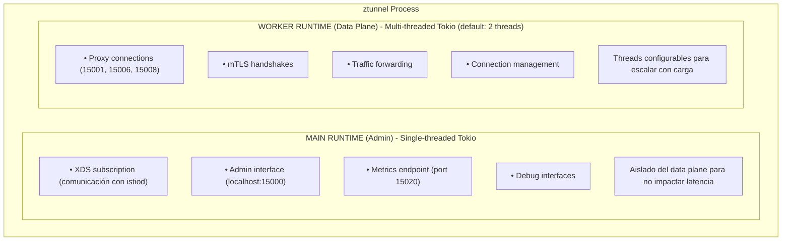
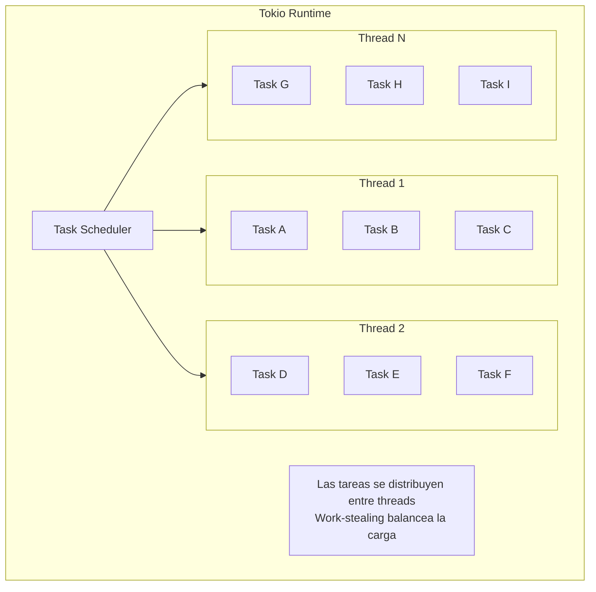
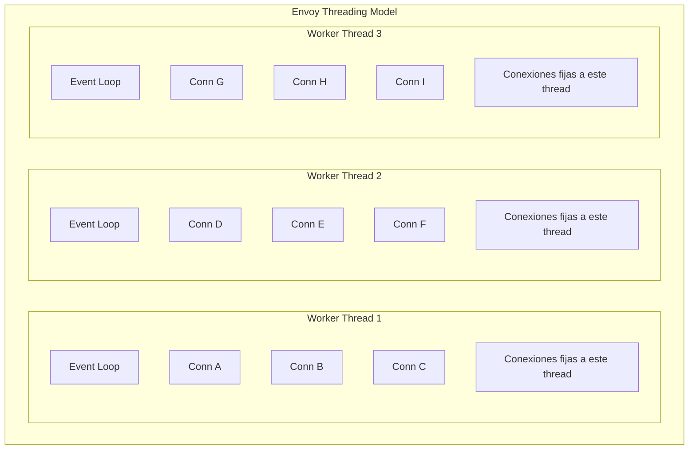
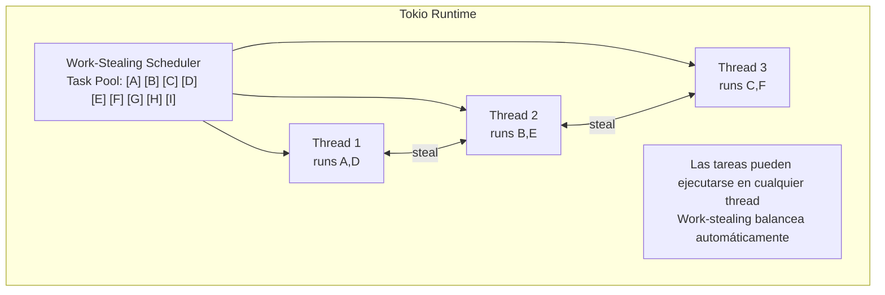

# Threading Model de ztunnel con Tokio

---

**Módulo**: 4 - Arquitectura de ztunnel
**Tema**: Threading y Async Runtime
**Tiempo estimado**: 3 horas
**Prerrequisitos**: [01_ambient_mode_context.md](01_ambient_mode_context.md)

---

## Objetivos de Aprendizaje

Al completar este documento:

- Entenderás el modelo de threading de ztunnel
- Comprenderás cómo funciona Tokio async runtime
- Conocerás la separación admin/data plane
- Podrás comparar con el modelo de Envoy

---

## 1. Visión General

### 1.1 Arquitectura de Runtimes

De `ARCHITECTURE.md`:



### 1.2 Por qué Dos Runtimes

| Motivo                  | Explicación                                    |
| ----------------------- | ---------------------------------------------- |
| **Aislamiento**         | Stats queries pueden ser costosos              |
| **Latencia predecible** | Admin no bloquea data plane                    |
| **Debugging**           | Admin accesible aunque data plane esté ocupado |

---

## 2. Tokio: El Runtime Async

### 2.1 ¿Qué es Tokio?

Tokio es un runtime asíncrono para Rust:

```rust
// Ejemplo básico de Tokio
use tokio::net::TcpListener;
use tokio::io::{AsyncReadExt, AsyncWriteExt};

#[tokio::main]
async fn main() {
    let listener = TcpListener::bind("127.0.0.1:8080").await.unwrap();

    loop {
        let (mut socket, _) = listener.accept().await.unwrap();

        // Spawn una tarea async para manejar la conexión
        tokio::spawn(async move {
            let mut buf = [0; 1024];
            loop {
                let n = socket.read(&mut buf).await.unwrap();
                if n == 0 { return; }
                socket.write_all(&buf[0..n]).await.unwrap();
            }
        });
    }
}
```

### 2.2 Modelo de Ejecución



### 2.3 Async/Await en Rust

```rust
// Una función async
async fn handle_connection(stream: TcpStream) -> Result<()> {
    let (mut reader, mut writer) = stream.split();

    // .await pausa la tarea hasta que complete
    // PERO no bloquea el thread
    let mut buffer = [0u8; 1024];
    let n = reader.read(&mut buffer).await?;

    // Mientras espera, el thread ejecuta otras tareas
    writer.write_all(&buffer[..n]).await?;

    Ok(())
}

// Cuando llamas .await:
// 1. Si la operación no está lista, la tarea se "pausa"
// 2. El thread toma otra tarea del scheduler
// 3. Cuando I/O completa, la tarea se reanuda
```

---

## 3. Comparación con Envoy

### 3.1 Modelo de Threading

| Aspecto      | Envoy                   | ztunnel                    |
| ------------ | ----------------------- | -------------------------- |
| **Runtime**  | libevent (callbacks)    | Tokio (async/await)        |
| **Modelo**   | 1 thread = 1 event loop | N threads, work-stealing   |
| **Conexión** | Siempre en mismo thread | Puede migrar entre threads |
| **Async**    | Callbacks explícitos    | async/await nativo         |

### 3.2 Visualización

**ENVOY:**



**ZTUNNEL (Tokio):**



---

## 4. Configuración de ztunnel

### 4.1 Número de Workers

```bash
# Por defecto: 2 worker threads
# Configurable via environment variable
ZTUNNEL_WORKER_THREADS=4 ztunnel
```

### 4.2 Código de Inicialización

```rust
// Pseudocódigo basado en la arquitectura

fn main() {
    // Runtime para admin (single-threaded)
    let admin_runtime = tokio::runtime::Builder::new_current_thread()
        .enable_all()
        .build()
        .unwrap();

    // Runtime para data plane (multi-threaded)
    let worker_runtime = tokio::runtime::Builder::new_multi_thread()
        .worker_threads(config.worker_threads)  // default: 2
        .enable_all()
        .build()
        .unwrap();

    // Correr admin en su runtime
    admin_runtime.spawn(async {
        run_admin_server().await;
        run_xds_client().await;
    });

    // Correr proxies en worker runtime
    worker_runtime.block_on(async {
        run_inbound_proxy(15006).await;
        run_outbound_proxy(15001).await;
        run_hbone_proxy(15008).await;
    });
}
```

---

## 5. Manejo de Conexiones

### 5.1 Estructura de una Conexión

```rust
// Pseudocódigo del manejo de conexión

struct ProxyConnection {
    downstream: TcpStream,  // Conexión del cliente
    upstream: TcpStream,    // Conexión al destino
    tls_state: Option<TlsStream>,  // Si hay mTLS
    metrics: ConnectionMetrics,
}

impl ProxyConnection {
    async fn run(self) -> Result<()> {
        let (downstream_read, downstream_write) = self.downstream.split();
        let (upstream_read, upstream_write) = self.upstream.split();

        // Copiar datos en ambas direcciones concurrentemente
        tokio::select! {
            result = copy(downstream_read, upstream_write) => {
                // downstream -> upstream completó
                result?;
            }
            result = copy(upstream_read, downstream_write) => {
                // upstream -> downstream completó
                result?;
            }
        }

        // Emitir métricas
        self.metrics.record_completion();

        Ok(())
    }
}
```

### 5.2 tokio::select!

El macro `select!` espera múltiples futures concurrentemente:

```rust
tokio::select! {
    // Espera cualquiera de estos
    result = operation_a => {
        // A completó primero
    }
    result = operation_b => {
        // B completó primero
    }
    // El otro se cancela automáticamente
}
```

---

## 6. Diferencias con Callbacks (Envoy)

### 6.1 Envoy: Callbacks

```cpp
// Estilo Envoy (callback-based)
class Connection : public Event::FileEventCallback {
    void onFileEvent(uint32_t events) {
        if (events & Event::FileReadyType::Read) {
            // Leer datos
            ssize_t rc = ::read(fd_, buffer, size);
            if (rc > 0) {
                // Procesar datos
                processData(buffer, rc);
            }
        }
    }

    void processData(char* data, size_t len) {
        // Puede necesitar registrar otro callback
        // para operaciones async
        asyncOperation([this](Result result) {
            // Callback anidado
            this->onAsyncComplete(result);
        });
    }
};
```

### 6.2 ztunnel: Async/Await

```rust
// Estilo ztunnel (async/await)
async fn handle_connection(stream: TcpStream) -> Result<()> {
    // Leer datos - se ve síncrono pero es async
    let mut buffer = [0u8; 1024];
    let n = stream.read(&mut buffer).await?;

    // Procesar
    let result = process_data(&buffer[..n]).await?;

    // Escribir respuesta
    stream.write_all(&result).await?;

    Ok(())
}
```

### 6.3 Ventajas de Async/Await

| Ventaja            | Descripción                        |
| ------------------ | ---------------------------------- |
| **Legibilidad**    | Código parece secuencial           |
| **Error handling** | `?` operator funciona naturalmente |
| **Composición**    | Fácil combinar operaciones async   |
| **Debugging**      | Stack traces más claros            |

---

## 7. Métricas y Observabilidad

### 7.1 Puertos de ztunnel

De `ARCHITECTURE.md`:

```
| Puerto | Propósito                        | En Pod NS |
|--------|----------------------------------|-----------|
| 15001  | Outbound capture                 | Y         |
| 15006  | Inbound plaintext capture        | Y         |
| 15008  | HBONE capture                    | Y         |
| 15021  | Readiness                        | N         |
| 15000  | Admin (localhost)                | N         |
| 15020  | Metrics                          | N         |
```

### 7.2 Separación de Responsabilidades

```
Admin Runtime (Main Thread):
  └── Metrics server (15020)
      └── Puede ser lento sin afectar data plane

Worker Runtime (Multiple Threads):
  └── Proxy listeners (15001, 15006, 15008)
      └── Latencia crítica, aislado de admin
```

---

## 8. Ejercicio: Entender el Flujo

### 8.1 Traza de una Conexión

```
1. Pod A quiere conectar a Pod B (10.0.2.5:8080)

2. iptables redirige a ztunnel:15001 (outbound)

3. Worker runtime acepta conexión:
   tokio::spawn(handle_outbound_connection(stream))

4. Tarea async:
   a) Lee destino original (SO_ORIGINAL_DST)
   b) Busca info del destino en xDS data
   c) Establece HBONE a ztunnel remoto
   d) Copia bytes bidireccionalmente

5. Todo sin bloquear threads - await points permiten
   que otras conexiones progresen
```

---

## 9. Autoevaluación

1. ¿Por qué ztunnel usa dos runtimes separados?
2. ¿Qué significa "work-stealing" en Tokio?
3. ¿Cuál es la diferencia entre async/await y callbacks?
4. ¿Cuántos worker threads usa ztunnel por defecto?
5. ¿Por qué las métricas están en un runtime separado?

---

**Siguiente**: [03_hbone_protocol.md](03_hbone_protocol.md) - HBONE Protocol Deep Dive
