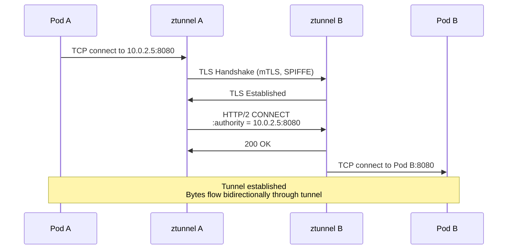
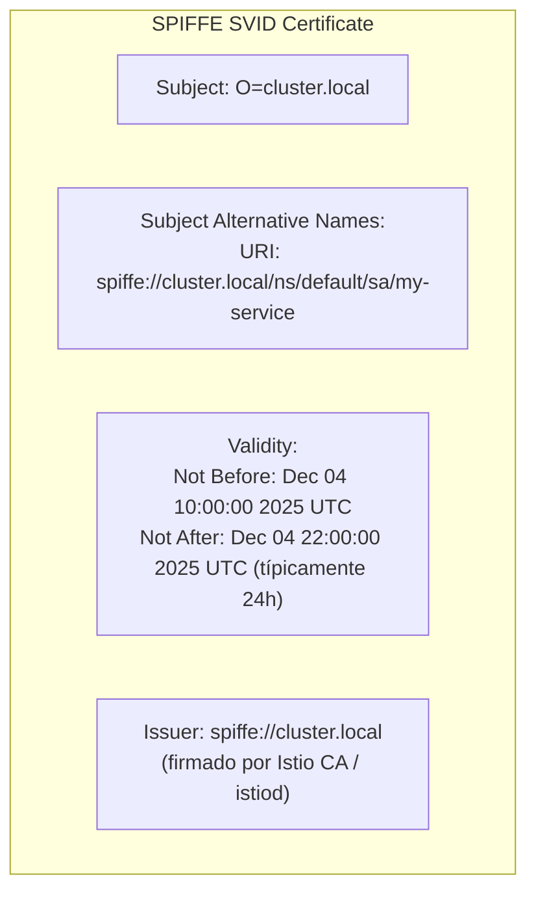
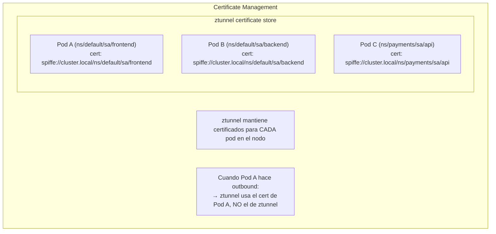

# HBONE Protocol Deep Dive

---

**Módulo**: 4 - Arquitectura de ztunnel
**Tema**: HTTP-Based Overlay Network Encapsulation
**Tiempo estimado**: 3 horas
**Prerrequisitos**: [02_threading_tokio.md](02_threading_tokio.md)

---

## Objetivos de Aprendizaje

Al completar este documento:

- Entenderás qué es HBONE y por qué existe
- Conocerás la estructura del protocolo
- Comprenderás el flujo de encapsulación
- Sabrás cómo interactúa con mTLS

---

## 1. ¿Qué es HBONE?

### 1.1 Definición

**HBONE** (HTTP-Based Overlay Network Encapsulation) es el protocolo de túnel usado en Istio ambient mode:

> **HBONE en una línea:** "HTTP CONNECT tunnel, over mutual TLS with SPIFFE certs, on port 15008"

### 1.2 Componentes

| Componente         | Descripción                          |
| ------------------ | ------------------------------------ |
| **HTTP/2 CONNECT** | Método para crear túnel TCP          |
| **mTLS**           | Autenticación mutua con certificados |
| **SPIFFE**         | Identidades de workload              |
| **Port 15008**     | Puerto estándar para HBONE           |

---

## 2. Estructura del Protocolo

### 2.1 Flujo de Conexión



### 2.2 HTTP/2 CONNECT Request

```http
:method = CONNECT
:protocol = connect-tcp
:scheme = https
:authority = 10.0.2.5:8080    # Destino real
:path = /

# Headers adicionales posibles:
x-envoy-peer-metadata: <base64-encoded-metadata>
x-forwarded-for: 10.0.1.5
```

### 2.3 Response

```http
:status = 200

# Después del 200, la conexión se convierte en túnel
# Bytes que van/vienen son el payload de la app
```

---

## 3. mTLS y Certificados

### 3.1 SPIFFE Identities

Cada workload tiene una identidad SPIFFE:

```
spiffe://cluster.local/ns/default/sa/my-service
         └─────────────┘ └─────────┘ └─────────┘
          Trust Domain   Namespace   Service Account
```

### 3.2 Certificado X.509 con SPIFFE



### 3.3 mTLS Handshake

```
ztunnel A (client)                              ztunnel B (server)
     │                                               │
     │─────────── ClientHello ─────────────────────>│
     │            + SNI: destino                     │
     │                                               │
     │<──────────── ServerHello ───────────────────│
     │              + Certificate (SPIFFE B)         │
     │              + CertificateRequest             │
     │                                               │
     │─────────── Certificate (SPIFFE A) ──────────>│
     │            + CertificateVerify                │
     │            + Finished                         │
     │                                               │
     │<──────────── Finished ──────────────────────│
     │                                               │
     │         mTLS establecido                      │
     │         Ambas identidades verificadas         │
     │                                               │
```

### 3.4 ztunnel y Certificados

De `ARCHITECTURE.md`:

```
"Ztunnel's own identity is never used for mTLS connections
between workloads. The certificates will be of the actual
user workloads, not Ztunnel's own identity."
```



---

## 4. Flujo Completo de Datos

### 4.1 Outbound (Pod A → Pod B)

```mermaid
flowchart TB
    subgraph OutboundFlow["Outbound Flow"]
        S1["1. App en Pod A hace: connect(10.0.2.5, 8080)"]
        S2["2. iptables redirige a ztunnel:15001<br/>(Pod A no sabe que hay redirección)"]

        subgraph ZtunnelA["3. ztunnel A"]
            A1["a) Lee destino original (SO_ORIGINAL_DST)"]
            A2["b) Busca info del destino en xDS cache"]
            A3["c) Determina: Pod B está en nodo remoto"]
            A4["d) Obtiene cert SPIFFE de Pod A"]
            A5["e) Conecta a ztunnel B:15008"]
            A6["f) Hace TLS handshake con cert de Pod A"]
            A7["g) Envía CONNECT con :authority = 10.0.2.5:8080"]
        end

        subgraph ZtunnelB["4. ztunnel B"]
            B1["a) Recibe conexión HBONE"]
            B2["b) Valida cert de Pod A"]
            B3["c) Parsea CONNECT, extrae destino"]
            B4["d) Conecta a Pod B:8080"]
            B5["e) Responde 200 OK"]
        end

        S5["5. Túnel establecido:<br/>Pod A ←→ ztunnel A ←→ ztunnel B ←→ Pod B"]
        S6["6. Bytes fluyen transparentemente"]

        S1 --> S2 --> ZtunnelA --> ZtunnelB --> S5 --> S6
    end
```



### 4.2 Encapsulación de Datos

```
Original packet from App:
┌──────────────────────────────────────────────────────────────┐
│ GET /api/users HTTP/1.1                                      │
│ Host: backend:8080                                           │
│ ...                                                          │
└──────────────────────────────────────────────────────────────┘

Después de HBONE (en el wire):
┌──────────────────────────────────────────────────────────────┐
│ TLS Record Layer                                             │
│ ┌──────────────────────────────────────────────────────────┐ │
│ │ HTTP/2 DATA Frame                                        │ │
│ │ Stream ID: 1 (del CONNECT)                               │ │
│ │ ┌──────────────────────────────────────────────────────┐ │ │
│ │ │ Payload: "GET /api/users HTTP/1.1\r\nHost:..."       │ │ │
│ │ │          (bytes opacos para ztunnel)                 │ │ │
│ │ └──────────────────────────────────────────────────────┘ │ │
│ └──────────────────────────────────────────────────────────┘ │
└──────────────────────────────────────────────────────────────┘

ztunnel NO parsea el contenido HTTP de la app
Solo ve bytes que copia al túnel
```

---

## 5. Por qué HTTP CONNECT

### 5.1 Alternativas Consideradas

| Opción                 | Problema                                        |
| ---------------------- | ----------------------------------------------- |
| **Raw TCP**            | No hay estándar para multiplexing               |
| **Custom protocol**    | Más código, menos interop                       |
| **gRPC bidirectional** | Overhead de protobuf                            |
| **HTTP/2 CONNECT**     | Estándar, multiplexing, herramientas existentes |

### 5.2 Ventajas de HTTP/2 CONNECT

| Ventaja | Descripción |
|---------|-------------|
| **1. ESTÁNDAR** | RFC 7540 define CONNECT. Interoperable con proxies HTTP existentes |
| **2. MULTIPLEXING** | Una conexión TCP, múltiples túneles. Reduce overhead de handshakes |
| **3. METADATA** | Headers HTTP pueden llevar info extra. `:authority` indica destino |
| **4. DEBUGGING** | Wireshark, tcpdump entienden HTTP/2. Más fácil de debuggear |
| **5. COMPATIBILIDAD CON SIDECARS** | Sidecars Envoy también pueden hablar HBONE. Ambient ↔ Sidecar interoperabilidad |

---

## 6. Código de ztunnel

### 6.1 Ubicación

```
src/proxy/          # Core proxy logic
├── inbound.rs      # Handles inbound connections
├── outbound.rs     # Handles outbound connections
└── hbone.rs        # HBONE protocol implementation
```

### 6.2 Pseudocódigo del Cliente HBONE

```rust
async fn connect_hbone(
    dest: SocketAddr,
    source_identity: &Identity,
) -> Result<TunnelStream> {
    // 1. Buscar ztunnel destino
    let remote_ztunnel = lookup_ztunnel_for_dest(dest).await?;

    // 2. Conectar TCP
    let tcp = TcpStream::connect(remote_ztunnel).await?;

    // 3. TLS handshake con cert del source workload
    let tls = do_mtls_handshake(tcp, source_identity).await?;

    // 4. HTTP/2 connection
    let (h2_send, h2_recv) = h2::client::handshake(tls).await?;

    // 5. Enviar CONNECT request
    let request = Request::builder()
        .method(Method::CONNECT)
        .uri(format!("https://{}/", dest))
        .header(":protocol", "connect-tcp")
        .body(())?;

    let (response, send_stream) = h2_send.send_request(request, false)?;

    // 6. Esperar respuesta
    let response = response.await?;
    if response.status() != StatusCode::OK {
        return Err(Error::TunnelFailed);
    }

    // 7. Retornar stream del túnel
    Ok(TunnelStream::new(send_stream, h2_recv))
}
```

---

## 7. Debugging HBONE

### 7.1 Con ztunnel Logs

```bash
# Habilitar logs verbose
RUST_LOG=debug kubectl logs -n istio-system -l app=ztunnel

# Buscar conexiones HBONE
kubectl logs -n istio-system -l app=ztunnel | grep -i hbone
```

### 7.2 Con tcpdump

```bash
# En el nodo
tcpdump -i any port 15008 -w hbone.pcap

# Analizar con Wireshark
# (TLS decrypt si tienes las keys)
```

---

## 8. Autoevaluación

1. ¿Qué significa HBONE?
2. ¿Por qué se usa HTTP/2 CONNECT en lugar de un protocolo custom?
3. ¿De quién es el certificado que usa ztunnel en conexiones outbound?
4. ¿Qué puerto usa HBONE?
5. ¿ztunnel parsea el HTTP de la aplicación?

---

**Siguiente**: [04_traffic_redirection.md](04_traffic_redirection.md) - Traffic Redirection con iptables
