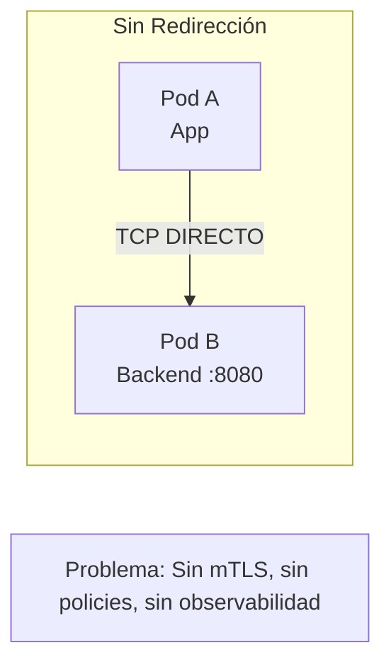
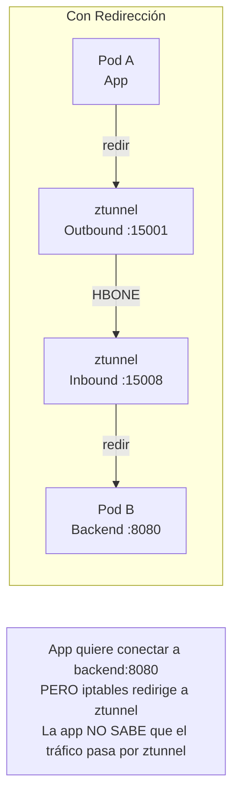
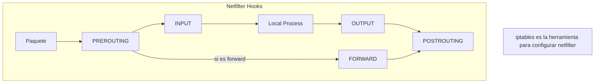
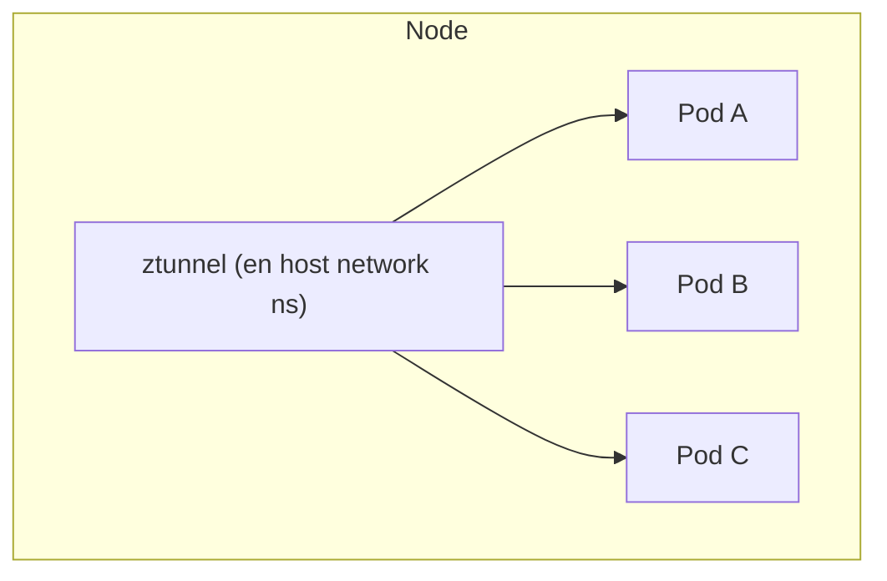
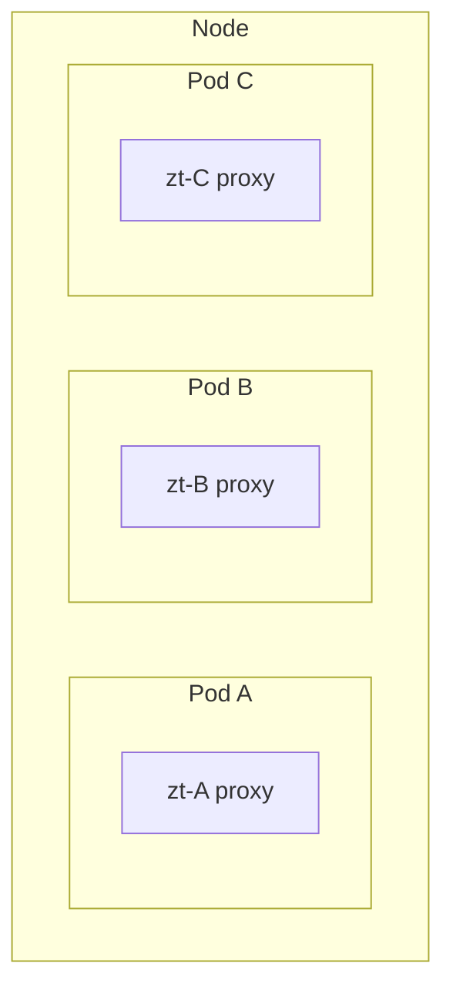
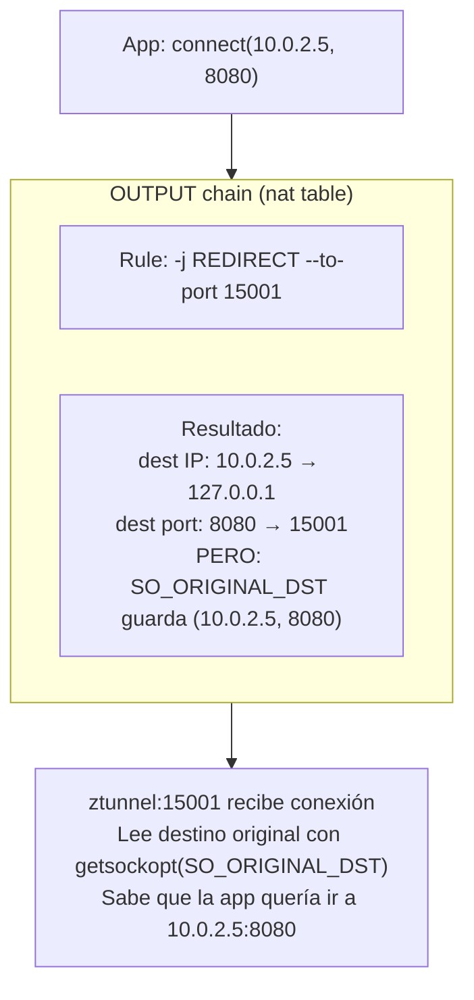
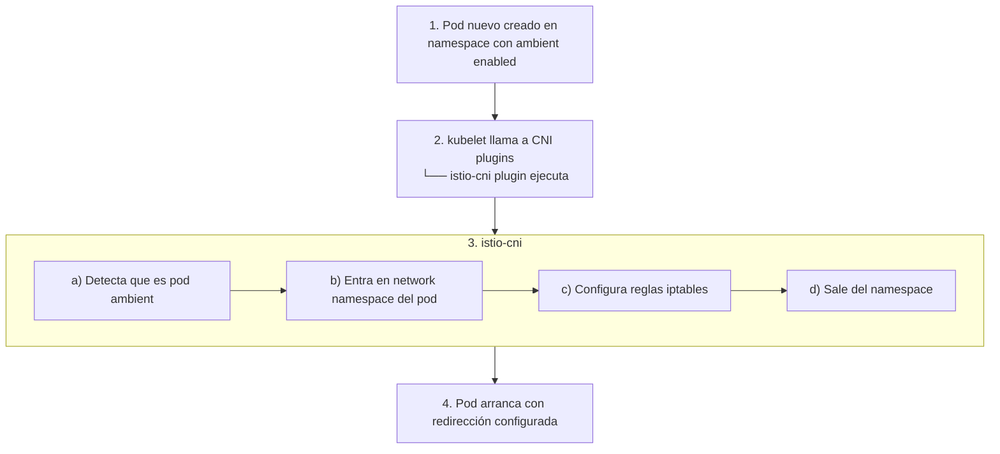

# Traffic Redirection en ztunnel

---

**Módulo**: 4 - Arquitectura de ztunnel
**Tema**: Redirección de Tráfico con iptables
**Tiempo estimado**: 3 horas
**Prerrequisitos**: [03_hbone_protocol.md](03_hbone_protocol.md)

---

## Objetivos de Aprendizaje

Al completar este documento:

- Entenderás cómo ztunnel intercepta tráfico transparentemente
- Conocerás el rol de iptables/netfilter en la redirección
- Comprenderás la diferencia entre in-pod y node-level redirection
- Sabrás cómo istio-cni configura las reglas

---

## 1. ¿Por qué Redirección de Tráfico?

### 1.1 El Problema

Las aplicaciones no saben que existe un proxy:



### 1.2 La Solución: Redirección Transparente



---

## 2. Netfilter e iptables

### 2.1 ¿Qué es Netfilter?

Netfilter es el framework de filtrado de paquetes del kernel Linux:



### 2.2 Tablas de iptables

| Tabla      | Propósito                          |
| ---------- | ---------------------------------- |
| **filter** | Filtrado de paquetes (ACCEPT/DROP) |
| **nat**    | Network Address Translation        |
| **mangle** | Modificación de paquetes           |
| **raw**    | Excepciones al connection tracking |

### 2.3 Chains Relevantes para Redirección

| Dirección | Chain | Descripción |
|-----------|-------|-------------|
| **OUTBOUND** | OUTPUT (nat) | Captura tráfico que sale de la app. Redirige a ztunnel:15001 |
| **INBOUND** | PREROUTING (nat) | Captura tráfico que llega al pod. Redirige a ztunnel:15006 (plaintext) o llega directo a ztunnel:15008 (HBONE) |

---

## 3. Tipos de Redirección en Ambient Mode

### 3.1 Node-Level vs In-Pod Redirection

**NODE-LEVEL (usando node network namespace):**



**IN-POD (ztunnel entra en network namespace del pod):**



### 3.2 Comparación

| Aspecto         | Node-Level                     | In-Pod            |
| --------------- | ------------------------------ | ----------------- |
| **Complejidad** | Mayor (manejo de múltiples ns) | Menor             |
| **Aislamiento** | Menor                          | Mayor (por pod)   |
| **Performance** | Mejor (menos context switches) | Overhead de ns    |
| **Usado en**    | Algunas configuraciones        | Istio CNI default |

---

## 4. Reglas iptables para ztunnel

### 4.1 Outbound Rules (desde el pod)

```bash
# Reglas en el network namespace del pod

# Cadena personalizada para outbound
iptables -t nat -N ISTIO_OUTPUT

# Redirigir OUTPUT a nuestra cadena
iptables -t nat -A OUTPUT -j ISTIO_OUTPUT

# En ISTIO_OUTPUT:
# 1. Ignorar tráfico de loopback
iptables -t nat -A ISTIO_OUTPUT -o lo -j RETURN

# 2. Ignorar tráfico del propio ztunnel (evitar loop)
iptables -t nat -A ISTIO_OUTPUT -m owner --uid-owner 1337 -j RETURN

# 3. Ignorar tráfico a localhost
iptables -t nat -A ISTIO_OUTPUT -d 127.0.0.1/32 -j RETURN

# 4. Redirigir TODO lo demás a ztunnel outbound
iptables -t nat -A ISTIO_OUTPUT -p tcp -j REDIRECT --to-port 15001
```

### 4.2 Inbound Rules (hacia el pod)

```bash
# Cadena para inbound
iptables -t nat -N ISTIO_INBOUND

# Redirigir PREROUTING a nuestra cadena
iptables -t nat -A PREROUTING -j ISTIO_INBOUND

# En ISTIO_INBOUND:
# 1. Ignorar tráfico a puertos excluidos (admin, metrics)
iptables -t nat -A ISTIO_INBOUND -p tcp --dport 15020 -j RETURN
iptables -t nat -A ISTIO_INBOUND -p tcp --dport 15021 -j RETURN

# 2. Redirigir inbound a ztunnel
iptables -t nat -A ISTIO_INBOUND -p tcp -j REDIRECT --to-port 15006
```

### 4.3 Visualización del Flujo



---

## 5. SO_ORIGINAL_DST

### 5.1 ¿Qué es?

Cuando iptables hace REDIRECT, el kernel guarda el destino original:

```c
// Obtener destino original en el proxy
struct sockaddr_in orig_dst;
socklen_t len = sizeof(orig_dst);

getsockopt(client_fd, SOL_IP, SO_ORIGINAL_DST, &orig_dst, &len);

// orig_dst ahora contiene la IP:puerto original
// que la app intentó alcanzar
```

### 5.2 En Rust (ztunnel)

```rust
// Pseudocódigo basado en ztunnel

use std::net::SocketAddr;
use tokio::net::TcpStream;

async fn get_original_dst(stream: &TcpStream) -> Result<SocketAddr> {
    // Usar socket2 o libc para getsockopt
    let fd = stream.as_raw_fd();

    let mut addr: libc::sockaddr_in = unsafe { std::mem::zeroed() };
    let mut len = std::mem::size_of::<libc::sockaddr_in>() as libc::socklen_t;

    unsafe {
        libc::getsockopt(
            fd,
            libc::SOL_IP,
            80, // SO_ORIGINAL_DST
            &mut addr as *mut _ as *mut libc::c_void,
            &mut len,
        );
    }

    // Convertir a SocketAddr
    Ok(SocketAddr::from(...))
}
```

---

## 6. istio-cni: Configuración Automática

### 6.1 ¿Qué es istio-cni?

istio-cni es un plugin CNI que configura automáticamente las reglas:



### 6.2 Componentes de istio-cni

```yaml
# DaemonSet de istio-cni
apiVersion: apps/v1
kind: DaemonSet
metadata:
  name: istio-cni-node
  namespace: istio-system
spec:
  selector:
    matchLabels:
      k8s-app: istio-cni-node
  template:
    spec:
      containers:
        - name: install-cni
          # Instala el plugin CNI en /opt/cni/bin
          # Configura /etc/cni/net.d
        - name: istio-cni
          # Agente que observa pods y configura redirección
          securityContext:
            capabilities:
              add:
                - NET_ADMIN # Para iptables
                - SYS_ADMIN # Para network namespaces
```

### 6.3 Flujo de Configuración

```
┌─────────────────────────────────────────────────────────────────┐
│              Pod Creation with istio-cni                        │
├─────────────────────────────────────────────────────────────────┤
│                                                                 │
│  kubectl apply -f my-pod.yaml                                  │
│         │                                                       │
│         ▼                                                       │
│  ┌─────────────────┐                                           │
│  │   API Server    │                                           │
│  └────────┬────────┘                                           │
│           │                                                     │
│           ▼                                                     │
│  ┌─────────────────┐                                           │
│  │    Scheduler    │ → Asigna nodo                             │
│  └────────┬────────┘                                           │
│           │                                                     │
│           ▼                                                     │
│  ┌─────────────────┐                                           │
│  │     Kubelet     │                                           │
│  └────────┬────────┘                                           │
│           │                                                     │
│           ▼                                                     │
│  ┌─────────────────────────────────────────────────────────┐   │
│  │              CNI Plugin Chain                            │   │
│  │                                                          │   │
│  │  1. Network plugin (Calico/Cilium/etc)                  │   │
│  │     └── Crea network namespace, asigna IP               │   │
│  │                                                          │   │
│  │  2. istio-cni plugin                                    │   │
│  │     └── Si namespace tiene ambient label:               │   │
│  │         a) nsenter al pod network namespace             │   │
│  │         b) iptables -t nat ... (reglas de redirección)  │   │
│  │         c) exit namespace                               │   │
│  │                                                          │   │
│  └─────────────────────────────────────────────────────────┘   │
│           │                                                     │
│           ▼                                                     │
│  Pod running con tráfico redirigido a ztunnel                  │
│                                                                 │
└─────────────────────────────────────────────────────────────────┘
```

---

## 7. Network Namespaces

### 7.1 ¿Qué son?

Network namespaces aíslan la configuración de red:

```bash
# Cada pod tiene su propio network namespace
# Contiene:
# - Interfaces de red (eth0, lo)
# - Tabla de routing
# - Reglas iptables
# - Sockets

# Ver namespaces de un proceso
ls -la /proc/<PID>/ns/net

# Entrar en namespace de otro proceso
nsenter -t <PID> -n iptables -L -t nat
```

### 7.2 ztunnel y Network Namespaces

```
┌─────────────────────────────────────────────────────────────────┐
│             ztunnel Network Namespace Access                    │
├─────────────────────────────────────────────────────────────────┤
│                                                                 │
│  ztunnel necesita:                                             │
│  1. Escuchar en el namespace de cada pod (15001, 15006)        │
│  2. O trabajar desde host namespace con acceso a pods          │
│                                                                 │
│  Opción 1: In-Pod Mode                                         │
│  ┌─────────────────────────────────────────────────────────┐   │
│  │ Pod namespace                                            │   │
│  │ ┌──────────────────────────────────────────────────┐    │   │
│  │ │ eth0: 10.0.1.5                                    │    │   │
│  │ │ lo: 127.0.0.1                                     │    │   │
│  │ │                                                   │    │   │
│  │ │ iptables REDIRECT to 15001, 15006                │    │   │
│  │ │                                                   │    │   │
│  │ │ ┌─────────────────┐  ┌─────────────────┐        │    │   │
│  │ │ │ App container   │  │ ztunnel proxy   │        │    │   │
│  │ │ │ (listens 8080)  │  │ (listens 15001) │        │    │   │
│  │ │ └─────────────────┘  └─────────────────┘        │    │   │
│  │ └──────────────────────────────────────────────────┘    │   │
│  └─────────────────────────────────────────────────────────┘   │
│                                                                 │
│  Opción 2: Node Mode (con socket en pod ns)                    │
│  ┌─────────────────────────────────────────────────────────┐   │
│  │ Host namespace                                           │   │
│  │                                                          │   │
│  │ ztunnel process                                         │   │
│  │ ├── main socket (host ns)                               │   │
│  │ ├── socket in Pod A ns (via netns)                      │   │
│  │ ├── socket in Pod B ns (via netns)                      │   │
│  │ └── socket in Pod C ns (via netns)                      │   │
│  │                                                          │   │
│  └─────────────────────────────────────────────────────────┘   │
│                                                                 │
└─────────────────────────────────────────────────────────────────┘
```

---

## 8. Debugging de Redirección

### 8.1 Ver Reglas iptables

```bash
# En el pod (necesitas shell con privilegios)
kubectl exec -it <pod> -- sh

# Ver reglas NAT
iptables -t nat -L -n -v

# Ver reglas específicas de Istio
iptables -t nat -L ISTIO_OUTPUT -n -v
iptables -t nat -L ISTIO_INBOUND -n -v

# Contar paquetes por regla
iptables -t nat -L -n -v --line-numbers
```

### 8.2 Verificar Redirección Funciona

```bash
# Desde dentro del pod
curl -v http://backend:8080

# Debería ver conexión a 127.0.0.1:15001 primero
# (si tiene herramientas de debugging)

# Ver conexiones establecidas
ss -tlnp

# Debería mostrar ztunnel escuchando en 15001, 15006
```

### 8.3 Logs de ztunnel

```bash
# Ver logs de ztunnel
kubectl logs -n istio-system -l app=ztunnel

# Buscar redirecciones
kubectl logs -n istio-system -l app=ztunnel | grep -i redirect

# Con más detalle
RUST_LOG=debug kubectl logs -n istio-system -l app=ztunnel
```

### 8.4 Troubleshooting Común

| Problema                    | Causa Posible                | Solución                             |
| --------------------------- | ---------------------------- | ------------------------------------ |
| Conexión directa (no proxy) | Reglas iptables no aplicadas | Verificar istio-cni, label namespace |
| Timeout en conexión         | ztunnel no escuchando        | Verificar ztunnel pods running       |
| Loop infinito               | Reglas no excluyen ztunnel   | Verificar `--uid-owner 1337` rule    |
| SO_ORIGINAL_DST falla       | Kernel no soporta            | Verificar versión kernel, conntrack  |

---

## 9. Flujo Completo con Redirección

```
┌─────────────────────────────────────────────────────────────────┐
│                Complete Traffic Flow                            │
├─────────────────────────────────────────────────────────────────┤
│                                                                 │
│  Node A                                    Node B               │
│  ┌───────────────────────────────┐  ┌───────────────────────┐  │
│  │ Pod A (10.0.1.5)              │  │ Pod B (10.0.2.5)      │  │
│  │                                │  │                       │  │
│  │ ┌─────────────────────────┐   │  │  ┌─────────────────┐  │  │
│  │ │ App                      │   │  │  │ Backend :8080   │  │  │
│  │ │ connect(10.0.2.5:8080)  │   │  │  │                 │  │  │
│  │ └───────────┬─────────────┘   │  │  └────────▲────────┘  │  │
│  │             │                  │  │           │           │  │
│  │             │ ①                │  │           │ ⑥         │  │
│  │             ▼                  │  │           │           │  │
│  │ ┌─────────────────────────┐   │  │  ┌────────┴────────┐  │  │
│  │ │ iptables OUTPUT         │   │  │  │ iptables        │  │  │
│  │ │ REDIRECT → 15001        │   │  │  │ (no redirige    │  │  │
│  │ └───────────┬─────────────┘   │  │  │  desde ztunnel) │  │  │
│  │             │                  │  │  └────────▲────────┘  │  │
│  │             │ ②                │  │           │           │  │
│  │             ▼                  │  │           │ ⑤         │  │
│  │ ┌─────────────────────────┐   │  │  ┌────────┴────────┐  │  │
│  │ │ ztunnel :15001          │   │  │  │ ztunnel :15008  │  │  │
│  │ │ - Lee SO_ORIGINAL_DST   │   │  │  │ - Recibe HBONE  │  │  │
│  │ │ - Busca destino en xDS  │   │  │  │ - Extrae destino│  │  │
│  │ │ - Obtiene cert SPIFFE   │   │  │  │ - Conecta a pod │  │  │
│  │ └───────────┬─────────────┘   │  │  └────────▲────────┘  │  │
│  │             │                  │  │           │           │  │
│  └─────────────┼──────────────────┘  └───────────┼───────────┘  │
│                │ ③                               │              │
│                │                                 │ ④            │
│                │  HBONE over mTLS (port 15008)  │              │
│                └─────────────────────────────────┘              │
│                                                                 │
│  Pasos:                                                        │
│  ① App llama connect() → interceptado por iptables            │
│  ② iptables redirige a ztunnel:15001                          │
│  ③ ztunnel A hace HBONE a ztunnel B:15008                     │
│  ④ Conexión HBONE establecida (mTLS con certs SPIFFE)         │
│  ⑤ ztunnel B conecta a Pod B:8080                             │
│  ⑥ Tráfico fluye transparentemente                            │
│                                                                 │
└─────────────────────────────────────────────────────────────────┘
```

---

## 10. Autoevaluación

1. ¿Por qué es necesaria la redirección de tráfico en ambient mode?
2. ¿Qué hace la regla `iptables -j REDIRECT --to-port 15001`?
3. ¿Cómo sabe ztunnel cuál era el destino original de la conexión?
4. ¿Cuál es el rol de istio-cni en la configuración?
5. ¿Por qué las reglas excluyen el tráfico del UID 1337?

---

## 11. Referencias en el Código

| Archivo/Recurso           | Descripción                            |
| ------------------------- | -------------------------------------- |
| ztunnel `ARCHITECTURE.md` | Puertos y flujo de tráfico             |
| istio/cni                 | Plugin CNI para reglas iptables        |
| iptables man page         | Referencia de netfilter                |
| `SO_ORIGINAL_DST`         | Opción de socket para destino original |

---

**Siguiente Módulo**: [../05_comparativa/01_envoy_vs_ztunnel.md](../05_comparativa/01_envoy_vs_ztunnel.md) - Comparación Envoy vs ztunnel
