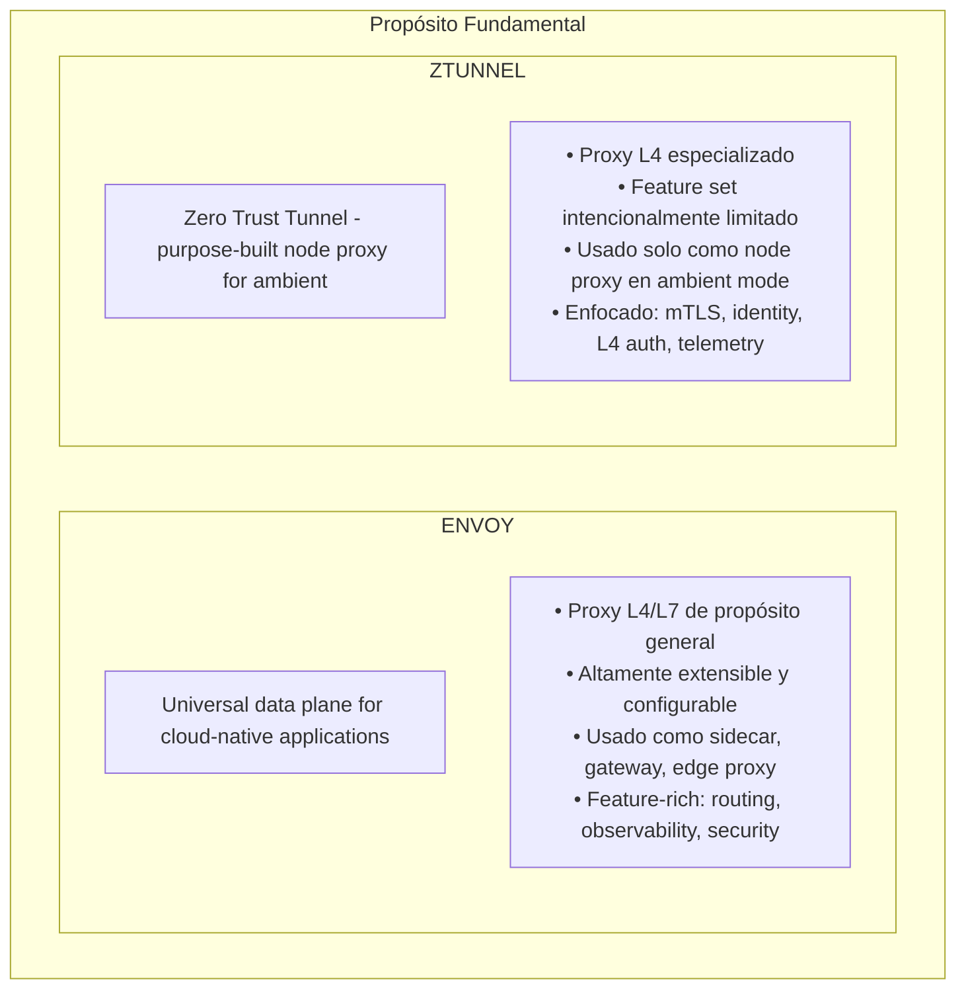
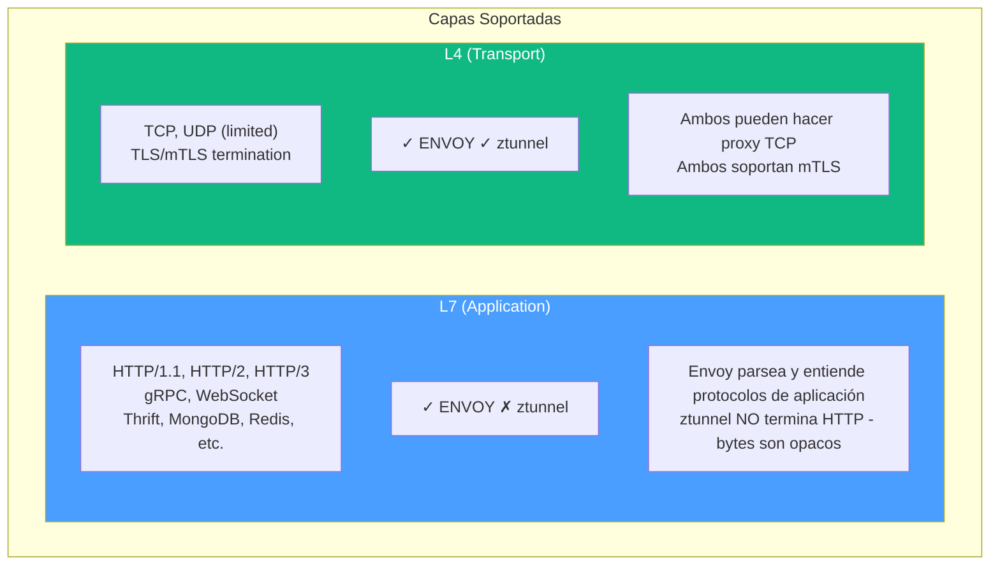
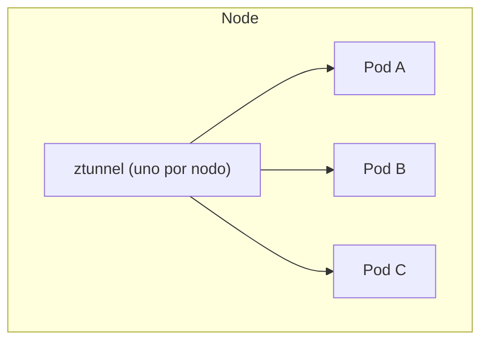
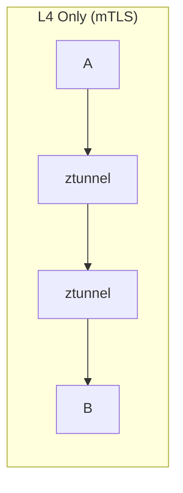
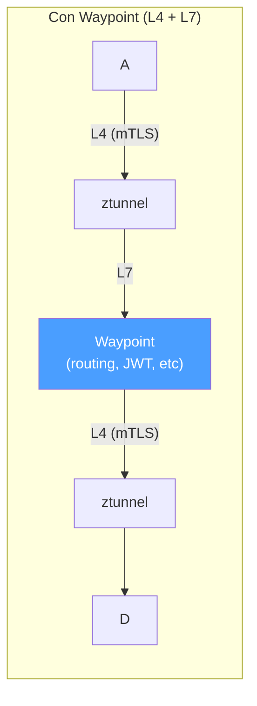

# Envoy vs ztunnel: Comparativa Detallada

---

**Módulo**: 5 - Comparativa
**Tema**: Comparación arquitectónica y funcional
**Tiempo estimado**: 2 horas
**Prerrequisitos**: Módulos 3 y 4 completos

---

## Objetivos de Aprendizaje

Al completar este documento:

- Entenderás las diferencias fundamentales entre Envoy y ztunnel
- Conocerás los trade-offs de cada aproximación
- Sabrás cuándo usar cada uno
- Comprenderás cómo se complementan

---

## 1. Visión General

### 1.1 Propósito de Cada Proyecto



### 1.2 Filosofía de Diseño

| Aspecto            | Envoy                       | ztunnel            |
| ------------------ | --------------------------- | ------------------ |
| **Alcance**        | General purpose             | Purpose-built      |
| **Extensibilidad** | Alta (WASM, Lua, ext_authz) | Mínima (by design) |
| **Complejidad**    | Alta                        | Baja               |
| **Features**       | Muchas                      | Pocas (esenciales) |
| **Configuración**  | Flexible, compleja          | Simple, limitada   |

---

## 2. Comparativa Técnica

### 2.1 Lenguaje y Runtime

| Aspecto | ENVOY | ZTUNNEL |
|---------|-------|---------|
| **Lenguaje** | C++20 | Rust |
| **Event Loop** | libevent (callback-based) | Tokio (async/await) |
| **Threading** | 1 main thread, N worker threads, Thread-local state | 1 admin runtime (single-t), 1 worker runtime (multi-t), Work-stealing scheduler |
| **Memory** | Manual management, Arena allocators, 50-100MB típico | Ownership system, No GC, no manual mgmt, 20-50MB típico |

### 2.2 Capas OSI



### 2.3 Features Detalladas

| Feature              | Envoy                     | ztunnel          |
| -------------------- | ------------------------- | ---------------- |
| **HTTP Routing**     | ✓ Path, headers, methods  | ✗                |
| **HTTP Transforms**  | ✓ Add/remove headers      | ✗                |
| **Rate Limiting**    | ✓ L7 rate limiting        | ✗                |
| **JWT Validation**   | ✓                         | ✗                |
| **Circuit Breaking** | ✓ L7 circuit breaker      | ✗                |
| **Retries**          | ✓ L7 retries              | ✗                |
| **Load Balancing**   | ✓ RR, LC, Ring Hash, etc. | Básico (via xDS) |
| **Health Checking**  | ✓ HTTP, TCP, gRPC         | ✗                |
| **mTLS**             | ✓                         | ✓                |
| **SPIFFE Identity**  | ✓                         | ✓                |
| **L4 Authorization** | ✓                         | ✓                |
| **L7 Authorization** | ✓                         | ✗                |
| **Access Logging**   | ✓ Rich L7 logs            | ✓ L4 logs        |
| **Tracing**          | ✓ Jaeger, Zipkin, etc.    | Limited          |
| **Metrics**          | ✓ Prometheus, StatsD      | ✓ Prometheus     |
| **WASM Extensions**  | ✓                         | ✗                |
| **Lua Scripting**    | ✓                         | ✗                |
| **External AuthZ**   | ✓                         | ✗                |
| **HBONE Protocol**   | ✓ (nuevo)                 | ✓                |

---

## 3. Comparativa de Código

### 3.1 Tamaño del Código

| Proyecto | Componente | Líneas de Código |
|----------|------------|------------------|
| **ENVOY** | source/ | ~400,000+ líneas C++ |
| **ENVOY** | api/ | ~100,000+ líneas protobuf |
| **ENVOY** | test/ | ~300,000+ líneas |
| **ENVOY** | Extensiones | cientos de filters, clusters, etc. |
| **ZTUNNEL** | src/ | ~30,000 líneas Rust |

> **Ratio:** Envoy es ~15x más grande
>
> **Por qué:** Envoy es propósito general con muchas features; ztunnel es propósito específico con features mínimas.

### 3.2 Manejo de Conexión

**Envoy (C++ con callbacks):**

```cpp
// Estilo callback-based
class ConnectionHandler : public Network::FilterManager {
public:
    void onData(Buffer::Instance& data, bool end_stream) override {
        // Procesar datos
        for (auto& filter : filters_) {
            FilterStatus status = filter->onData(data, end_stream);
            if (status == FilterStatus::StopIteration) {
                return;  // Filter quiere pausar
            }
        }
        // Continuar con upstream
        upstream_->write(data, end_stream);
    }

    void onUpstreamData(Buffer::Instance& data, bool end_stream) {
        // Datos del upstream, enviar a downstream
        downstream_->write(data, end_stream);
    }
};
```

**ztunnel (Rust con async/await):**

```rust
// Estilo async/await
async fn handle_connection(
    downstream: TcpStream,
    upstream: TcpStream,
) -> Result<()> {
    let (down_read, down_write) = downstream.into_split();
    let (up_read, up_write) = upstream.into_split();

    // Copiar en ambas direcciones concurrentemente
    let client_to_server = copy(down_read, up_write);
    let server_to_client = copy(up_read, down_write);

    // Esperar que cualquiera termine
    tokio::select! {
        result = client_to_server => result?,
        result = server_to_client => result?,
    }

    Ok(())
}
```

### 3.3 Configuración

**Envoy (YAML extenso):**

```yaml
# Envoy config - muchas opciones
static_resources:
  listeners:
    - name: listener_0
      address:
        socket_address:
          address: 0.0.0.0
          port_value: 8080
      filter_chains:
        - filters:
            - name: envoy.filters.network.http_connection_manager
              typed_config:
                "@type": type.googleapis.com/envoy.extensions.filters.network.http_connection_manager.v3.HttpConnectionManager
                stat_prefix: ingress_http
                codec_type: AUTO
                route_config:
                  name: local_route
                  virtual_hosts:
                    - name: backend
                      domains: ["*"]
                      routes:
                        - match:
                            prefix: "/"
                          route:
                            cluster: backend_cluster
                http_filters:
                  - name: envoy.filters.http.router
                    typed_config:
                      "@type": type.googleapis.com/envoy.extensions.filters.http.router.v3.Router

  clusters:
    - name: backend_cluster
      type: STRICT_DNS
      lb_policy: ROUND_ROBIN
      load_assignment:
        cluster_name: backend_cluster
        endpoints:
          - lb_endpoints:
              - endpoint:
                  address:
                    socket_address:
                      address: backend
                      port_value: 8080
```

**ztunnel (xDS principalmente):**

```yaml
# ztunnel: configuración mínima, principalmente vía xDS
# No hay YAML de configuración extenso
# La configuración viene de istiod

# Variables de entorno principales:
# ZTUNNEL_WORKER_THREADS=2
# RUST_LOG=info

# Todo lo demás (destinos, policies, certs) viene de xDS
```

---

## 4. Performance

### 4.1 Overhead

**Latencia Añadida (aproximada):**

| Proxy | Componente | Latencia |
|-------|------------|----------|
| **ENVOY (L7)** | HTTP parsing | +0.1-0.5ms |
| **ENVOY (L7)** | Filter chain | +0.1-1.0ms (depende) |
| **ENVOY (L7)** | **Total típico** | **+1-5ms per request** |
| **ZTUNNEL (L4)** | TCP proxy | +0.05-0.1ms |
| **ZTUNNEL (L4)** | mTLS overhead | +0.1-0.3ms (handshake) |
| **ZTUNNEL (L4)** | **Total típico** | **+0.1-0.5ms per connection** |

**Memoria (por instancia):**

| Configuración | Memoria |
|---------------|---------|
| Envoy sidecar | 50-100MB |
| ztunnel (nodo) | 20-50MB (para todo el nodo) |

**En cluster de 1000 pods:**

| Modelo | RAM Total |
|--------|-----------|
| Sidecars Envoy | 50-100GB |
| ztunnel (20-30 nodos) | 600MB-1.5GB |

### 4.2 Throughput

| Escenario           | Envoy       | ztunnel     |
| ------------------- | ----------- | ----------- |
| **TCP passthrough** | ~1M req/s   | ~1.2M req/s |
| **HTTP/1.1 proxy**  | ~100K req/s | N/A         |
| **HTTP/2 proxy**    | ~150K req/s | N/A         |
| **mTLS overhead**   | ~5-10%      | ~5-10%      |

_Nota: Números ilustrativos, varían según hardware y configuración_

---

## 5. Modelo de Despliegue

### 5.1 Envoy: Múltiples Patrones

| Patrón | Descripción | Usado en |
|--------|-------------|----------|
| **1. SIDECAR** | Pod: App + Envoy sidecar | Istio sidecar mode |
| **2. GATEWAY** | Internet → Envoy Gateway → Services | Istio Gateway, Contour, Ambassador |
| **3. EDGE PROXY** | Front-facing load balancer | CDN, API Gateway |
| **4. WAYPOINT** | L7 processing por namespace/service | Istio ambient mode |

### 5.2 ztunnel: Un Solo Patrón

**SOLO: Node Proxy (DaemonSet)**



**ztunnel NO se usa como:**
- ✗ Sidecar
- ✗ Gateway
- ✗ Edge proxy
- ✗ Standalone proxy

---

## 6. Extensibilidad

### 6.1 Envoy: Altamente Extensible

```
┌─────────────────────────────────────────────────────────────────┐
│                    Envoy Extension Points                       │
├─────────────────────────────────────────────────────────────────┤
│                                                                 │
│  Tipos de Extensiones:                                         │
│  ─────────────────────                                          │
│  • HTTP Filters (request/response processing)                  │
│  • Network Filters (L4 processing)                             │
│  • Listener Filters (connection accept)                        │
│  • Clusters (upstream groups)                                  │
│  • Transport Sockets (TLS providers)                           │
│  • Access Loggers                                              │
│  • Stat Sinks                                                  │
│  • Tracers                                                     │
│  • Resource Monitors                                           │
│  • ... y más                                                   │
│                                                                 │
│  Mecanismos de Extensión:                                      │
│  ─────────────────────────                                      │
│  • C++ nativo (compile-time)                                   │
│  • WASM (runtime, sandboxed)                                   │
│  • Lua scripting (runtime)                                     │
│  • External processes (ext_proc, ext_authz)                    │
│                                                                 │
│  Ejemplo: Añadir HTTP filter                                   │
│  ┌──────────────────────────────────────────────────────────┐  │
│  │  1. Implementar FilterFactory                            │  │
│  │  2. Implementar Filter interface                         │  │
│  │  3. Registrar en extensions_build_config.bzl             │  │
│  │  4. Rebuild Envoy                                        │  │
│  └──────────────────────────────────────────────────────────┘  │
│                                                                 │
└─────────────────────────────────────────────────────────────────┘
```

### 6.2 ztunnel: Intencionalmente Limitado

```
┌─────────────────────────────────────────────────────────────────┐
│                 ztunnel: No Extension Points                    │
├─────────────────────────────────────────────────────────────────┤
│                                                                 │
│  De README.md:                                                 │
│  "Ztunnel does not aim to be a generic extensible proxy;       │
│   Envoy is better suited for that task."                        │
│                                                                 │
│  ┌──────────────────────────────────────────────────────────┐  │
│  │  Lo que ztunnel NO tiene:                                │  │
│  │                                                           │  │
│  │  ✗ Plugin system                                         │  │
│  │  ✗ WASM support                                          │  │
│  │  ✗ Lua scripting                                         │  │
│  │  ✗ External processors                                   │  │
│  │  ✗ Custom filters                                        │  │
│  │  ✗ Hot reload de extensiones                             │  │
│  │                                                           │  │
│  └──────────────────────────────────────────────────────────┘  │
│                                                                 │
│  ¿Por qué?                                                     │
│  ─────────                                                      │
│  • Simplicidad → menos bugs                                    │
│  • Performance → menos overhead                                │
│  • Seguridad → menor superficie de ataque                      │
│  • Si necesitas L7 → usa waypoint (Envoy)                      │
│                                                                 │
└─────────────────────────────────────────────────────────────────┘
```

---

## 7. Casos de Uso

### 7.1 Cuándo Usar Envoy

| Caso de Uso                | Por qué Envoy                            |
| -------------------------- | ---------------------------------------- |
| **API Gateway**            | Necesita routing L7, rate limiting, auth |
| **Service Mesh (sidecar)** | Full L7 control per-service              |
| **Ingress Controller**     | HTTP routing, TLS termination            |
| **L7 Load Balancer**       | Content-based routing                    |
| **Protocol Translation**   | HTTP/1 ↔ HTTP/2 ↔ gRPC                 |
| **Observability**          | Rich L7 metrics y tracing                |
| **Security Policies**      | JWT, RBAC on paths/methods               |

### 7.2 Cuándo Usar ztunnel

| Caso de Uso             | Por qué ztunnel                     |
| ----------------------- | ----------------------------------- |
| **Ambient Mesh**        | Node-level mTLS para todos los pods |
| **L4 Only**             | No necesitas features L7            |
| **Resource Efficiency** | Muchos pods, recursos limitados     |
| **Simple mTLS**         | Solo quieres cifrado y identidad    |
| **High Throughput**     | L4 proxy con mínimo overhead        |

### 7.3 Cuándo Usar Ambos (Ambient Mode)

**Escenario:** Cluster con mix de requisitos

- **Services A, B, C:** Solo necesitan mTLS → ztunnel es suficiente
- **Service D (API pública):** Necesita JWT validation, rate limiting, routing → Añadir waypoint proxy (Envoy)





**Beneficios:**
- L7 solo donde se necesita
- Menor uso de recursos
- Flexibilidad por servicio

---

## 8. Tabla Resumen

| Aspecto            | Envoy      | ztunnel    | Ganador               |
| ------------------ | ---------- | ---------- | --------------------- |
| **Lenguaje**       | C++20      | Rust       | Empate (trade-offs)   |
| **Código**         | ~500K LOC  | ~30K LOC   | ztunnel (simplicidad) |
| **Memoria**        | 50-100MB   | 20-50MB    | ztunnel               |
| **Latencia**       | +1-5ms     | +0.1-0.5ms | ztunnel               |
| **L7 Features**    | Completo   | Ninguno    | Envoy                 |
| **Extensibilidad** | Alta       | Ninguna    | Envoy                 |
| **Configuración**  | Compleja   | Simple     | ztunnel               |
| **Debugging**      | Rich tools | Básico     | Envoy                 |
| **Casos de uso**   | Muchos     | Uno        | Envoy                 |
| **Madurez**        | 8+ años    | 2+ años    | Envoy                 |

---

## 9. Autoevaluación

1. ¿Por qué ztunnel no soporta HTTP routing?
2. ¿Cuándo elegirías Envoy sobre ztunnel?
3. ¿Cuál es la ventaja de recursos de ztunnel vs sidecars?
4. ¿Cómo se complementan Envoy y ztunnel en ambient mode?
5. ¿Por qué ztunnel es intencionalmente no extensible?

---

## 10. Referencias

| Recurso                | URL                                                              |
| ---------------------- | ---------------------------------------------------------------- |
| Envoy Architecture     | https://www.envoyproxy.io/docs/envoy/latest/intro/arch_overview/ |
| ztunnel Architecture   | ARCHITECTURE.md en repositorio                                   |
| Istio Ambient          | https://istio.io/latest/docs/ambient/                            |
| Rust vs C++ in Systems | Múltiples blogs técnicos                                         |

---

**Siguiente**: [02_ambient_mode_completo.md](02_ambient_mode_completo.md) - Arquitectura Ambient Mode Completa
